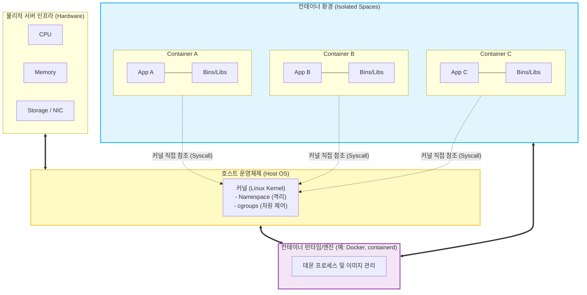

# 컨테이너 (Container)

---

## I. 애플리케이션의 이식성과 민첩성을 보장하는 경량 가상화 기술, 컨테이너의 개요

* **가. 컨테이너(Container)의 정의**: 호스트 [[OS(운영체제)|운영체제]](OS)의 커널을 공유하면서 애플리케이션 실행에 필요한 코드, 런타임, 시스템 도구, 라이브러리를 하나로 패키징하여 논리적으로 격리된 환경에서 실행하는 OS 레벨의 [[가상화]] 기술
* **나. 컨테이너의 등장배경 및 특징**
* **등장배경**: 기존 하이퍼바이저 기반 가상머신(VM)의 무거운 게스트 OS(Guest OS) 오버헤드 극복 및 [[MSA (Micro Service Architecture)|MSA]](Microservices Architecture) 확산에 따른 민첩한 배포 환경 요구 증가
* **특징**:
* **이식성 (Portability)**: "Build Once, Run Anywhere" 지원으로 개발/테스트/운영 환경의 불일치 해소
* **경량성 및 빠른 속도**: 게스트 OS 부팅 과정이 생략되어 밀리초(ms) 단위의 빠른 시작 및 적은 리소스 사용량(MB 단위) 달성
* **확장성**: 트래픽 변화에 따른 빠르고 유연한 오토스케일링(Auto-scaling) 지원

---

## II. 컨테이너의 아키텍처 및 핵심 기술 요소

### 가. 컨테이너의 아키텍처 및 동작 원리

* 컨테이너는 별도의 게스트 OS 없이 호스트 OS의 커널([[커널|Kernel]])을 직접 공유하며, 컨테이너 엔진이 Namespace와 cgroups를 호출하여 각 컨테이너를 독립적인 프로세스처럼 격리하여 실행함

### 나. 컨테이너의 핵심 기술 및 구성 요소

| 구분 | 요소기술(키워드) | 세부 설명 |
| --- | --- | --- |
| **격리 기술** | Namespace | [[프로세스]], 네트워크(NET), 마운트(MNT), 사용자(USER), IPC 등 리소스에 대한 가시성을 독립적으로 격리하는 리눅스 커널 기능 |
| **자원 관리** | cgroups (Control Groups) | 개별 컨테이너(프로세스 그룹)가 사용할 수 있는 하드웨어 리소스([[CPU]], 메모리, 디스크 I/O)의 사용량을 제한하고 통제 |
| **파일 시스템** | UnionFS / OverlayFS | 여러 개의 파일 시스템(디렉터리)을 투명하게 겹쳐서 하나의 파일 시스템처럼 보이게 하는 계층형(Layered) 파일 시스템 구조 |
| **표준 런타임** | OCI (Open Container Initiative) | 특정 벤더에 종속되지 않도록 컨테이너 런타임(runc) 및 이미지 포맷에 대한 업계 개방형 표준 규격 |
| **런타임 데몬** | containerd, CRI-O | 컨테이너의 생명주기(생성, 실행, 중지) 및 이미지를 관리하는 고수준 런타임 (Kubernetes CRI 호환) |
| **보안 통제** | Seccomp / AppArmor | 컨테이너 프로세스가 호출할 수 있는 시스템 콜(System Call)을 필터링하거나 [[MAC]](강제 접근 제어)을 통해 호스트 커널 보호 |
| **이미지** | Container Image (Dockerfile) | 애플리케이션과 종속성을 패키징한 읽기 전용(Read-Only) 템플릿으로, 선언적인 코드(Dockerfile)로 정의 및 빌드 |

---

## III. 컨테이너와 가상머신(VM) 비교 및 최신 동향

### 가. 컨테이너와 가상머신(VM) 아키텍처 비교

| 비교 항목 | 컨테이너 (Container) | 가상머신 (Virtual Machine) |
| --- | --- | --- |
| **가상화 수준** | **운영체제(OS) 레벨** 가상화 | **하드웨어(HW) 레벨** 가상화 ([[Hypervisor (VMM)|Hypervisor]] 기반) |
| **커널 공유** | 호스트 OS의 **커널을 모든 컨테이너가 공유** | 각 VM마다 **독립적인 Guest OS 커널** 보유 |
| **크기 및 리소스** | **MB 단위** (게스트 OS 미포함으로 매우 경량) | **GB 단위** (게스트 OS 포함으로 무거움) |
| **부팅 속도** | 애플리케이션 시작과 동일 (**ms ~ 초 단위**) | 전체 OS 부팅 과정 필요 (**분 단위**) |
| **격리성 및 보안** | 프로세스 격리 수준으로 보안 취약성 우려 존재 | 하드웨어 수준 격리로 높은 보안성(Sandboxing) 제공 |
| **주요 활용도** | MSA, CI/CD, [[클라우드 네이티브]] 애플리케이션 | 모놀리식 앱, 다양한 OS 환경 혼용 지원, 높은 보안 요구 시스템 |

### 나. 컨테이너 기술의 최신 발전 동향 및 전망

* **오케스트레이션의 표준화**: 수많은 컨테이너의 배포, 스케일링, 네트워킹을 자동화하기 위해 Kubernetes(K8s)가 사실상의 업계 표준(De Facto)으로 확고히 자리 잡음
* **보안과 경량성의 결합 (MicroVM)**: 컨테이너의 커널 공유로 인한 보안 취약점을 극복하기 위해, VM의 강력한 격리성과 컨테이너의 빠른 속도를 결합한 **Kata Containers, Firecracker(AWS), gVisor(Google)** 등 마이크로VM 기반의 보안 컨테이너 도입 확산
* **WebAssembly (Wasm) 컨테이너**: [[도커|Docker]]를 대체하거나 보완할 수 있는 기술로, OS 및 아키텍처에 완전 독립적이며 밀리초 단위의 극단적인 부팅 속도를 자랑하는 Wasm을 서버사이드 컨테이너 런타임으로 활용하는 생태계 급부상

---

### 🔗 연관 토픽

- **소속 도메인**: [[00_디지털서비스_MOC|🚀 디지털서비스]]
- **세부 분류**: `1. 클라우드 컴퓨팅 & 가상화 인프라`
- **핵심 연관 토픽**:
  - [[가상화]]
  - [[도커|도커 (Docker)]]
  - [[Hypervisor (VMM)]]
  - [[클라우드 네이티브]]
  - [[프로세스]]
