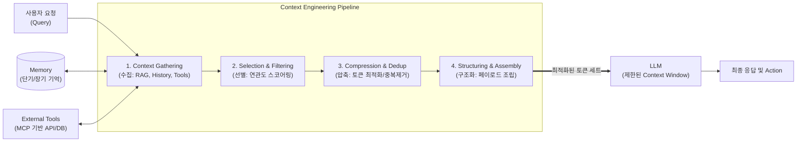

# 컨텍스트 엔지니어링(Context Engineering)

---

## I. LLM의 인지 최적화, 컨텍스트 엔지니어링의 개요

* **정의**: 대규모 언어 모델([[초거대 언어 모델|LLM]])이 제한된 컨텍스트 윈도우(Context Window) 내에서 최적의 성능을 낼 수 있도록 검색된 데이터, 메모리, 도구 출력 등 동적 정보를 선별, 압축, 구조화하여 제공하는 AI 정보 아키텍처 설계 기술
* **등장 배경 및 필요성**:
* **주의력 예산(Attention Budget) 한계**: 토큰 증가에 따른 LLM의 집중력 저하 및 연산 비용 증가 문제 해결 필요
* **정보 왜곡 방지**: 불필요한 정보로 인한 컨텍스트 오염(Context Poisoning) 및 상충 정보 충돌(Context Clash) 방지
* **자율형 에이전트 진화**: 단순 텍스트 입력을 넘어 RAG, 단기/장기 메모리, 도구 사용(Tool Use)을 통합하는 Agentic 워크플로우 요구 증대

* **특징**: 동적 데이터 파이프라인 연동, 토큰 예산 기반 자원 할당, 프롬프트 구조화 및 시스템 컨텍스트 캐싱(Context Caching) 지원

---

## II. 컨텍스트 엔지니어링의 아키텍처 및 핵심 구성요소

### 가. 컨텍스트 엔지니어링의 아키텍처 및 동작 원리

* **동작 원리**: 사용자의 요청과 함께 외부 메모리 및 도구의 결과를 수집한 후, 컨텍스트 파이프라인을 통해 연관성 높은 정보만 필터링 및 압축하여 LLM의 컨텍스트 윈도우에 최적화된 형태로 전달함

### 나. 컨텍스트 엔지니어링의 핵심 기술 요소

| 구분 | 요소기술(키워드) | 세부 설명 |
| --- | --- | --- |
| **정보 수집** | Context Selection | RAG(검색 증강 생성)를 활용하여 사용자 쿼리와 연관성이 높은 고품질 데이터 선별 |
| **정보 압축** | Context Compression | 문서 요약 및 필수 정보 추출을 통해 한정된 Context Window 내로 정보량 축소 |
| **정보 정제** | Deduplication / Resolution | 중복 데이터 제거 및 상충되는 정보 간의 충돌(Context Clash) 논리적 해결 |
| **기억 관리** | Memory Management | 대화 기록(단기 메모리) 및 사용자 프로필/선호도(장기 메모리)의 연속성 유지 |
| **도구 연동** | Tool Integration / [[MCP]] | 모델 컨텍스트 [[프로토콜]](MCP) 등을 통한 실시간 외부 API 연동 및 결과값 컨텍스트 주입 |
| **자원 할당** | Token Budgeting | LLM의 정보 처리 능력(Attention Budget)을 고려한 소스별/기능별 토큰 할당 최적화 |
| **구조화** | Prompt Structuring | 시스템 지시문, 사용자 쿼리, Few-shot 예제의 명확한 구분 및 마크다운 기반 템플릿 배치 |
| **성능 최적화** | Context Caching | 자주 참조되는 방대한 컨텍스트(시스템 매뉴얼, 코드베이스 등)를 캐싱하여 비용 및 지연 단축 |

---

## III. 컨텍스트 엔지니어링과 프롬프트 엔지니어링 비교 및 전망

### 가. 프롬프트 엔지니어링과의 비교

| 비교 항목 | [[프롬프트 엔지니어링|프롬프트 엔지니어링(Prompt Engineering)]] | 컨텍스트 엔지니어링(Context Engineering) |
| --- | --- | --- |
| **핵심 목적** | 의도한 답변을 유도하기 위한 **최적의 지시어 설계** | AI가 작업을 수행하기 위한 **최적의 정보 환경 및 시스템 구축** |
| **최적화 대상** | 단어 선택, 문장 구조, 어조, 예제 텍스트 | 메모리, 데이터 파이프라인 검색(RAG), 도구 출력(API) |
| **데이터 속성** | 정적 텍스트 기반 (사전 정의된 규칙 위주) | 동적/실시간 데이터, 스트리밍, 멀티모달 정보의 통합 |
| **접근 방식** | 시행착오(Heuristic) 기반의 수동 튜닝 | 에이전트 플랫폼 기반 자동화 리트리버 및 토큰 예산 관리 |
| **적용 분야** | 단순 챗봇 질의응답, 일회성 텍스트 생성 | 자율형 AI 에이전트(Agentic AI), 엔터프라이즈 AI 시스템 |

* **전망 및 동향**: 단순한 프롬프트 기법을 넘어 기업 환경의 방대한 데이터를 AI와 연결하기 위한 모델 컨텍스트 프로토콜(MCP) 도입이 가속화되고 있으며, 무한대에 가까운 컨텍스트 윈도우 확장에 대응하기 위한 **Context Caching** 및 **동적 토큰 최적화 아키텍처**가 향후 LLM 플랫폼의 핵심 경쟁력으로 부상할 전망임

---

### 🔗 연관 토픽

- **소속 도메인**: [[00_인공지능_MOC|🤖 인공지능]]
- **세부 분류**: `3. 딥러닝 핵심 아키텍처 & 신경망`
- **핵심 연관 토픽**:
  - [[초거대 언어 모델|초거대 언어 모델(Large Language Model)]]
  - [[MCP|MCP (Model Context Protocol)]]
  - [[프롬프트 엔지니어링|프롬프트 엔지니어링(Prompt Engineering)]]
  - [[프로토콜]]
  - [[딥러닝]]
