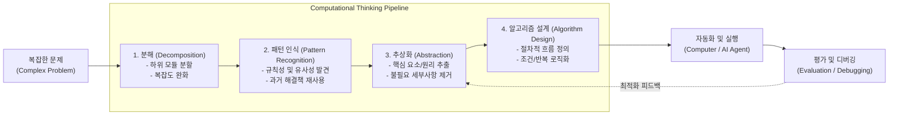

# 컴퓨팅 사고력(Computational Thinking)

---

## I. 소프트웨어 기반 문제 해결 패러다임, 컴퓨팅 사고력의 개요

* **정의**: 복잡한 현실 세계의 문제를 분해, 패턴화, 추상화하여 컴퓨터(컴퓨팅 시스템)가 효과적으로 수행할 수 있는 [[알고리즘]] 형태로 구조화하고 해결책을 도출하는 인간의 본질적 사고 역량
* **등장배경 및 필요성**:
* **보편적 기초 역량 대두**: 2006년 지넷 윙(Jeannette Wing) 교수가 제창, 읽기·쓰기·셈하기와 더불어 모든 사람이 갖추어야 할 분석적 사고 능력으로 부각
* **복잡계 문제 해결(Complexity Management)**: 빅데이터 및 초연결 환경에서 발생하는 대규모·비정형 문제를 기계가 이해·연산 가능한 모델로 변환 필요
* **AI 전환(AX) 가속화**: 생성형 AI 및 자율형 에이전트 환경에서 작업을 명확히 정의하고 시스템을 오케스트레이션·검증하는 핵심 메타 역량으로 진화

* **특징**: 인간 중심적(Human-centric), 도구 독립적(기계 없이도 성립), 자동화 지향(Automation-oriented), 확장성(Scalability)

---

## II. 컴퓨팅 사고력의 아키텍처 및 핵심 구성요소

### 가. 컴퓨팅 사고력의 절차적 프레임워크

* **동작 원리**: 대형 문제를 해결 가능한 단위로 분해하고 유사 패턴을 탐색하여 불필요한 정보를 제거(추상화)한 뒤, 명확한 단계별 알고리즘을 도출하여 컴퓨터/AI 자원을 통해 자동화 및 검증을 반복 수행함

### 나. 컴퓨팅 사고력의 핵심 기술 요소

| 구분 | 요소기술(키워드) | 세부 설명 |
| --- | --- | --- |
| **문제 분석** | 분해 (Decomposition) | 복잡한 전체 문제를 개별적으로 해결 가능한 작은 하위 단위(Sub-problems)로 쪼개는 기술 |
| **패턴 탐색** | 패턴 인식 (Pattern Recognition) | 분해된 데이터 및 문제들 간의 유사성, 공통 규칙, 주기성을 찾아내어 기개발된 해결법을 적용 |
| **모델링** | [[추상화|추상화 (Abstraction)]] | 복잡성을 제어하기 위해 세부적이고 지엽적인 요소는 생략하고 핵심 개념 및 규칙만 모델링 |
| **절차화** | 알고리즘 (Algorithm Design) | 주어진 입력으로부터 목표 출력을 도출하기 위한 명확하고 유한한 실행 단계(Step-by-step) 정의 |
| **구현 및 실행** | 자동화 (Automation) | 정립된 알고리즘을 프로그래밍 언어나 컴퓨팅 시스템을 통해 기계가 반복 수행하도록 구현 |
| **영역 전이** | [[일반화]] (Generalization) | 특정 문제 해결을 위해 구축된 모델과 절차를 유사한 다른 도메인 문제에 [[재사용]] 및 확장 |
| **품질 검증** | 평가 (Evaluation) | 도출된 솔루션의 시간·공간 복잡도(Big-O), 자원 효율성, 요구사항 충족 여부를 측정 및 정량 평가 |
| **결함 개선** | 디버깅 ([[Debugging]]) | 실행 과정에서 발견된 논리적 오류, 예외 상황을 추적하여 알고리즘 및 추상화 모델을 개선 |

---

## III. 컴퓨팅 사고력과 일반적 논리적 사고 비교 및 AI 시대 발전 방향

### 가. 일반적 논리적 사고와의 비교

| 비교 항목 | 일반적 논리적 사고 (Logical Thinking) | 컴퓨팅 사고력 (Computational Thinking) |
| --- | --- | --- |
| **핵심 목적** | 논증의 타당성 검증 및 논리적 설득 | 컴퓨터를 통한 효율적 문제 해결 및 자동화 |
| **주요 기법** | 연역법, 귀납법, 삼단논법, MECE 분류 | 분해, 패턴 인식, 추상화, 알고리즘 설계 |
| **수행 주체** | 인간의 뇌 (인지적 판단) | 컴퓨터 시스템, 알고리즘 실행 엔진 (기계 연산) |
| **복잡도 관리** | 개념의 정합성 및 모순 배제 중심 | 시간/공간 복잡도 최적화, 대규모 확장성(Scale-out) 고려 |
| **결과물 형태** | 논증 보고서, 정책 제언, 논리적 결론 | 실행 가능한 알고리즘, 소프트웨어 코드, 워크플로우 |

* **전망 및 동향**:
* **프롬프트 및 컨텍스트 엔지니어링의 근간**: [[초거대 언어 모델|LLM]] 및 Agentic AI 환경에서 작업을 모듈화하고 최적의 컨텍스트를 주입하는 지적 프레임워크로 기능
* **코딩 패러다임 변화에 대응**: 단순 구문(Syntax) 작성 중심 코딩에서 벗어나, 시스템 아키텍처를 모델링하고 AI 결과물의 결함을 검증·평가하는 상위 수준의 메타인지 역량으로 중요성 증대

---

### 🔗 연관 토픽

- **소속 도메인**: [[00_소프트웨어공학_MOC|🏗️ 소프트웨어공학]]
- **세부 분류**: `4. 아키텍처 스타일 & 객체지향 설계 원리`
- **핵심 연관 토픽**:
  - [[재사용]]
  - [[추상화|추상화 (Abstraction)]]
  - [[Debugging]]
  - [[일반화]]
  - [[디자인 패턴|디자인 패턴 (Design Pattern)]]
