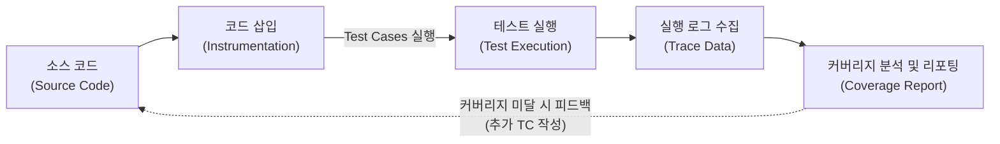

# 코드 커버리지(Code Coverage)

---

## I. 소프트웨어 테스트 신뢰성 확보 지표, 코드 커버리지의 개요

* **정의**: [[소프트웨어 테스트]] 과정에서 작성된 테스트 케이스에 의해 소스 코드가 어느 정도 실행되었는지를 정량적인 수치(%)로 측정하여 테스트의 충분성(Adequacy)을 검증하는 [[화이트박스 테스트]] 지표
* **필요성 및 등장배경**:
* **테스트 완전성 검증**: 개발자가 작성한 테스트 케이스의 누락 방지 및 사각지대 해소
* **잠재적 결함 예방**: 미실행 코드(Dead Code) 및 도달 불가 로직을 식별하여 소프트웨어 [[신뢰성]] 향상

* **특징**: 소스 코드의 구조와 로직을 분석하는 화이트박스(White-box) 기법 활용, CI/CD 파이프라인과 연동하여 품질 게이트(Quality Gate)의 핵심 통과 기준으로 사용됨

---

## II. 코드 커버리지의 개념도 및 핵심 커버리지 기법

### 가. 코드 커버리지의 개념도 및 동작 원리

* 소스 코드에 추적을 위한 프로브(Probe) 코드를 삽입(Instrumentation)한 후, [[단위 테스트]] 등을 실행하여 각 코드 라인 및 분기문의 실행 여부를 수집하고 정량화된 리포트를 산출함

### 나. 코드 커버리지의 핵심 기술/구성 요소

| 구분 | 요소기술(기법) | 세부 설명 |
| --- | --- | --- |
| **기본 커버리지** | 구문 (Statement) | 프로그램 내의 모든 코드 라인(문장)이 최소 1번 이상 실행되는지 측정 |
| **분기 커버리지** | 결정 (Decision/Branch) | 프로그램 내 **전체 조건식**의 결과가 참(True)/거짓(False)을 최소 1번 이상 갖는지 측정 |
| **조건 커버리지** | 조건 (Condition) | 전체 조건식과 무관하게, 내부 **개별 조건식** 각각이 참(True)/거짓(False)을 최소 1번 이상 갖는지 측정 |
| **복합 커버리지** | 조건/결정 (Condition/Decision) | 전체 조건식의 T/F 조건과 내부 개별 조건식의 T/F 조건을 모두 만족하도록 실행 |
| **안전 필수 검증** | 변경조건/결정 (MC/DC) | 개별 조건식이 다른 개별 조건식에 영향을 받지 않고, 전체 조건식의 결과에 **독립적으로 영향**을 미치는지 검증 |
| **완전 조합 검증** | 다중 조건 (Multiple Condition) | 개별 조건식들이 가질 수 있는 가능한 **모든 논리적 조합(Truth Table)**을 100% 테스트 |
| **흐름 검증** | 경로 (Path) | 프로그램의 시작부터 종료까지 도달할 수 있는 **모든 실행 경로**를 테스트 (가장 강력하나 비용 최대) |
| **자동화 도구** | 측정 도구 (Tool) | JaCoCo(Java), SonarQube, Coverage.py 등을 통해 런타임 추적 및 CI/CD 연동 리포팅 제공 |

---

## III. 주요 코드 커버리지 간 비교 및 최신 동향

### 가. 주요 코드 커버리지 기법 비교

| 비교 항목 | 결정 (Decision / Branch) | 조건 (Condition) | 변경조건/결정 (MC/DC) |
| --- | --- | --- | --- |
| **검증 대상** | 전체 조건식의 결과 (T/F) | 내부 개별 조건식의 결과 (T/F) | 개별 조건식의 전체에 대한 독립적 영향력 |
| **결함 검출 한계** | 전체가 참이더라도 내부 개별 조건의 오류 누락 가능성 존재 | 개별 조건이 참/거짓을 만족해도 전체 조건식의 특정 결과 누락 가능성 존재 | 없음 (개별 조건이 결론을 바꾸는 조합을 모두 검증) |
| **난이도 및 비용** | 보통 | 보통 | 매우 높음 (조합의 수 N+1개 최적화) |
| **주요 적용 분야** | 일반 웹/앱 애플리케이션, 기업용 시스템의 비즈니스 로직 | 상세 로직 및 개별 변수 검증이 요구되는 중요 모듈 | 항공기(DO-178C), 자동차([[ISO 26262]]), 원자력 등 무결점 시스템 |

* **향후 전망 및 동향**:
* **[[DevSecOps]] 통합 가속**: CI/CD 파이프라인 내에서 소스 코드 병합(Merge) 전, 특정 커버리지 임계치(예: 80% 이상)를 만족하지 못하면 빌드 및 배포를 차단하는 자동화된 품질 통제(Quality Gate)가 표준화되고 있음
* **AI 기반 TC 자동 생성**: 최근 생성형 AI 및 [[초거대 언어 모델|LLM]]을 활용하여 코드 커버리지가 부족한 영역(Uncovered Lines)을 자동으로 식별하고, 이를 커버하기 위한 테스트 케이스 로직을 자동으로 작성해 주는 도구(GitHub Copilot for Tests 등)의 도입이 확산 중임

---

### 🔗 연관 토픽

- **소속 도메인**: [[00_소프트웨어공학_MOC|🏗️ 소프트웨어공학]]
- **세부 분류**: `6. 소프트웨어 테스팅 & 품질 보증 (QA/QC)`
- **핵심 연관 토픽**:
  - [[화이트박스 테스트]]
  - [[소프트웨어 테스트|소프트웨어 테스트 (Software Test)]]
  - [[ISO 29119-11]]
  - [[정적 분석 도구]]
  - [[단위 테스트]]
