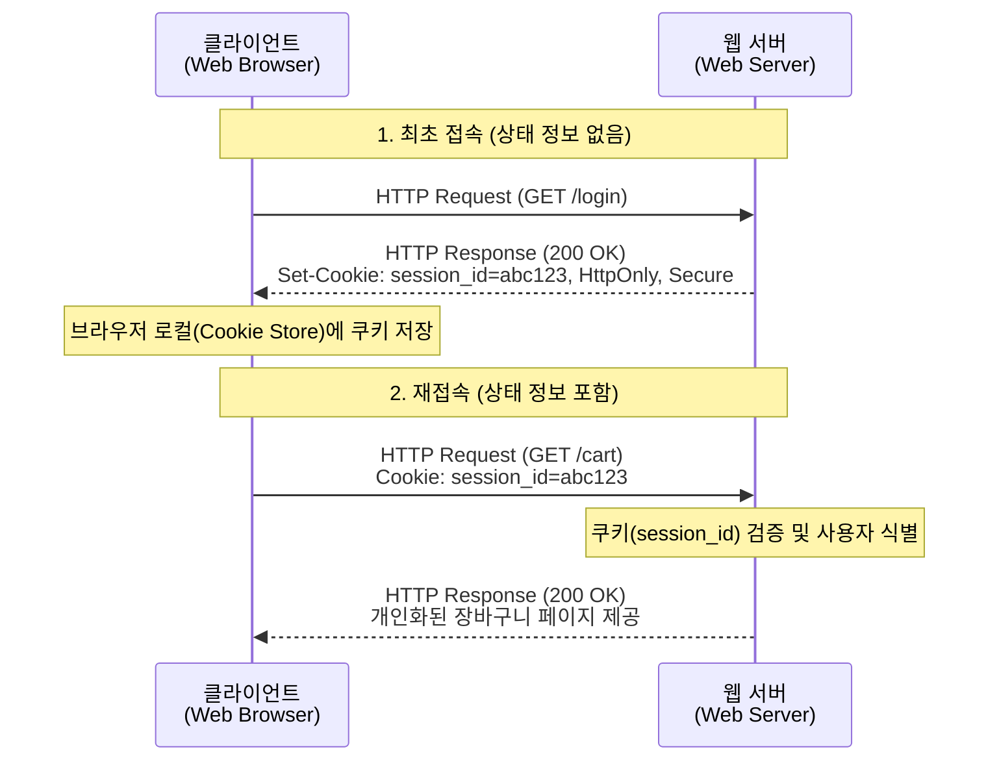

# HTTP 쿠키(Cookie)

---

## I. 상태 비저장(Stateless) 프로토콜의 한계 극복, HTTP 쿠키의 개요

* **정의**: HTTP의 무상태(Stateless) 및 비연결성(Connectionless) 특성을 보완하기 위해, 웹 서버가 클라이언트(브라우저)에 전송하여 로컬에 저장한 뒤 이후 요청 시 함께 서버로 재전송하는 소규모 상태 정보 데이터 파일
* **등장배경 및 특징**:
* **상태 유지(State Management)**: 로그인 [[세션]] 관리, 장바구니 유지, 사용자 개인화 설정 등 연속적인 웹 서비스 경험 제공 필수
* **보안 위협 노출**: 평문 전송 시 스니핑, 스크립트를 통한 [[XSS]](Cross-Site Scripting), [[CSRF]] 등의 공격에 취약하여 방어 속성 적용 필요
* **프라이버시 이슈 대두**: 서드파티 쿠키(3rd Party Cookie)를 활용한 사용자 추적으로 인해 글로벌 개인정보보호 규제(GDPR 등) 강화

---

## II. 쿠키의 아키텍처 및 핵심 기술 요소

### 가. 쿠키의 발급 및 동작 원리

* 서버는 응답 헤더의 `Set-Cookie`를 통해 쿠키를 생성하고, 클라이언트는 이후 동일 도메인 요청 시 마다 `Cookie` 헤더에 해당 값을 자동으로 포함하여 전송함

### 나. 쿠키의 핵심 속성 및 보안 기술 요소

| 구분 | 요소기술(키워드) | 세부 설명 |
| --- | --- | --- |
| **통신 규격** | Set-Cookie / Cookie | 서버가 클라이언트에게 상태 저장을 지시하는 응답 헤더(`Set-Cookie`)와 브라우저가 서버로 상태를 전달하는 요청 헤더(`Cookie`) |
| **생명 주기** | [[Session Layer|Session]] / Persistent | 만료일(`Expires` 또는 `Max-Age`) 설정 유무에 따라 브라우저 종료 시 삭제되는 세션 쿠키와 디스크에 저장되는 영속 쿠키로 구분 |
| **유효 범위** | Domain / Path | 쿠키가 유효하여 전송될 수 있는 목적지 도메인(URI)과 특정 디렉터리 경로를 제한하여 불필요한 정보 노출 방지 |
| **보안(XSS 방어)** | HttpOnly | 자바스크립트(`document.cookie`)를 통한 쿠키 접근을 원천 차단하여 XSS([[크로스 사이트 스크립팅]]) 공격에 의한 탈취 방지 |
| **보안(스니핑 방어)** | Secure | 암호화된 통신 채널인 HTTPS 연결 시에만 브라우저가 쿠키를 서버로 전송하도록 강제하여 네트워크 스니핑 방어 |
| **보안(CSRF 방어)** | SameSite | 크로스 도메인 요청 시 쿠키 전송을 제한(`Strict`, `Lax`, `None`)하여 CSRF(크로스 사이트 요청 위조) 공격 방어 |
| **발급 주체** | 1st Party Cookie | 사용자가 현재 방문 중인 웹사이트 도메인과 직접 일치하는 서버에서 발급한 쿠키 (주요 기능 유지 목적) |
| **발급 주체** | 3rd Party Cookie | 방문 중인 도메인이 아닌, 광고 네트워크 등 외부 도메인에서 발급한 쿠키 (크로스 사이트 트래킹 목적) |

---

## III. 웹 스토리지(Web Storage)와의 비교 및 최신 동향

### 가. 쿠키와 HTML5 웹 스토리지 비교

| 비교 항목 | Cookie (쿠키) | Local Storage (로컬 스토리지) | Session Storage (세션 스토리지) |
| --- | --- | --- | --- |
| **저장 용량** | 도메인 당 최대 4KB | 도메인 당 약 5MB 이상 | 도메인 당 약 5MB 이상 |
| **서버 전송 여부** | HTTP 요청 시마다 헤더에 자동 포함 (트래픽 유발) | 클라이언트에만 저장 (서버 자동 전송 안 됨) | 클라이언트에만 저장 (서버 자동 전송 안 됨) |
| **생명 주기** | 만료일(Expires)에 따라 다름 | 사용자가 직접 삭제하기 전까지 영구 보존 | 브라우저 탭/윈도우 종료 시 즉시 삭제 |
| **주요 용도** | 서버 연동 세션 관리, 인증 토큰 저장 | 사용자 UI 설정 유지, 대용량 캐시 데이터 | 일회성 입력 폼 저장, 탭 단위 고립 데이터 |

### 나. 향후 전망 및 기술 동향

* **서드파티 쿠키(3rd Party Cookie)의 종말**: 개인정보보호 강화 흐름에 따라 주요 브라우저(Safari, Firefox)에서 기본 차단 적용 중이며, 구글 크롬 또한 프라이버시 [[샌드박스]](Privacy Sandbox) 기반의 대체 기술 전환 추진
* **토큰 기반 인증 트렌드 가속화**: 쿠키/세션 기반의 서버 종속적 인증에서 벗어나, 무상태성을 극대화하는 JWT([[JSON]] Web Token) 및 OAuth 2.0 기반의 제로 트러스트([[제로 트러스트 보안모델|Zero Trust]]) 인증 아키텍처로 엔터프라이즈 환경 전환 중

---

### 🔗 연관 토픽

- **소속 도메인**: [[00_네트워크_MOC|🌐 네트워크]]
- **세부 분류**: `1. OSI 7계층 & 데이터링크 계층 (L1/L2)`
- **핵심 연관 토픽**:
  - [[세션]]
  - [[Session Layer|Session]]
  - [[크로스 사이트 스크립팅]]
  - [[CSRF]]
  - [[XSS]]
