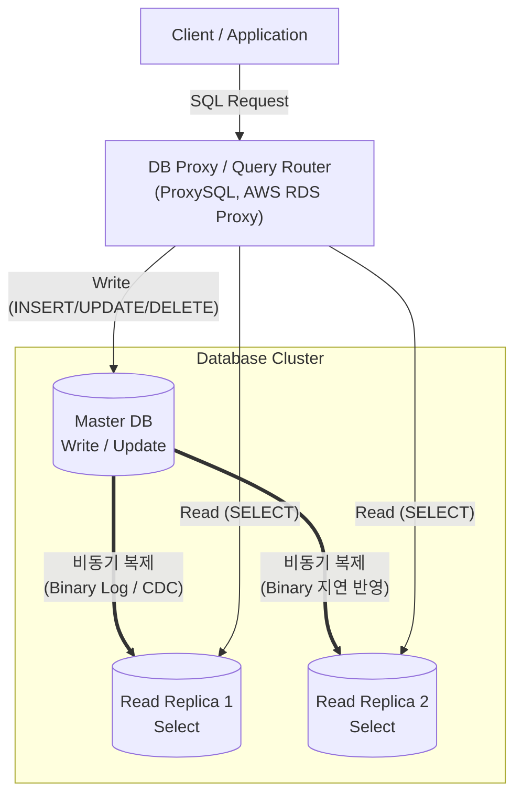

# 쿼리 오프로딩(Query Offloading)

---

## I. 대용량 DB 트랜잭션 부하 분산 기법, 쿼리 오프로딩의 개요

* **정의**: 데이터베이스의 처리 부하를 분산하기 위해 쓰기(Write/Update) 트랜잭션은 마스터(Master) DB로, 읽기(Read/Select) 쿼리는 읽기 전용 복제본(Read Replica)으로 분리하여 처리하는 [[데이터베이스]] 성능 최적화 아키텍처
* **필요성 및 등장배경**:
* **병목현상 해소**: 단일 Primary DB에 집중되는 대량의 조회 요청으로 인한 디스크 I/O 및 [[CPU]] 부하 경감
* **[[트랜잭션]] 지연 방지**: 무거운 통계/집계(Select) 쿼리로 인한 테이블 락(Lock) 경합 및 쓰기 작업 지연 차단
* **시스템 확장성 확보**: 읽기 트랜잭션 비율이 높은 서비스(예: 이커머스, 포털)에서 Scale-out을 통한 전체 [[처리량]](Throughput) 극대화

* **특징**: R/W Splitting(읽기/쓰기 분리), 데이터 비동기 복제(Asynchronous Replication), CQRS 패턴과 연계 적용 가능

---

## II. 쿼리 오프로딩의 개념도 및 핵심 기술 요소

### 가. 쿼리 오프로딩의 개념도 및 동작 원리

* **동작 원리**: 클라이언트의 [[SQL(Structured Query Language)|SQL]] 요청을 프록시나 [[라우터]] 계층에서 파싱(Parsing)하여, [[DML]] 유형(CUD vs R)에 따라 Master DB 또는 Slave DB(Replica) 그룹으로 부하 분산(Load Balancing) 및 분기 라우팅 수행

### 나. 쿼리 오프로딩의 핵심 기술 요소

| 구분 | 요소기술(키워드) | 세부 설명 |
| --- | --- | --- |
| **쿼리 분기** | Read/Write Splitting | SQL 문장을 분석하여 변경(Write) 및 조회(Read) 목적의 쿼리를 물리적으로 다른 DB 노드로 분배 |
| **인프라 라우팅** | Proxy-based Routing | 애플리케이션과 DB 사이에 미들웨어(ProxySQL, MaxScale 등)를 두어 투명한 쿼리 라우팅 제공 |
| **로직 라우팅** | App-based Routing | [[프레임워크]](Spring `AbstractRoutingDataSource` 등)를 활용하여 코드 레벨에서 DataSource 동적 전환 |
| **데이터 동기화** | Asynchronous Replication | Master DB의 트랜잭션 로그(BinLog, WAL)를 Slave 노드로 전송 및 재현하여 데이터 일관성 유지 |
| **지연 제어** | Replication Lag Monitoring | 네트워크 문제 등으로 복제 지연(Lag) 임계치 초과 시, 데이터 정합성을 위해 Master 직접 조회 우회 처리 |
| **부하 분산** | Load Balancing | 다수의 Read Replica 간 라운드로빈, Least Connection 알고리즘을 적용하여 조회 부하를 균등하게 배분 |
| **[[HA(High Availability)|고가용성]]** | Auto Failover (MHA/MMM) | Master DB 장애 발생 시 대기 중인 Slave를 새로운 Master로 자동 승격(Promotion)시켜 무중단 서비스 제공 |
| **상태 관리** | Health Check & Eviction | Replica 노드의 가용 상태를 주기적으로 확인하여, 응답 지연이나 장애 발생 시 라우팅 대상 풀에서 즉시 제외 |

---

## III. 쿼리 오프로딩 적용 방식 비교 및 향후 전망

### 가. 쿼리 오프로딩 라우팅 구현 방식 비교

| 비교 항목 | Proxy 기반 라우팅 (Middleware) | Application 기반 라우팅 (Code-level) |
| --- | --- | --- |
| **주요 솔루션/기술** | ProxySQL, MySQL Router, AWS RDS Proxy | Spring AbstractRoutingDataSource, MyBatis |
| **아키텍처 위치** | 애플리케이션 ↔ DB 사이의 별도 네트워크 인프라 | 애플리케이션 소스 코드 및 프레임워크 내부 |
| **장점 (확장성)** | DB 토폴로지 변경 시 애플리케이션 무중단/무수정 대응 가능 | 별도의 Proxy 인프라 구축 및 [[유지보수]] 비용 불필요 |
| **단점 (복잡도)** | 단일 장애점(SPOF) 방지를 위한 Proxy 자체의 이중화 필수 | DB 노드 증설/변경 시 애플리케이션 설정 변경 및 재배포 필요 |

### 나. 향후 전망 및 동향

* **매니지드 서비스 내재화**: 최근 [[클라우드 네이티브]] 환경(AWS Aurora, GCP Cloud SQL 등)에서는 인프라 레벨의 복잡성을 줄이기 위해 읽기 엔드포인트(Read Endpoint) 및 프록시 풀링 기능을 클라우드 플랫폼에서 기본 탑재하여 제공하는 추세임
* **CQRS 패턴으로의 진화**: 단순한 데이터베이스 계층의 R/W 분리를 넘어, 마이크로서비스([[MSA (Micro Service Architecture)|MSA]]) 아키텍처 환경에서는 Command(명령/쓰기) 모델과 Query(조회) 모델 자체를 물리적/논리적으로 완전히 분리하여 이벤트 소싱(Event Sourcing)과 결합하는 CQRS 패턴으로 고도화되고 있음

---

### 🔗 연관 토픽

- **소속 도메인**: [[00_데이터베이스_MOC|🗄️ 데이터베이스]]
- **세부 분류**: `2. 트랜잭션 & 동시성 제어 (Concurrency)`
- **핵심 연관 토픽**:
  - [[트랜잭션]]
  - [[DML]]
  - [[데이터베이스]]
  - [[프레임워크]]
  - [[클라우드 네이티브]]
