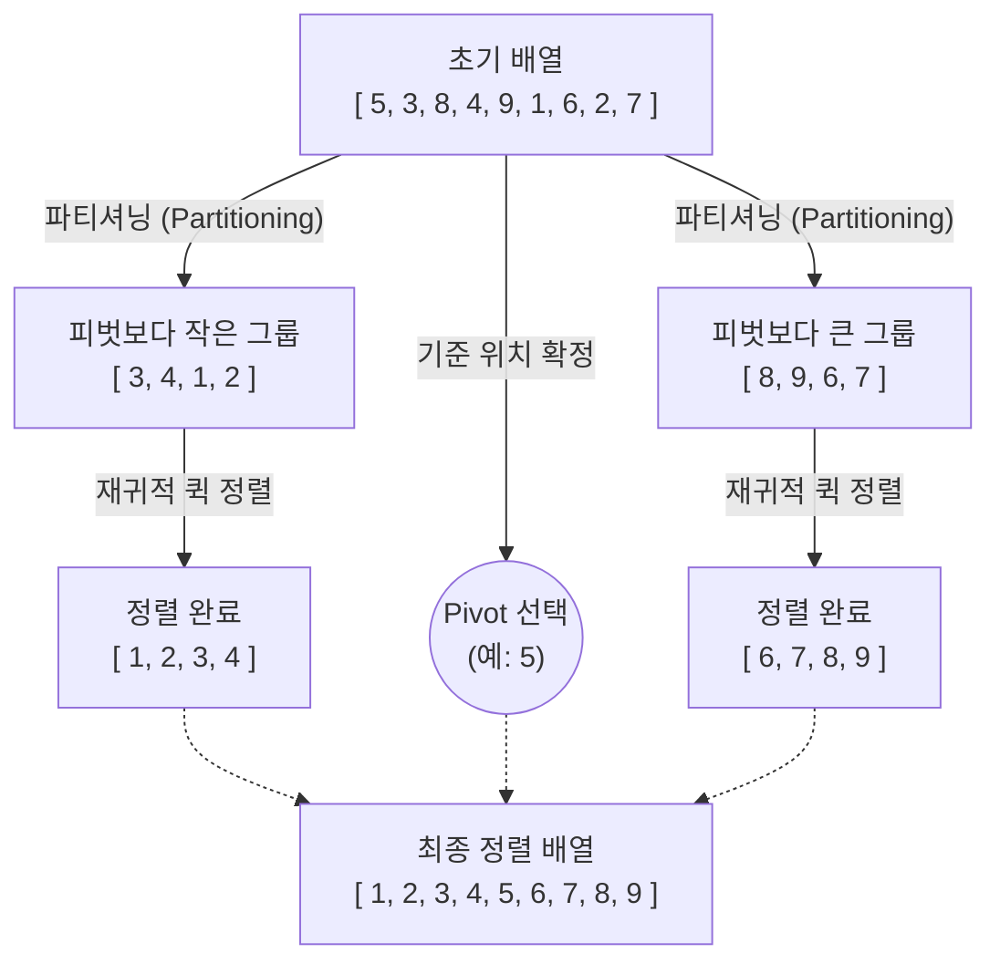

# 퀵 정렬 (Quick Sort)

---

## I. 분할 정복 기반의 고속 정렬 알고리즘, 퀵 정렬의 개요

* **정의**: 임의의 기준값인 피벗(Pivot)을 설정하여 배열을 두 부분으로 분할하고, 각 부분을 재귀적으로 정렬하여 최종적으로 전체 데이터를 정렬하는 불안정(Unstable) 분할 정복(Divide and Conquer) 정렬 [[알고리즘]]
* **등장 배경 및 특징**:
* **실측 성능의 우수성**: 평균 시간복잡도 O(n log n)을 가지며, 하드웨어의 [[캐시 메모리]] 친화적인 특성으로 인해 실제 응용 환경에서 가장 빠른 정렬 성능 제공
* **메모리 효율성 극대화**: 추가적인 배열 공간을 할당하지 않는 제자리 정렬(In-place Sort) 방식으로 메모리 오버헤드 최소화 (단, 재귀 호출을 위한 스택 메모리 O(log n) 필요)
* **성능 저하 리스크**: 피벗 선택 방식에 따라 불균형 분할이 발생할 경우, 최악의 시간복잡도 O(n²)로 성능이 급격히 저하될 수 있는 한계 존재

---

## II. 퀵 정렬의 아키텍처 및 핵심 구성요소

### 가. 퀵 정렬의 동작 원리

* **동작 원리**: 피벗(Pivot)을 기준으로 좌측은 피벗보다 작은 값, 우측은 큰 값으로 분할(Partitioning)한 뒤, 분할된 서브 리스트에 대해 재귀적(Recursive)으로 분할과 정렬을 반복하여 데이터 집합을 완성함

### 나. 퀵 정렬의 핵심 기술 요소

| 구분 | 요소기술(키워드) | 세부 설명 |
| --- | --- | --- |
| **설계 패러다임** | 분할 정복 (Divide & Conquer) | 하향식(Top-down)으로 문제를 더 이상 분할할 수 없을 때까지 나누어 독립적으로 해결 |
| **기준 원소** | 피벗 (Pivot) | 배열을 두 부분으로 분할하기 위한 기준값 (첫 번째, 마지막, 중간, 난수 등 선택 기법 다양) |
| **분할 기법** | [[파티셔닝]] (Partitioning) | 2개의 포인터(Left, Right)를 교차 이동하며 피벗보다 작은 값과 큰 값을 교환하는 핵심 로직 |
| **메모리 최적화** | 제자리 정렬 (In-place Sort) | 데이터 정렬 과정에서 원본 배열 안에서 위치 교환만 발생하여 별도의 대규모 데이터 복사 불필요 |
| **호출 기법** | 재귀 호출 (Recursive Call) | 분할된 좌/우측 부분 배열에 대해 퀵 정렬 함수를 자기 참조 형태로 반복 호출 |
| **평균 성능** | O(n log n) | 피벗을 통해 배열이 균등하게 분할될 경우, 트리 깊이 log n과 각 레벨 당 n번의 비교 수행 |
| **최악 성능** | O(n²) | 배열이 이미 정렬되어 있거나 역정렬된 상태에서 최솟/최댓값을 피벗으로 반복 선택하여 비대칭 분할 발생 시 |
| **데이터 순서** | 불안정 정렬 (Unstable Sort) | 키 값이 같은 데이터들의 상대적인 초기 순서가 파티셔닝 중의 교환 연산으로 인해 유지되지 않음 |

---

## III. 퀵 정렬과 병합 정렬 비교 및 최적화 동향

### 가. 퀵 정렬 vs 병합 정렬(Merge Sort) 비교

| 비교 항목 | 퀵 정렬 (Quick Sort) | [[병합 정렬|병합 정렬 (Merge Sort)]] |
| --- | --- | --- |
| **설계 접근 방식** | 피벗 기준 분할 후 정렬 수행 (하향식) | 개별 단위로 분할 후 병합하면서 정렬 (상향식) |
| **시간 복잡도** | 평균: O(n log n), **최악: O(n²)** | 항상 O(n log n) 보장 |
| **공간 복잡도** | O(log n) (재귀 호출용 콜 스택 메모리) | O(n) (병합 시 임시 보관용 추가 배열 필요) |
| **안정성 (Stability)** | Unstable (불안정 정렬) | Stable (안정 정렬) |
| **주요 활용 분야** | C/C++ 내부 정렬(qsort), 범용 고속 정렬 | Linked List 정렬, [[데이터베이스]] 외부 정렬(External Sort) |

### 나. 퀵 정렬의 최악 성능 한계 극복 및 최적화 기법

* **피벗 선택 최적화 (Median-of-Three)**: 배열의 첫 번째, 중간, 마지막 값 중 중앙값을 피벗으로 선택하여 최악의 비대칭 분할(O(n²))을 방지하고 균형 잡힌 파티셔닝 유도
* **난수화 (Randomized Quick Sort)**: 피벗을 난수 생성기를 통해 무작위 인덱스에서 선택하여, 입력 데이터의 초기 정렬 상태와 무관하게 평균 시간 복잡도를 보장
* **하이브리드 정렬 (IntroSort 적용)**: 재귀 깊이가 일정 수준을 초과하면 힙 정렬(Heap Sort)로 전환하고, 분할된 배열 크기가 작아지면 캐시 지역성이 좋은 [[삽입 정렬]](Insertion Sort)로 전환하는 기법으로, 현대 C++ STL(`std::sort`) 등에서 표준으로 채택됨

---

### 🔗 연관 토픽

- **소속 도메인**: [[00_컴퓨터구조_MOC|💻 컴퓨터구조]]
- **세부 분류**: `2. 캐시 & 메모리 계층 구조 · 스토리지`
- **핵심 연관 토픽**:
  - [[병합 정렬|병합 정렬 (Merge Sort)]]
  - [[알고리즘]]
  - [[삽입 정렬|삽입 정렬 (Insertion Sort)]]
  - [[O-Notation (O-표기법)]]
  - [[빅오 표기법|빅오 표기법 (O-Notation)]]
