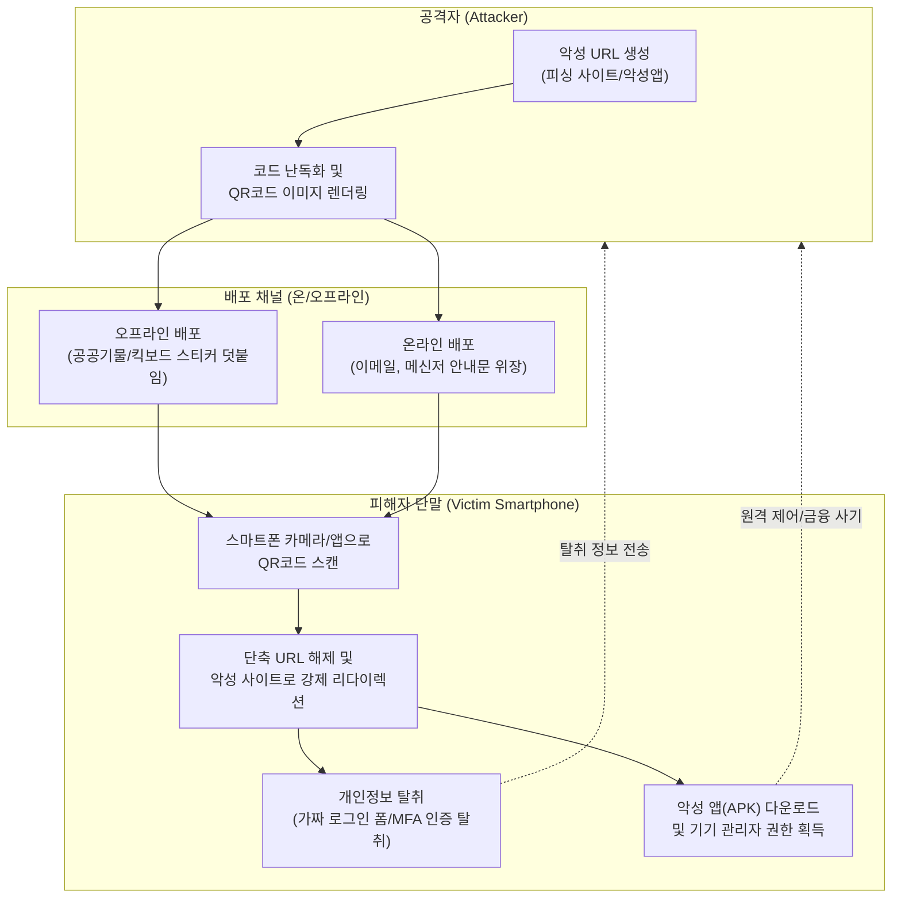

# 큐싱 (Qshing)

---

## I. 온·오프라인 융합형 신종 사이버 사기, 큐싱(Qshing)의 개요

* **정의**: QR코드(Quick Response Code)와 피싱(Phishing)의 합성어로, 사용자가 스마트폰으로 악성 QR코드를 스캔하도록 유도하여 악성 앱 설치 또는 가짜 웹사이트로 연결해 개인·금융 정보를 탈취하는 사이버 공격 기법
* **등장 배경**: 팬데믹 이후 결제, 인증, 공유 모빌리티 등 일상 속 QR코드 활용의 보편화 및 기존 텍스트 기반 피싱 차단 기술의 발전
* **특징**: 인간의 육안으로 진위(URL) 식별 불가, 오프라인(스티커 덧붙임)과 온라인(이메일 첨부)을 넘나드는 하이브리드 공격, 최신 [[난독화]] 및 우회 기술(Anti-Analysis) 적용

---

## II. 큐싱의 개념도 및 핵심 기술 요소

### 가. 큐싱의 아키텍처 및 동작 원리

* 공격자가 생성한 악성 QR코드를 사용자가 스캔하면, 보안 검결을 우회하는 난독화 스크립트를 거쳐 피싱 사이트로 접속되거나 백그라운드에서 악성 앱이 다운로드됨

### 나. 큐싱의 핵심 기술 및 구성 요소

| 분류 | 요소기술(키워드) | 세부 설명 |
| --- | --- | --- |
| **공격 준비** | 악성 QR 렌더링 | 피싱 URL, 악성코드 다운로드 링크를 포함한 고밀도 QR코드 매트릭스 생성 |
| **우회/은닉** | 스크립트 난독화 | Base64, [[AES]] 암호화를 적용하여 보안 솔루션의 악성 URL 및 페이로드 탐지 회피 |
| **우회/은닉** | Anti-Analysis | 분석 도구(Selenium) 및 디버깅 환경(단축키) 접근 시 빈 페이지로 강제 이동하여 분석 방해 |
| **유포 채널** | QR 오버레이 (Overlay) | 공유 킥보드, 메뉴판, 주차장 등 기존 정상 QR코드 위에 악성 스티커를 덧붙이는 기법 |
| **침투/실행** | Drive-by Download | 가짜 페이지 접속 시 사용자 인지 없이 백그라운드에서 악성 앱(APK) 자동 다운로드 및 실행 |
| **침투/실행** | 가짜 로그인 폼 | 공공기관, 포털 위장 페이지를 통해 계정 정보 및 다중 인증(MFA) [[세션]] 정보 실시간 탈취 |
| **권한 획득** | 기기 관리자 권한 획득 | 스마트폰 원격 제어 권한 탈취를 통해 기기 초기화 방해 및 백신 앱 무력화 |
| **피해 확산** | 통신 가로채기 (Interception) | SMS, 주소록 탈취를 통해 모바일 뱅킹 무단 결제/이체 수행 및 지인 대상 스미싱 재배포 |

---

## III. 큐싱의 비교 및 향후 전망

### 가. 유사 피싱 공격 기법 간 비교

| 비교 항목 | 스미싱 (Smishing) | 파밍 (Pharming) | 큐싱 (Qshing) |
| --- | --- | --- | --- |
| **공격 매개체** | SMS 문자 메시지, 메신저 | 악성코드 감염, [[DNS(Domain Name System)|DNS]] 변조 | 온/오프라인 QR코드 |
| **접근 유도 방식** | 메시지 내 단축 URL 클릭 유도 | 정상 URL 입력 시 가짜 사이트 유도 | 스마트폰 카메라 스캔 유도 |
| **식별 용이성** | 링크 텍스트 육안 식별 가능 (일부) | 육안 식별 불가능 (정상 도메인 위장) | **육안 식별 완벽히 불가능** (난수 매트릭스) |
| **주요 방어 수단** | 스팸 차단 앱, 텍스트 URL 필터링 | 백신 프로그램, 호스트 파일 [[무결성]] 검증 | **보안 QR 스캐너, 앱 설치 통제(MDM)** |

### 나. 큐싱의 동향 및 보안 대응 전략

* **최신 동향**: 마이크로소프트 등 기업용 다중 인증(MFA) 설정을 사칭한 이메일 내 큐싱 공격이 급증하며, 기업 내부망 침투를 위한 초기 거점으로 활용됨
* **개인적 대응**: 출처가 불분명하거나 스티커가 덧붙여진 QR코드 스캔 금지, 스캔 후 연결되는 브라우저 도메인의 무결성(HTTPS, 공식 도메인) 교차 검증, KISA '보호나라' 채널을 통한 사전 악성 여부 확인
* **기업적 대응**: 고객 대상 자사 전용 보안 QR코드 가이드라인 제공, 임직원 단말기(MDM)의 비인가 앱 설치 차단 및 망분리를 통한 내부 정보 유출 통제 강화

---

### 🔗 연관 토픽

- **소속 도메인**: [[00_보안_MOC|🛡️ 보안]]
- **세부 분류**: `3. 네트워크 & 엔드포인트 · 인프라 보안`
- **핵심 연관 토픽**:
  - [[난독화]]
  - [[AES]]
  - [[DNS(Domain Name System)]]
  - [[샌드박스|샌드박스 (Sandbox)]]
  - [[무결성]]
