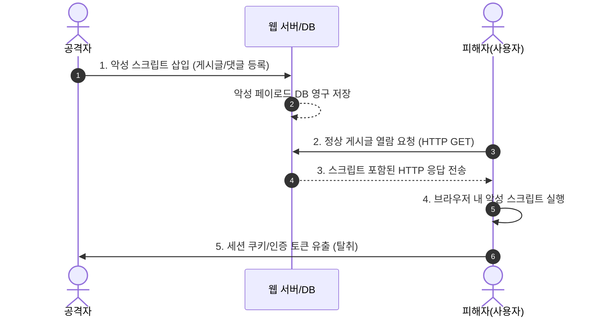

# 크로스 사이트 스크립팅 (XSS, Cross-Site Scripting)

---

## I. 웹 클라이언트 측 스크립트 삽입 공격, XSS의 개요

* **정의**: 웹 애플리케이션의 검증 취약점을 이용하여 악의적인 스크립트(JavaScript 등)를 사용자 브라우저에 주입·실행시켜 [[세션]] 탈취, 권한 획득, 악성코드 유포 등을 수행하는 웹 공격 기법
* **배경 및 특징**:
* 클라이언트 사이드 취약점: 서버가 아닌 피해자의 웹 브라우저 컨텍스트 내에서 스크립트 실행
* 위험성: [[쿠키]]/세션 하이재킹, 피싱 유도, 웹페이지 변조(Defacement), 브라우저 원격 제어

---

## II. XSS의 메커니즘 및 핵심 유형·보안 대책

### 가. XSS의 공격 메커니즘 (저장형 XSS 기준)

* 공격자가 저장한 악성 스크립트가 포함된 웹페이지를 사용자가 요청 시, 브라우저 해석 단계에서 자동 실행되어 권한 탈취 발생

### 나. XSS의 공격 유형 및 핵심 방어 기술 요소

| 구분 | 요소 기술/유형 | 세부 설명 |
| --- | --- | --- |
| **공격 유형** | Stored [[XSS]] | 악성 스크립트가 DB에 영구 저장되어 게시물 열람 시 불특정 다수에게 실행되는 공격 |
| **공격 유형** | Reflected XSS | URL 파라미터 등에 포함된 스크립트가 서버의 응답에 즉시 반사되어 사용자 브라우저에서 실행 |
| **공격 유형** | DOM-based XSS | 서버를 거치지 않고, 브라우저의 DOM 조작 과정(`eval()`, `innerHTML`)에서 악성 스크립트 실행 |
| **입력 검증** | Whitelist Validation | 허용된 태그 및 문자열 집합만 통과시키고, 위험 패턴(특수문자 등)을 차단/정규화 |
| **출력 처리** | HTML Entity 변환 | 특수문자 치환(`<` $\rightarrow$ `&lt;`, `>` $\rightarrow$ `&gt;`, `"` $\rightarrow$ `&quot;`, `'` $\rightarrow$ `&#x27;`)을 통한 태그 무효화 |
| **브라우저 보안** | Content Security Policy ([[CSP]]) | 브라우저가 신뢰할 수 있는 소스의 스크립트만 로드/실행하도록 제한하는 HTTP 헤더 |
| **브라우저 보안** | HttpOnly Cookie | `document.cookie`를 통한 스크립트 기반 쿠키 접근을 원천 차단하여 세션 하이재킹 방어 |
| **보안 [[프레임워크]]** | Modern UI Framework | React(JSX auto-escaping), Angular 등 내장 자동 이스케이프 지원 프레임워크 활용 |

---

## III. XSS vs CSRF 비교 및 최신 대응 트렌드

### 가. XSS와 CSRF의 핵심 비교

| 비교 항목 | XSS (Cross-Site Scripting) | [[CSRF]] (Cross-Site Request Forgery) |
| --- | --- | --- |
| **공격 목적** | 클라이언트 브라우저 내 악성 스크립트 실행 및 정보 탈취 | 인증된 사용자의 권한을 도용하여 비인가 요청([[트랜잭션]]) 유도 |
| **공격 대상** | 사용자 클라이언트 (웹 브라우저 컨텍스트) | 사용자 인증 상태를 신뢰하는 웹 애플리케이션 서버 |
| **실행 주체** | 브라우저 내에서 자바스크립트 엔진이 페이로드 실행 | 브라우저가 사용자 인증 세션(쿠키 등)을 실어 서버로 전송 |
| **방어 메커니즘** | HTML 입출력 필터링, Contextual Encoding, CSP | CSRF Token 검증, SameSite Cookie(`Strict`/`Lax`), 재인증 유도 |

### 나. 최신 동향 및 적용 방향

* **심층 방어(Defense in Depth)**: 단순 특수문자 치환을 넘어 정적 CSP 3.0(Nonce/Hash 기반) 적용 및 프레임워크 수준의 안전한 DOM 조작 의무화
* **Secure by Design**: 개발 생명주기([[DevSecOps]]) 내 [[SAST]]/[[DAST]] 자동화 도구를 연동하여 신규 배포 파이프라인에서 입력 검증 취약점 원천 제거

---

### 🔗 연관 토픽

- **소속 도메인**: [[00_보안_MOC|🛡️ 보안]]
- **세부 분류**: `2. 현대 암호학 & 키 관리 · 전자서명`
- **핵심 연관 토픽**:
  - [[쿠키]]
  - [[XSS]]
  - [[CSRF]]
  - [[DevSecOps]]
  - [[DAST]]
