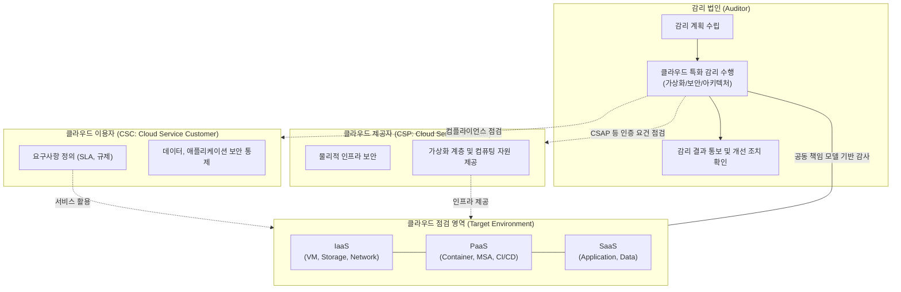

# 클라우드 감리 (Cloud Audit)

---

## I. 안전한 클라우드 전환과 운영을 위한 통제 체계, 클라우드 감리의 개요

* **정의**: [[클라우드 컴퓨팅]] 환경(IaaS, [[PaaS]], SaaS)의 도입, 구축, 운영 전반에 걸쳐 정보시스템의 효율성, 안전성, [[신뢰성]], 보안성을 확보하기 위해 객관적으로 점검하고 평가하는 체계적인 감사 및 통제 활동
* **등장 배경**: [[클라우드 네이티브]](Cloud Native) 전환 가속화, 공동 책임 모델(Shared Responsibility Model)에 따른 보안 경계 모호, 멀티/하이브리드 클라우드 확산에 따른 컴플라이언스([[CSAP]], [[ISMS-P]] 등) 준수 요구 증대
* **특징**: 공동 책임 모델 기반 점검([[CSP]]와 CSC의 역할 분리), [[가상화]]/[[컨테이너]](K8s) 영역 등 논리적 자원 집중 통제, 동적 자원(Auto-scaling) 평가, [[SLA]](Service Level Agreement) 기반 서비스 품질 측정

---

## II. 클라우드 감리의 개념도 및 핵심 기술 요소

### 가. 클라우드 감리의 아키텍처 및 동작 원리

* 감리 법인은 클라우드 이용자(CSC)와 제공자(CSP) 간의 **공동 책임 모델**을 기반으로, 논리적 가상화 인프라부터 애플리케이션 영역까지 서비스 전반의 적정성을 점검함

### 나. 클라우드 감리의 핵심 점검 및 기술 요소

| 구분 | 요소기술(키워드) | 세부 설명 |
| --- | --- | --- |
| **거버넌스** | SLA 점검 | [[HA(High Availability)|가용성]](Uptime), [[응답시간]] 등 클라우드 서비스 수준 협약 준수 여부 평가 |
| **거버넌스** | 컴플라이언스 | CSAP(클라우드 보안인증), ISMS-P, GDPR 등 법적/규제 요건 부합성 확인 |
| **아키텍처** | 클라우드 네이티브 | [[MSA (Micro Service Architecture)|MSA]](Microservices), 컨테이너(K8s), 서버리스(Serverless) 아키텍처 적정성 점검 |
| **아키텍처** | 자원 탄력성 | Auto-scaling 정책, Load Balancing 설정 및 부하 테스트를 통한 확장성 검증 |
| **보안** | 공동 책임 모델 | CSP(물리/가상화 인프라)와 CSC(데이터/앱) 간의 보안 책임 영역 명확화 및 통제 점검 |
| **보안** | [[IAM]] (접근통제) | [[제로 트러스트 보안모델|Zero Trust]] 기반의 권한 관리, 망분리(VPC), 다중 인증(MFA) 적용 여부 점검 |
| **데이터** | [[암호화]] 및 백업 | 데이터 전송(TLS 1.3) 및 저장([[KMS]] 연동) 암호화, 재해복구(DR) 체계 구축 여부 |
| **운영** | CI/CD 및 모니터링 | 배포 파이프라인([[DevSecOps]]) [[무결성]], CloudWatch 등 통합 로깅/모니터링 체계 점검 |

---

## III. 전통적 정보시스템 감리와 클라우드 감리의 비교 및 향후 전망

### 가. 전통적 감리와 클라우드 감리의 비교

| 비교 항목 | 전통적 [[정보시스템 감리]] | 클라우드 감리 (Cloud Audit) |
| --- | --- | --- |
| **대상 인프라** | On-Premise 기반 물리적 서버 및 네트워크 | IaaS, PaaS, SaaS 기반 논리적/가상화 자원 |
| **보안/운영 책임** | 발주기관(정보시스템 구축/운영자) 단독 책임 | CSP 및 CSC **공동 책임 모델 (Shared Responsibility)** |
| **성능/확장성 평가** | HW 스펙 기반 Scale-Up 위주 점검 | **자원 탄력성(Auto-scaling) 기반 Scale-Out 위주 점검** |
| **주요 기준/지침** | 정보시스템 감리 수행 가이드라인 | 클라우드 컴퓨팅 서비스 정보보호 기준(CSAP), 행안부 지침 |
| **점검 도구/방식** | 시스템 직접 접근 및 물리적 구성 점검 | **API 기반 점검, 관리 콘솔 및 템플릿(IaC) 설정 검증** |

### 나. 클라우드 감리의 향후 전망 및 발전 방향

* **상시 감사(Continuous Auditing) 체계 전환**: 클라우드 인프라의 동적 특성을 반영하여, 구축 시점의 일회성 감리를 넘어 CSPM([[CWPP & CSPM|Cloud Security Posture Management]]) 등 자동화 도구를 활용한 상시 모니터링 및 감사 체계로 발전
* **DevSecOps 기반 IaC 감리 도입**: 인프라가 코드(Infrastructure as Code)로 관리됨에 따라, 런타임 이전 CI/CD 파이프라인 단계에서 보안 취약점과 설정 오류(Misconfiguration)를 사전 점검하는 시프트 레프트(Shift-Left) 감리 모델 확산

---

### 🔗 연관 토픽

- **소속 도메인**: [[00_프로젝트관리_MOC|📋 프로젝트관리]]
- **세부 분류**: `4. 품질 보증 · 위험 관리 & 정보시스템 감리`
- **핵심 연관 토픽**:
  - [[무결성]]
  - [[클라우드 네이티브]]
  - [[신뢰성]]
  - [[컨테이너|컨테이너 (Container)]]
  - [[CSP|CSP (Cloud Service Provider)]]
