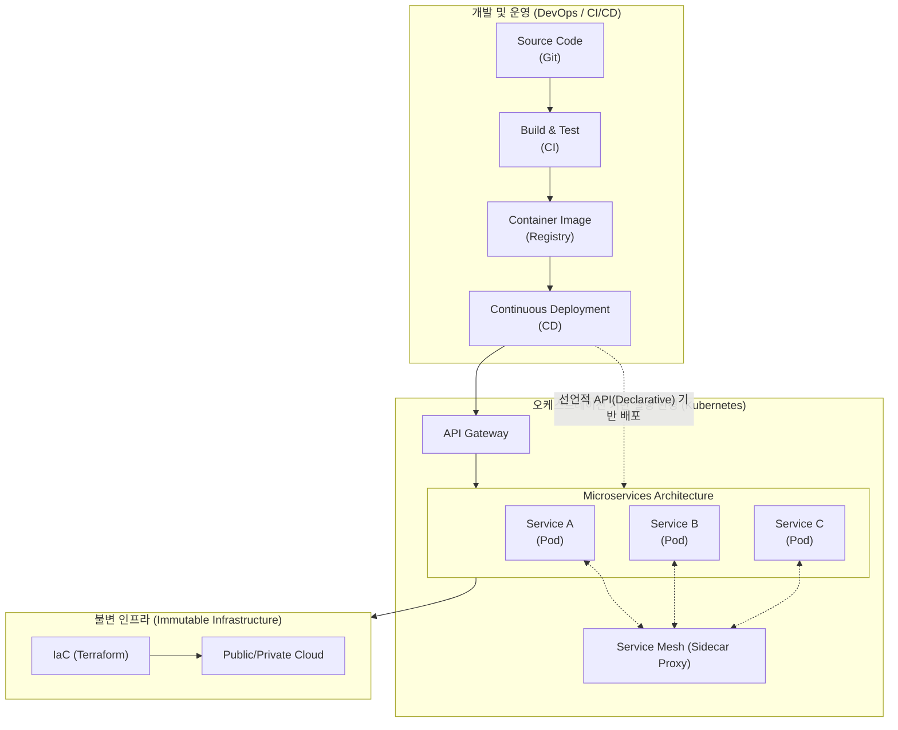

# 클라우드 네이티브 (Cloud Native)

---

## I. 비즈니스 민첩성 확보를 위한 차세대 아키텍처, 클라우드 네이티브의 개요

* **정의**: [[클라우드 컴퓨팅]] 모델의 장점(확장성, 유연성)을 최대한 활용하기 위해, 애플리케이션을 독립적인 모듈로 구축하고 자동화된 환경에서 배포 및 운영하는 소프트웨어 개발 접근 방식
* **등장 배경**: 급변하는 비즈니스 환경에 따른 TTM(Time to Market) 단축 요구, 기존 모놀리식(Monolithic) 시스템의 확장성 한계 극복, 멀티/하이브리드 클라우드 환경 도입 가속화
* **특징**: 민첩성(Agility) 및 탄력성(Elasticity) 확보, [[무중단 배포]], 벤더 종속성(Lock-in) 최소화(이식성 보장), 결함 격리(Fault Isolation)를 통한 [[HA(High Availability)|고가용성]] 제공

---

## II. 클라우드 네이티브의 개념도 및 핵심 기술 요소

### 가. 클라우드 네이티브의 개념도 및 동작 원리

* 개발자 코드는 CI/CD 파이프라인을 거쳐 컨테이너 이미지로 패키징되며, 선언적 API를 통해 [[쿠버네티스]](K8s) 클러스터 상의 마이크로서비스([[MSA (Micro Service Architecture)|MSA]])로 자동 배포되고 운영됨

### 나. 클라우드 네이티브의 4대 핵심 기술 및 구성 요소

| 구분 | 요소기술(키워드) | 세부 설명 |
| --- | --- | --- |
| **아키텍처** | 마이크로서비스 (MSA) | 애플리케이션을 비즈니스 기능 단위의 독립적으로 배포 가능한 소규모 서비스로 분할 |
| **패키징** | [[컨테이너|컨테이너 (Container)]] | OS 레벨 가상화로 애플리케이션과 종속 라이브러리를 하나로 묶어 이식성 및 일관성 보장 |
| **운영/관리** | 오케스트레이션 (K8s) | 수많은 컨테이너의 배포, 스케일링, 로드 밸런싱, 자동 복구(Self-healing) 등을 자동 관리 |
| **문화/[[프로세스]]** | [[DevOps]] & CI/CD | 개발(Dev)과 운영(Ops)을 통합하여 지속적 통합(CI) 및 지속적 배포(CD) 파이프라인 구축 |
| **통신/보안** | 서비스 매시 (Service Mesh) | 사이드카(Sidecar) 패턴을 통해 마이크로서비스 간 통신, 라우팅, 보안, 모니터링을 [[추상화]] |
| **인프라 관리** | 불변 인프라 (Immutable) | 실행 중인 서버의 상태를 수정하지 않고, 변경 필요 시 새로운 인스턴스를 생성하여 교체 |
| **자동화** | IaC (Infra as Code) | 테라폼(Terraform) 등을 활용하여 인프라 프로비저닝을 코드로 정의하고 버전 관리 |
| **인터페이스** | 선언적 API (Declarative API) | 시스템의 '원하는 상태(Desired State)'를 명시하면 시스템이 자동으로 현재 상태를 일치시킴 |

---

## III. 클라우드 네이티브와 클라우드 기반(Lift & Shift) 비교 및 향후 전망

### 가. 클라우드 이행 방식 비교 (Cloud Native vs Cloud Based)

| 비교 항목 | Cloud Based (Lift & Shift) | Cloud Native (Re-architecture) |
| --- | --- | --- |
| **기본 개념** | 기존 레거시 시스템을 그대로 클라우드로 이전 | 클라우드 환경에 최적화하여 시스템 재설계 및 구축 |
| **아키텍처** | 모놀리식 (Monolithic) 아키텍처 | 마이크로서비스 (Microservices) 아키텍처 |
| **인프라 환경** | 가상 머신 (VM) 기반 | 컨테이너 (Container), 서버리스 (Serverless) 기반 |
| **인프라 상태** | 가변 인프라 (Mutable, 패치/업데이트 수행) | **불변 인프라 (Immutable, 폐기 후 재생성)** |
| **배포/운영** | 수동 배포, 정기 점검/업데이트 | **CI/CD 파이프라인을 통한 무중단 자동 배포** |

### 나. 클라우드 네이티브의 향후 전망 및 최신 동향

* **Kube-Native AI의 부상**: AI/ML 워크로드를 쿠버네티스 위에서 직접 실행하고 관리하기 위한 [[MLOps]] 통합 및 [[스케줄링]] 기술(KubeFlow 등) 적용 확대
* **WebAssembly (Wasm) 도입**: 컨테이너보다 가볍고 빠른 콜드 스타트(Cold Start)를 지원하는 Wasm이 클라우드 네이티브 런타임의 새로운 대안으로 부상
* **FinOps 거버넌스 내재화**: 동적 자원 할당으로 인한 클라우드 비용 낭비를 방지하기 위해, 개발-운영-재무 조직이 협업하는 FinOps(비용 최적화) [[프레임워크]] 적용 필수화

---

### 🔗 연관 토픽

- **소속 도메인**: [[00_디지털서비스_MOC|🚀 디지털서비스]]
- **세부 분류**: `1. 클라우드 컴퓨팅 & 가상화 인프라`
- **핵심 연관 토픽**:
  - [[쿠버네티스|쿠버네티스(Kubernates)]]
  - [[클라우드 컴퓨팅|클라우드 컴퓨팅 (Cloud Computing)]]
  - [[컨테이너|컨테이너 (Container)]]
  - [[MSA (Micro Service Architecture)]]
  - [[추상화|추상화 (Abstraction)]]
