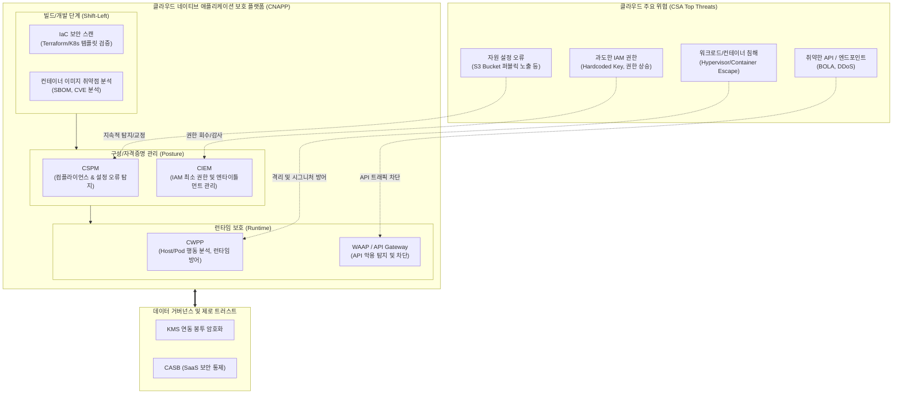

# 클라우드 컴퓨팅 취약점 및 대응기술

---

## I. 공유 환경의 보안 경계 확장, 클라우드 컴퓨팅 취약점 및 대응기술의 개요

* **정의**: 클라우드 자원의 다중 테넌시(Multi-Tenancy), 동적 확장성 및 API 의존성으로 인해 발생하는 보안 취약점을 식별·분석하고, 이를 예방·탐지·대응하기 위한 클라우드 특화 보안 기술 체계
* **부각 배경**: [[클라우드 네이티브]] 전환에 따른 공격 표면(Attack Surface) 급증, 공동 책임 모델(Shared Responsibility Model) 하의 설정 오류(Misconfiguration) 빈발, 전통적 경계 보안(Perimeter) 한계 직면
* **특징**: 소프트웨어 정의 인프라(IaC) 대상 Shift-Left 보안 적용, [[제로 트러스트 보안모델|Zero Trust]] 기반의 최소 권한 통제, 단일 플랫폼 기반 통합 가시성(CNAPP) 확보 중심 패러다임 전환

---

## II. 클라우드 컴퓨팅 위협 모델 및 핵심 대응 기술

### 가. 클라우드 보안 위협 및 대응 아키텍처

* 개발 파이프라인(IaC/이미지)부터 런타임 워크로드까지 전 주기를 아우르는 CNAPP 체계를 통해 설정 오류, 과도한 권한, [[컨테이너]] 탈출 등의 위협을 실시간 탐지 및 차단함

### 나. 클라우드 핵심 취약점 및 매핑 대응 기술

| 구분 | 요소기술(키워드) | 세부 설명 |
| --- | --- | --- |
| **설정 오류** | CSPM | 클라우드 인프라의 보안 설정 결함, 규정 위반(CIS Benchmark)을 자동 탐지하고 교정 |
| **자격증명/권한** | CIEM | 사용되지 않는 과도한 권한(Excessive Permissions)을 식별하고 최소 권한 원칙을 자동 강제 |
| **워크로드 보호** | CWPP | VM, 컨테이너, 서버리스 워크로드의 이상 행위 탐지, [[무결성]] 검증, 제로데이 익스플로잇 차단 |
| **통합 플랫폼** | CNAPP | CSPM, CIEM, CWPP를 단일 콘솔로 통합하여 개발부터 런타임까지의 엔드투엔드 가시성 제공 |
| **SaaS 제어** | CASB | 사용자-클라우드 간 트래픽 프록시를 통해 Shadow IT 탐지, 데이터 유출 방지([[DLP]]), 접근 제어 |
| **API 보안** | [[WAAP]] | WAF, API 보안, [[DDOS|DDoS]] 방어, 봇(Bot) 관리를 단일 솔루션으로 통합하여 웹/API 공격 차단 |
| **코드 보안** | IaC Security (Shift-Left) | Terraform, Helm Chart 등의 인프라 코드를 빌드 단계에서 정적 분석([[SAST]])하여 취약점 사전 차단 |
| **데이터 [[기밀성]]** | 봉투 [[암호화]] ([[KMS]]) | 마스터 키(KEK)와 데이터 암호화 키(DEK)를 이원화 관리하여 클라우드 스토리지 내 데이터 노출 방지 |

---

## III. 클라우드 보안 솔루션 간 비교 및 향후 대응 방향

### 가. 클라우드 보안 핵심 솔루션 비교 (CSPM vs CWPP vs CIEM vs CNAPP)

| 비교 항목 | CSPM | CWPP | CIEM | CNAPP |
| --- | --- | --- | --- | --- |
| **보안 초점** | 인프라 구성 및 설정 (Control Plane) | 실행 중인 워크로드 (Data Plane) | ID 및 권한 통제 (Entitlements) | **클라우드 전 계층 통합 라이프사이클** |
| **주요 보호 대상** | 스토리지 버킷, VPC, [[방화벽]] 규칙 | VM, K8s Pod, [[도커|Docker]], Lambda | [[IAM]] Role, 서비스 계정, 토큰 | **코드, 파이프라인, 인프라, 워크로드 전체** |
| **점검 시점** | 배포 후 상시 모니터링 | 런타임(실행) 시점 | 배포 후 실시간/주기적 감사 | **Build, Deploy, Run 전 단계 (Shift-Left)** |
| **핵심 효과** | 설정 오류 및 컴플라이언스 준수 | 악성코드 및 런타임 공격 방어 | 권한 오남용 및 계정 탈취 억제 | **보안 사일로 해소 및 위협 우선순위화** |

### 나. 향후 전망 및 보안 전략

* **CNAPP 중심의 보안 통합 가속화**: 개별 포인트 솔루션(CSPM, CWPP)의 파편화로 인한 피로도를 극복하기 위해, 리스크 기반 상관분석이 가능한 CNAPP 체계로의 전환 가속화
* **AI 기반 위협 탐지 및 자율 교정(Self-Healing)**: [[초거대 언어 모델|LLM]] 및 그래프 분석 기술을 결합하여 복합적인 공격 경로(Attack Path)를 사전에 추적하고, 취약 설정을 자동으로 롤백·교정하는 자율 방어 체계 정착
* **Zero Trust Architecture(ZTA) 실현**: "절대 신뢰하지 않고 지속적으로 검증(Never Trust, Always Verify)" 원칙에 따라, 마이크로세그멘테이션(Microsegmentation)과 mTLS 기반의 서비스 간 상호 인증 필수화

---

### 🔗 연관 토픽

- **소속 도메인**: [[00_보안_MOC|🛡️ 보안]]
- **세부 분류**: `3. 네트워크 & 엔드포인트 · 인프라 보안`
- **핵심 연관 토픽**:
  - [[방화벽]]
  - [[WAAP|WAAP(Web Application and API Protection)]]
  - [[DLP]]
  - [[암호화|암호화 (Encryption)]]
  - [[제로 트러스트 보안모델|제로 트러스트 (Zero Trust) 보안모델]]
