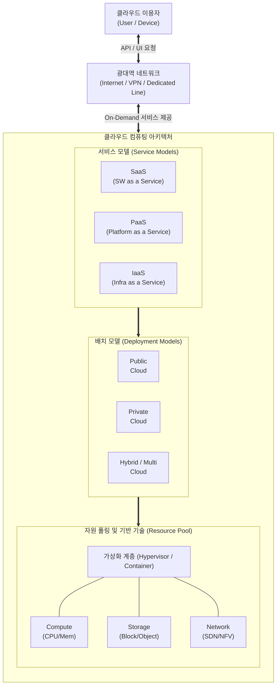

# 클라우드 컴퓨팅 (Cloud Computing)

---

## I. IT 자원의 On-Demand 제공을 통한 비즈니스 민첩성 실현, 클라우드 컴퓨팅의 개요

* **정의**: 인터넷 기술을 활용하여 가상화된 IT 자원(서버, 스토리지, 소프트웨어 등)을 사용자의 요구에 따라 즉시 제공하고(On-Demand), 사용량에 비례하여 비용을 지불하는(Pay-as-you-go) 컴퓨팅 서비스 모델
* **등장 배경**: 급증하는 트래픽 및 데이터에 대한 IT 인프라 확장성 한계 극복, 초기 투자 비용(CapEx)을 운영 비용(OpEx)으로 전환하여 비즈니스 적시성(Time-to-Market) 확보 필요성 증대
* **특징 (NIST 정의 5대 특성)**: 주문형 셀프 서비스(On-demand Self-service), 광대역 네트워크 접근(Broad Network Access), 자원의 풀링(Resource Pooling), 신속한 탄력성(Rapid Elasticity), 측정 가능한 서비스(Measured Service)

---

## II. 클라우드 컴퓨팅의 개념도 및 핵심 기술 요소

### 가. 클라우드 컴퓨팅의 아키텍처 및 동작 원리

* 사용자는 네트워크를 통해 서비스 모델(IaaS, [[PaaS]], SaaS) 단위로 접속하며, 하단의 [[가상화]] 계층은 물리적 자원을 논리적인 풀(Pool)로 구성하여 다중 테넌트(Multi-Tenant)에게 독립적으로 자원을 할당함

### 나. 클라우드 컴퓨팅의 핵심 기술 및 구성 요소

| 구분 | 요소기술(키워드) | 세부 설명 |
| --- | --- | --- |
| **자원 공유** | 가상화 (Virtualization) | 하이퍼바이저 기반 물리적 하드웨어의 논리적 분할 및 통합 (서버, 스토리지, 네트워크) |
| **자원 공유** | 멀티 테넌시 (Multi-Tenancy) | 단일 [[인스턴스]] 또는 인프라 자원을 다수의 사용자(Tenant)가 독립적이고 안전하게 공유하는 기술 |
| **자원 관리** | 자원 [[프로비저닝]] (Provisioning) | 사용자의 요청에 따라 [[CPU]], 메모리, 스토리지 등의 컴퓨팅 자원을 자동 할당 및 배치 |
| **탄력적 운영** | 오토 스케일링 (Auto-Scaling) | 시스템 부하 상태(CPU 사용률 등)에 따라 자원을 자동으로 확장(Scale-out) 및 축소(Scale-in) |
| **인프라 제어** | 소프트웨어 정의 기술 (SDx) | [[SDN(Software Defined Network)|SDN]](네트워크), SDS(스토리지) 등 소프트웨어 기반으로 인프라를 유연하게 통제 및 프로그래밍 |
| **대용량 처리** | 분산 컴퓨팅 시스템 | 대규모 트래픽과 대용량 데이터를 처리하기 위한 병렬 분산 처리 기술 (Hadoop, Spark 등) |
| **과금/관리** | 미터링 및 빌링 (Metering/Billing) | 사용자의 자원 사용량을 실시간으로 수집, 측정하여 종량제(Pay-as-you-go) 기반으로 과금 처리 |
| **보안 체계** | 접근통제 및 망분리 (VPC) | [[IAM]] 기반의 권한 제어 체계 및 가상 사설 클라우드(VPC)를 통한 네트워크 수준의 테넌트 격리 |

---

## III. 클라우드 컴퓨팅과 전통적 온프레미스 시스템의 비교

### 가. 전통적 시스템(On-Premise)과의 비교

| 비교 항목 | 전통적 시스템 (On-Premise) | 클라우드 컴퓨팅 (Cloud Computing) |
| --- | --- | --- |
| **자원 조달 방식** | 하드웨어 직접 구매 및 소유 (CapEx 중심) | 자원 임대 및 서비스 구독 (OpEx 중심) |
| **자원 확장성** | Scale-Up 중심, 최대 부하 기준 오버 프로비저닝 | **Scale-Out/In 중심, 부하에 따른 유연한 탄력적 확장** |
| **구축 소요 시간** | 수 주 ~ 수 개월 소요 (발주, 입고, 설치) | **수 분 내 즉시 할당 (Self-Service 기반)** |
| **[[유지보수]] 및 관리** | 자사 IT 인력이 하드웨어부터 앱까지 전면 관리 | [[CSP]](제공자)와 CSC(이용자) 간의 **공동 책임 모델 적용** |
| **자원 활용률** | 유휴 자원 발생으로 효율성 저하 우려 | 가상화 및 풀링(Pooling) 기반 자원 활용률 극대화 |
| **보안 모델** | 물리적 경계 기반 보안 (Perimeter Security) | 논리적 망분리(VPC), 제로 트러스트([[제로 트러스트 보안모델|Zero Trust]]) 기반 통제 |

### 나. 향후 전망 및 발전 동향

* **[[클라우드 네이티브]](Cloud Native)로의 진화**: 단순 인프라 이관(Lift & Shift)을 넘어, [[MSA (Micro Service Architecture)|MSA]], [[컨테이너]], CI/CD, 서버리스(Serverless) 중심의 클라우드 최적화 아키텍처로 전면 개편 중
* **멀티/하이브리드 클라우드 확산**: 벤더 종속성(Lock-In) 방지, 데이터 주권 및 [[HA(High Availability)|가용성]] 확보를 위해 단일 CSP가 아닌 여러 퍼블릭 클라우드와 프라이빗 클라우드를 혼용하는 전략이 기업의 기본 인프라 표준으로 자리 잡음

---

### 🔗 연관 토픽

- **소속 도메인**: [[00_디지털서비스_MOC|🚀 디지털서비스]]
- **세부 분류**: `1. 클라우드 컴퓨팅 & 가상화 인프라`
- **핵심 연관 토픽**:
  - [[클라우드 네이티브]]
  - [[CSP|CSP (Cloud Service Provider)]]
  - [[컨테이너|컨테이너 (Container)]]
  - [[가상화]]
  - [[PaaS|PaaS (Platform as a Service)]]
