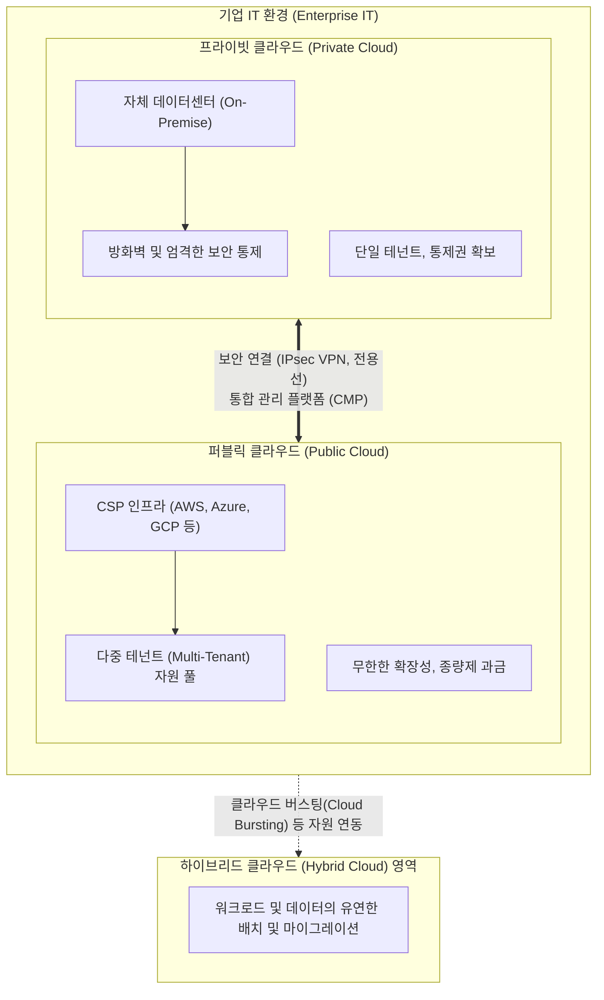

# 클라우드 컴퓨팅의 배치 모델 (Deployment Model)

---

## I. 비즈니스 목적과 보안 요구사항에 따른 인프라 제공 형태, 클라우드 배치 모델의 개요

* **정의**: 기업이나 조직의 보안 수준, IT 인프라 통제권, 비즈니스 요구사항에 따라 클라우드 자원(컴퓨팅, 스토리지, 네트워크)을 구축하고 서비스를 제공하는 물리적/논리적 아키텍처 유형
* **등장 배경**: 퍼블릭 클라우드의 보안성 한계 극복, 사내 주요 데이터 보호 및 규제(컴플라이언스) 준수 요구, 특정 클라우드 사업자([[CSP]])에 대한 종속성(Lock-in) 방지 필요성 증대
* **특징**: 소유권과 관리 주체에 따른 분류, 자원 공유 수준(단일 테넌트 vs 다중 테넌트)의 차이, 개별 모델의 장점을 결합한 하이브리드 및 멀티 클라우드로 발전

---

## II. 클라우드 배치 모델의 개념도 및 주요 유형

### 가. 클라우드 배치 모델의 아키텍처 및 동작 원리

* 기업은 핵심 데이터 및 레거시 시스템은 내부 프라이빗 클라우드에, 대규모 트래픽 처리나 신규 서비스는 퍼블릭 클라우드에 배치하여 두 환경을 전용선([[VPN]] 등)으로 연동하는 하이브리드 형태로 운영함

### 나. 주요 클라우드 배치 모델 유형 및 핵심 기술

| 분류 (유형) | 핵심 기술 / 키워드 | 세부 설명 |
| --- | --- | --- |
| **Public Cloud** | 다중 테넌시 (Multi-Tenancy) | CSP가 불특정 다수에게 인터넷을 통해 공유 자원을 제공하며 종량제 과금 적용 |
| **Private Cloud** | 단일 테넌시 (Single-Tenancy) | 특정 단일 기업/조직만을 위해 자체 데이터센터 내에 독점적으로 구축 및 운영 |
| **Hybrid Cloud** | Cloud Bursting (클라우드 버스팅) | Private의 용량 한계 초과 시(Traffic Spike), Public 자원을 일시적으로 동원하여 처리 |
| **Community Cloud** | 공동 목적의 인프라 공유 | 공공기관, 의료, 금융 등 특정 규제나 목적을 공유하는 제한된 조직 간 자원 공유 |
| **연동/통합 기술** | 전용선 / Direct Connect | Public과 Private 클라우드 간 고속, 저지연 및 안전한 데이터 전송을 위한 전용 회선 |
| **연동/통합 기술** | [[IP Sec|IPsec]] VPN | 인터넷망을 이용하면서도 트래픽을 암호화하여 논리적인 사설망(가상 사설망) 구성 |
| **통합 관리** | CMP (Cloud Management Platform) | 이기종 클라우드 환경(Public/Private)을 단일 대시보드에서 통합 [[프로비저닝]] 및 모니터링 |
| **이식성 확보** | [[컨테이너]] 및 K8s | 환경(Public ↔ Private) 간 애플리케이션 종속성 없이 자유로운 이동성(Portability) 보장 |

---

## III. 클라우드 배치 모델 3대 유형 비교 및 향후 전망

### 가. Public, Private, Hybrid 클라우드 상세 비교

| 비교 항목 | 퍼블릭 클라우드 (Public) | 프라이빗 클라우드 (Private) | 하이브리드 클라우드 (Hybrid) |
| --- | --- | --- | --- |
| **소유 및 관리** | 클라우드 서비스 제공자 (CSP) | 해당 기업 자체 소유 및 관리 | CSP 및 해당 기업 공동 |
| **자원 공유 대상** | 불특정 다수 (Public) | 특정 단일 조직 내부 | 내부망 + 외부 인프라 연동 |
| **보안 및 통제권** | 상대적으로 낮음 (제공자 의존) | 매우 높음 (기업 자체 통제) | 중간~높음 (데이터 분류 배치) |
| **확장성 및 탄력성** | 무한에 가까운 빠른 확장성 | 하드웨어 자원 한계 내 제한적 | 필요 시 Public 연동을 통해 유연함 |
| **초기 구축 비용** | 매우 낮음 (가입 즉시 사용) | 매우 높음 (HW/SW 라이선스 구매) | 높음 (Private 구축 + 연동 솔루션) |
| **적합한 워크로드** | 웹 서비스, 대규모 분석, [[변동성]] 트래픽 | 중요 기밀 데이터, 규제 준수 시스템 | 코어 시스템(Private) + 웹 프론트(Public) |

### 나. 클라우드 배치 모델의 향후 전망 및 발전 방향

* **멀티 클라우드(Multi-Cloud)로의 진화**: 단일 Public Cloud 종속성(Vendor Lock-in)을 탈피하고 서비스 장애(아웃테이지)에 대비하기 위해, AWS, Azure, GCP 등 2개 이상의 퍼블릭 클라우드를 결합하는 형태가 주류로 자리 잡음
* **분산 클라우드(Distributed Cloud)의 부상**: 퍼블릭 클라우드의 자원과 서비스를 사용자가 위치한 엣지([[EDGE|Edge]]) 인프라로 분산시켜 지연시간(Latency)을 최소화하는 차세대 모델 확산 (예: AWS Outposts)
* **소버린 클라우드(Sovereign Cloud) 도입 가속**: 국가 간 데이터 주권(Data Sovereignty) 문제 해결을 위해 특정 국가의 법률과 규제(컴플라이언스)를 완벽히 준수하는 독립적인 클라우드 수요 증가

---

### 🔗 연관 토픽

- **소속 도메인**: [[00_디지털서비스_MOC|🚀 디지털서비스]]
- **세부 분류**: `1. 클라우드 컴퓨팅 & 가상화 인프라`
- **핵심 연관 토픽**:
  - [[CSP|CSP (Cloud Service Provider)]]
  - [[컨테이너|컨테이너 (Container)]]
  - [[가상화]]
  - [[프로비저닝]]
  - [[클라우드 컴퓨팅|클라우드 컴퓨팅 (Cloud Computing)]]
