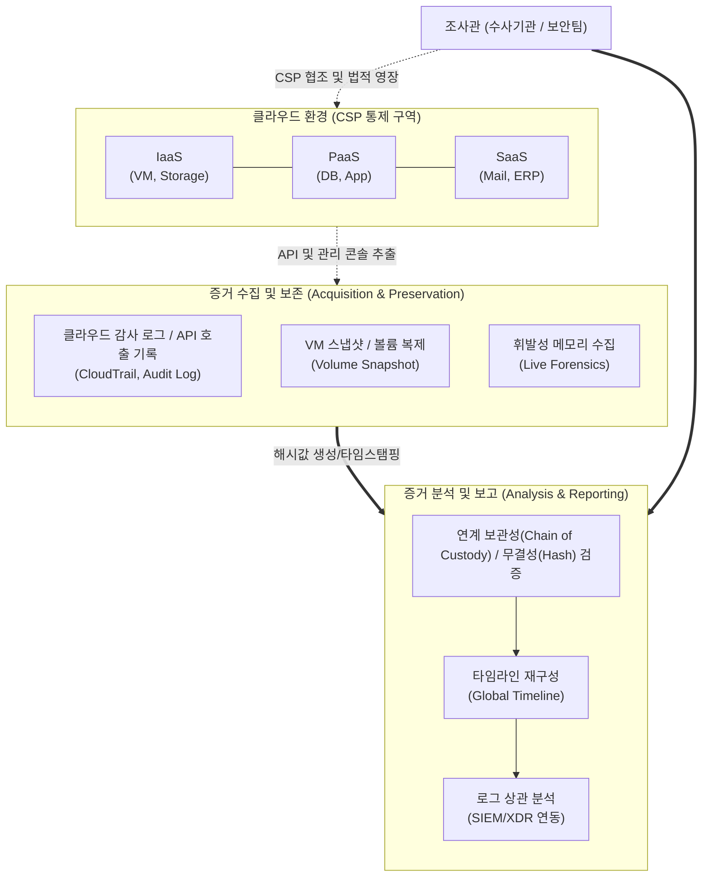

# 클라우드 포렌식 (Cloud Forensics)

---

## I. 가상화 및 분산 환경의 디지털 증거 확보 체계, 클라우드 포렌식의 개요

* **정의**: [[가상화]] 및 분산 컴퓨팅 기반의 클라우드 환경(IaaS, [[PaaS]], SaaS)에서 발생한 보안 사고나 범죄와 관련된 디지털 증거를 적법한 절차에 따라 식별, 수집, 보존, 분석, 보고하는 기술 및 일련의 과정
* **등장 배경**: [[클라우드 네이티브]] 환경 전환에 따른 보안 위협(데이터 유출, 계정 탈취) 증가, 가상화 및 자원 공유 특성으로 인한 전통적 디스크 기반 포렌식 한계 봉착
* **클라우드 특성에 따른 난제(NIST Challenges)**:
* **다중 테넌시(Multi-Tenancy)**: 타 사용자의 데이터 침해 없이 특정 대상의 데이터만 선별적 수집의 어려움
* **지리적 분산**: 데이터가 여러 국가에 분산 저장되어 발생하는 사법 관할권(Jurisdiction) 및 데이터 주권 문제
* **데이터 휘발성**: 오토 스케일링(Auto-Scaling) 및 [[컨테이너]] 폐기로 인한 메모리 및 디스크 증거의 빠른 소실
* **[[CSP]] 의존성**: 물리적 장비 접근이 불가능하여 클라우드 서비스 제공자(CSP)와의 협력 및 로그 의존성 높음

---

## II. 클라우드 포렌식의 개념도 및 핵심 기술 요소

### 가. 클라우드 포렌식의 아키텍처 및 동작 절차

* 조사관은 CSP와의 협조를 통해 서비스 모델(IaaS/PaaS/SaaS)에 맞는 획득 전략을 적용하며, 획득한 증거는 원본성 및 [[무결성]](해시값)을 보장하여 사건 타임라인을 재구성함

### 나. 클라우드 포렌식의 핵심 기술 및 구성 요소

| 구분 | 요소기술(키워드) | 세부 설명 |
| --- | --- | --- |
| **증거 식별** | 클라우드 시그니처 (Cloud Signature) | 사용자 로컬 기기(웹 브라우저 접속 기록, 레지스트리)에서 클라우드 서비스 사용 유무를 판단하는 흔적 데이터 |
| **증거 수집** | VM 스냅샷 (Snapshot) | IaaS 환경에서 특정 시점의 가상 머신 상태, 디스크 볼륨 전체를 이미지 파일 형태로 동결하여 획득 |
| **증거 수집** | 라이브 포렌식 (Live Forensics) | 실행 중인 가상 머신이나 컨테이너에서 네트워크 연결 상태, [[프로세스]], RAM 데이터를 휘발되기 전 수집 |
| **로그 확보** | API 및 제어 평면 로그 | 클라우드 자원 생성, 삭제, 접근 기록 등 관리자 콘솔 접근 및 API 호출 감사 추적(예: AWS CloudTrail) |
| **보존/무결성** | 연계 보관성 (Chain of Custody) | 수집부터 법정 제출까지 디지털 증거의 획득, 이동, 보관 상태를 기록하여 증거의 절차적 정당성 확보 |
| **보존/무결성** | 해시(Hash) 및 타임스탬프 | 수집된 데이터에 대한 SHA-256 등의 [[암호화]] 해시를 적용하고 시점 확인(Time-stamping)을 통해 위변조 방지 |
| **증거 분석** | 전역 타임라인 (Global Timeline) | 분산된 클라우드 리전 및 다수의 로그 메타데이터를 동기화하여 전체 사건의 흐름을 시계열로 정렬 |
| **증거 분석** | AI 기반 행동 기반 상관 분석 | 방대한 클라우드 감사 로그와 네트워크 트래픽 패턴을 [[XDR]]/[[SIEM]]과 연동하여 이상 행위 및 침해 경로 추적 |

---

## III. 전통적 포렌식과 클라우드 포렌식 비교 및 향후 전망

### 가. 전통적 디지털 포렌식과 클라우드 포렌식의 비교

| 비교 항목 | 전통적 [[디지털 포렌식]] | 클라우드 포렌식 (Cloud Forensics) |
| --- | --- | --- |
| **물리적 접근성** | 물리적 장치(HDD/서버) 직접 접근 및 압수 가능 | **물리적 접근 불가능** (CSP의 데이터센터에 위치) |
| **데이터 수집 주체** | 조사관(수사기관)이 독립적으로 장비 획득 | **CSP의 적극적 협조 및 API 기반 추출 필수** |
| **데이터 휘발성** | 디스크 전원 차단 후 정적(Dead) 이미지 획득 | 자원의 잦은 생성/폐기로 **실시간(Live) 획득 중요** |
| **증거 선별성** | 하드디스크 전체 비트 스트림(Bit-stream) 복제 | 다중 테넌시로 인해 **특정 테넌트 데이터만 논리적 선별** |
| **주요 증거 데이터** | 파일 시스템, 로컬 이벤트 로그, 삭제된 파일 | **API 호출 로그(제어 평면), VM 스냅샷, 네트워크 흐름 로그** |

### 나. 클라우드 포렌식의 향후 전망 및 발전 방향

* **지속적 모니터링 기반의 선제적 포렌식(Proactive Forensics)**: 인프라 동적 특성상 사후 수집이 불가능한 경우가 많으므로, 침해 발생 이전 평상시에 상태 데이터와 스냅샷을 주기적으로 저장하는 'Readiness' 체계 확보 필수
* **컨테이너 및 서버리스 포렌식 기술 고도화**: 수명 주기가 초 단위로 짧은 Kubernetes Pod 및 Lambda 워크로드의 특성을 고려하여, 이벤트 발생 시 즉각적으로 메모리와 로그를 스토리지로 덤프하는 자동화 캡처 도구 발전
* **국제적 사법 공조(MLAT) 및 표준화 체계 마련**: 데이터 주권 충돌을 해결하기 위한 클라우드 액트(CLOUD Act) 적용 확대 및 서비스 제공자별로 상이한 로그 형식을 통일하기 위한 포렌식 데이터 수집 국제 표준 제정 필요

---

### 🔗 연관 토픽

- **소속 도메인**: [[00_보안_MOC|🛡️ 보안]]
- **세부 분류**: `5. 사이버 공격 기법 & 침해사고 대응`
- **핵심 연관 토픽**:
  - [[디지털 포렌식|디지털 포렌식(Digital Forensic)]]
  - [[XDR|XDR(eXtended Detection Response)]]
  - [[SIEM]]
  - [[프로세스]]
  - [[컨테이너|컨테이너 (Container)]]
