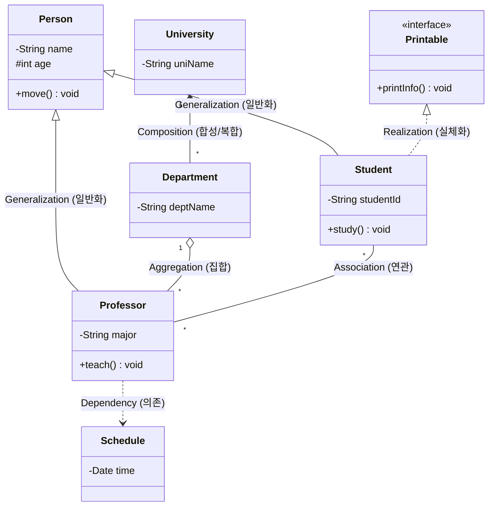

# 클래스 다이어그램 (Class Diagram)

---

## I. 객체지향 시스템의 정적 청사진, 클래스 다이어그램의 개요

* **정의**: [[객체지향]] 분석/설계(OOAD) 과정에서 시스템을 구성하는 클래스들의 속성(Attribute), 연산(Operation) 및 [[클래스]] 간의 정적인 관계(Relationship)를 시각화한 [[UML]] 구조 다이어그램
* **등장 배경**: 시스템의 전반적인 구조와 뼈대를 가시화하여 개발자 및 이해관계자 간 의사소통 효율을 높이고, 요구사항을 실제 코드로 전환(포워드 엔지니어링)하기 위한 명확한 기준 필요
* **특징**: 시스템의 정적(Static) 구조 표현, 객체 간의 관계(다중성, 포함 관계 등) 규명, 모델 기반 아키텍처(MDA)에서 코드 자동 생성의 핵심 기반 제공

---

## II. 클래스 다이어그램의 개념도 및 핵심 구성 요소

### 가. 클래스 다이어그램의 아키텍처 및 관계 표현 모델

* **다이어그램 설명**: `Person`을 상속받는 `Student`와 `Professor`([[일반화]]), `University`와 `Department`의 강한 생명주기 결합(복합), 파라미터로 일시적 참조를 하는 `Schedule`(의존) 등의 주요 관계를 명세함

### 나. 클래스 다이어그램의 핵심 구성 요소 및 관계(Relationship) 유형

| 구분 | 요소/관계명(키워드) | 표기법 및 세부 설명 |
| --- | --- | --- |
| **기본 요소** | 클래스 (Class) | 사각형 구획에 **클래스명, 속성(Attribute), 연산(Operation)**을 표기 |
| **기본 요소** | 가시성 (Visibility) | 외부 접근 통제 기호: `+`(Public), `-`(Private), `#`(Protected), `~`(Package) |
| **기본 요소** | 다중성 (Multiplicity) | 대상 객체가 연관될 수 있는 객체의 수 (`1`, `*`(다수), `0..1`, `1..*` 등) |
| **클래스 관계** | **일반화 (Generalization)** | `부모 ◁-- 자식` (실선, 빈 화살표) / 상속 관계를 나타내며 'is-a' 관계 성립 |
| **클래스 관계** | **실체화 (Realization)** | `인터페이스 ◁.. 구현클래스` (점선, 빈 화살표) / 추상화된 행위의 실제 구현(can-do) |
| **클래스 관계** | **연관 (Association)** | `객체A --- 객체B` (실선) / 클래스 간의 참조를 의미하며 양방향 또는 단방향 통신 |
| **클래스 관계** | **집합 연관 (Aggregation)** | `전체 ◇-- 부분` (실선, 빈 마름모) / 'has-a' 관계, **부분 객체가 독립적 생명주기**를 가짐 |
| **클래스 관계** | **복합 연관 (Composition)** | `전체 ◆-- 부분` (실선, 꽉찬 마름모) / **전체 객체 소멸 시 부분 객체도 함께 소멸** (강한 결합) |
| **클래스 관계** | **의존 (Dependency)** | `객체A ..> 객체B` (점선, 화살표) / 메서드 내에서 파라미터나 지역변수로 일시적 참조 |

---

## III. 클래스 다이어그램의 동적 모델 비교 및 활용 방안

### 가. UML 다이어그램 비교 (클래스 다이어그램 vs 시퀀스 다이어그램)

| 비교 항목 | 클래스 다이어그램 (Class Diagram) | 시퀀스 다이어그램 ([[순차 다이어그램|Sequence Diagram]]) |
| --- | --- | --- |
| **관점 (View)** | **정적(Static) / 구조적 관점** | **동적(Dynamic) / 행위적 관점** |
| **주요 목적** | 시스템의 뼈대와 데이터 구조 파악 | 객체 간 메시지 흐름 및 상호작용 시계열 파악 |
| **구성 요소** | 클래스, 속성, 연산, 관계(상속, 연관 등) | 라이프라인(Lifeline), 메시지, 활성 구간(Activation) |
| **활용 단계** | 분석 및 설계 단계 (DB [[스키마]] 도출 연계) | 상세 설계 및 비즈니스 로직 검증 단계 |

### 나. 클래스 다이어그램의 최근 활용 트렌드 및 전망

* **도메인 주도 설계([[DDD (Domain Driven Design)|DDD]])와의 결합**: 마이크로서비스 아키텍처([[MSA (Micro Service Architecture)|MSA]]) 구축 시, 바운디드 컨텍스트(Bounded Context) 내의 애그리거트(Aggregate) 묶음과 도메인 모델 구조를 시각화하는 필수 도구로 활용
* **MDA(Model-Driven Architecture) 자동화**: 플랫폼 독립 모델([[PIM]]) 형태로 작성된 클래스 다이어그램을 기반으로, 특정 언어 [[프레임워크]](PSM)의 소스 코드 뼈대(Boilerplate) 및 [[DDL]] 스키마를 자동 생성하는 리버스/포워드 엔지니어링 도구 체계 정착

---

### 🔗 연관 토픽

- **소속 도메인**: [[00_소프트웨어공학_MOC|🏗️ 소프트웨어공학]]
- **세부 분류**: `3. 요구사항 공학 & UML 객체지향 분석/설계`
- **핵심 연관 토픽**:
  - [[UML|UML (정적, 동적 다이어그램)]]
  - [[클래스]]
  - [[객체지향]]
  - [[순차 다이어그램|순차 다이어그램 (Sequence Diagram)]]
  - [[UML Diagram 전체|UML / Diagram 전체]]
