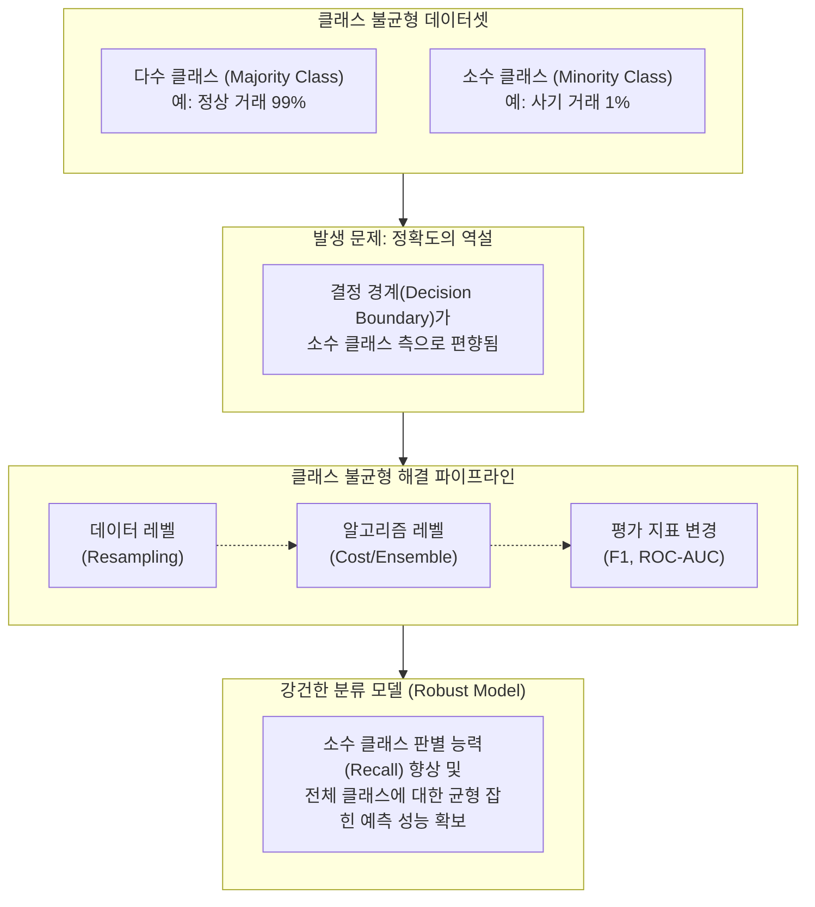

# 클래스 불균형 (Class Imbalance)

---

## I. 기계학습 모델의 예측 편향을 유발하는 데이터 불균형 현상, 클래스 불균형의 개요

* **정의**: 분류(Classification) 모델 학습 시 대상이 되는 특정 클래스의 데이터 수가 다른 클래스에 비해 압도적으로 많거나 적어, 데이터 분포의 비대칭성이 심화된 상태
* **등장 배경**: 금융 사기 탐지(Fraud Detection), 희귀병 암 진단, 제조 공정의 불량품 탐지 등 실제 산업 환경에서 소수(이상) 데이터가 극히 적은 특성으로 인해 필연적으로 발생
* **문제점/특징**: 모델이 다수 클래스로만 예측하려는 [[편향]] 발생, 높은 정확도(Accuracy)에도 불구하고 소수 클래스의 재현율(Recall)이 0%에 수렴하는 **정확도의 역설(Accuracy Paradox)** 유발

---

## II. 클래스 불균형의 개념도 및 핵심 대응 기술 요소

### 가. 클래스 불균형 해결을 위한 다각적 접근 모델 (개념도)

* 데이터셋 레벨의 리샘플링, 모델 레벨의 비용(가중치) 조절, 평가 평가지표의 변경을 종합적으로 적용하여 소수 클래스에 대한 예측력(재현율)을 높이는 것이 핵심 원리임

### 나. 클래스 불균형 해결을 위한 핵심 기술 요소

| 분류 | 요소기술(키워드) | 세부 설명 |
| --- | --- | --- |
| **데이터 레벨** | 언더샘플링 (Under-sampling) | 다수 [[클래스]] 데이터를 무작위로 축소시켜 불균형을 해소 (Tomek Links, ENN 기법 등 활용) |
| **데이터 레벨** | 오버샘플링 (Over-sampling) | 소수 클래스 데이터를 복제하거나 증식시켜 균형 확보 (단순 복제 시 과적합 위험 발생) |
| **데이터 레벨** | SMOTE (Synthetic Minority) | K-NN(최근접 이웃) 알고리즘을 활용하여 기존 소수 클래스 데이터 사이에 가상의 데이터를 합성/생성 |
| **데이터 레벨** | ADASYN | SMOTE를 개선하여, 다수 클래스에 둘러싸여 판별이 어려운 소수 클래스 주변에 집중적으로 데이터를 생성 |
| **[[알고리즘]] 레벨** | 비용 민감 학습 (Cost-sensitive) | 소수 클래스를 오분류(False Negative)했을 때 다수 클래스 오분류보다 더 큰 패널티(비용/가중치) 부과 |
| **알고리즘 레벨** | 이상 탐지 ([[Anomaly(이상현상)|Anomaly]] Detection) | 불균형이 극심할 경우, 다중 분류가 아닌 Isolation Forest, One-class [[서포트 벡터 머신|SVM]] 등 비지도학습 기반 [[이상치]] 탐지로 접근 |
| **평가 지표** | 혼동 행렬 (Confusion Matrix) | 단순 정확도(Accuracy) 배제, 정밀도(Precision)와 재현율(Recall) 중심의 평가지표 설계 |
| **평가 지표** | F1-Score / ROC-AUC | Precision과 Recall의 조화평균(F1), 임계값 변화에 따른 FPR-TPR 면적(AUC)을 통해 객관적 성능 검증 |

---

## III. 데이터 레벨 샘플링 기법 비교 및 최신 동향

### 가. 언더샘플링과 오버샘플링 기법 비교

| 비교 항목 | 언더샘플링 (Under-sampling) | 오버샘플링 (Over-sampling) |
| --- | --- | --- |
| **동작 원리** | 다수 클래스의 데이터 양을 축소하여 균형 확보 | 소수 클래스의 데이터 양을 증식하여 균형 확보 |
| **대표 알고리즘** | Random, Tomek Links, ENN (Edited Nearest Neighbors) | Random, SMOTE, ADASYN, Borderline-SMOTE |
| **주요 장점** | 데이터 크기 감소로 인한 연산 시간 및 메모리 절약 | 원본 데이터의 정보 손실 방지, 모델의 학습 범위 확장 |
| **주요 단점/한계** | **다수 클래스의 유의미한 주요 정보가 유실될 위험 존재** | 소수 클래스 반복 학습으로 인한 **과적합(Overfitting) 발생 우려** |

### 나. 클래스 불균형 해결 기술의 최신 동향

* **생성형 AI(Generative AI) 기반 데이터 증강**: SMOTE 기반의 단순 보간법을 넘어, [[GAN (Generative Adversarial Network)|GAN]](적대적 생성 신경망), [[VAE]](변이형 오토인코더) 및 디퓨전(Diffusion) 모델을 활용해 극소수 이미지/정형 데이터를 고품질로 합성하는 Data Augmentation 트렌드 확산
* **하이브리드 샘플링(Hybrid Sampling)**: 언더샘플링과 오버샘플링의 단점을 상호 보완하기 위해 SMOTE와 Tomek Links를 결합(SMOTETomek)하여 결정 경계를 명확히 하는 기법이 캐글(Kaggle) 등 실제 모델링 환경에서 표준적으로 활용됨

---

### 🔗 연관 토픽

- **소속 도메인**: [[00_인공지능_MOC|🤖 인공지능]]
- **세부 분류**: `1. 수학 · 통계학 & 데이터 전처리`
- **핵심 연관 토픽**:
  - [[이상치]]
  - [[서포트 벡터 머신|서포트 벡터 머신 SVM(Support Vector Machine)]]
  - [[이상 감지]]
  - [[GAN (Generative Adversarial Network)]]
  - [[VAE|VAE(Variational Autoencoder)]]
