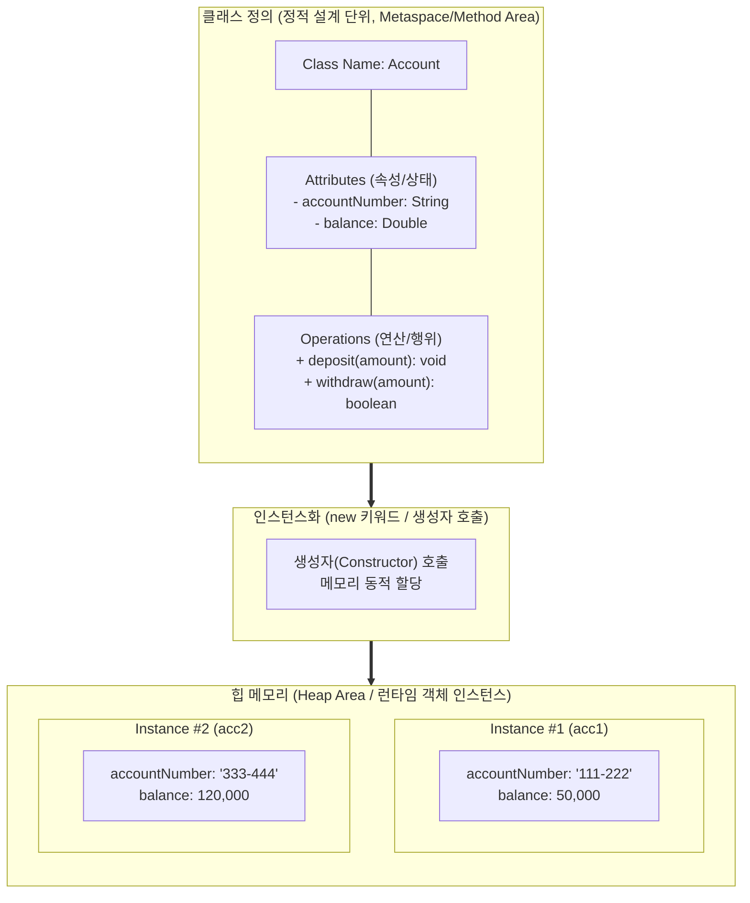

# 클래스 (Class)

---

## I. 객체지향 프로그래밍의 기본 설계 단위, 클래스의 개요

* **정의**: 동일한 속성(Attribute)과 행위(Method/Operation)를 공유하는 객체(Object)들을 정의하기 위한 틀(Blueprint)이자, 사용자 정의 추상 데이터 타입(ADT: Abstract [[Data Type]])
* **등장 배경**: 절차지향 프로그래밍의 데이터-함수 분리로 인한 유지보수성 저하 극복, 소프트웨어 재사용성(Reuse) 및 [[모듈화]](Modularity) 극대화 요구
* **특징**:
* **추상화([[추상화|Abstraction]])**: 실세계 복잡한 개체의 핵심 속성과 행위를 모델링하여 단순화
* **[[캡슐화]](Encapsulation)**: 데이터와 처리 로직을 하나로 묶고 접근 제어자를 통해 내부 구현 은닉
* **인스턴스화(Instantiation)**: 정적 선언 단위인 클래스를 런타임에 동적 메모리(Heap) 상의 객체로 구체화

---

## II. 클래스의 구조 및 핵심 구성 요소

### 가. 클래스의 구조 및 인스턴스화 메커니즘

* 컴파일 시점에 정의된 클래스 메타정보를 기반으로, 런타임에 `new` [[연산자]] 및 생성자를 호출하여 독립된 상태를 갖는 다수의 [[인스턴스]](객체)를 힙(Heap) 메모리에 할당함

### 나. 클래스의 핵심 구성 요소 및 요소 기술

| 분류 | 요소기술(키워드) | 세부 설명 |
| --- | --- | --- |
| **상태 정의** | 속성 (Attribute/Field) | 객체의 정적 상태 데이터를 저장하는 변수, 원시 타입 및 참조 타입 포함 |
| **행위 정의** | 연산 (Method/Operation) | 객체의 상태를 변경하거나 외부와 상호작용하는 동적 행위 및 비즈니스 로직 |
| **초기화** | 생성자 (Constructor) | 객체 생성 시점(new)에 필드 초기화 및 필수 리소스 할당을 수행하는 특수 메서드 |
| **보안/은닉** | 접근 제어자 (Visibility) | 외부 접근 범위를 통제하는 키워드 (Public `+`, Private `-`, Protected `#`, Package `~`) |
| **데이터 보호** | 정보 은닉 (Information Hiding) | 속성을 Private으로 감추고 Getter/Setter 메서드를 통해 제어된 접근만 허용 |
| **구조 확장** | 상속 (Inheritance) | 부모 클래스의 속성과 메서드를 자식 클래스가 물려받아 [[재사용]] 및 확장([[일반화]]/[[특수화]]) |
| **동적 바인딩** | [[다형성|다형성 (Polymorphism)]] | 오버로딩(Overloading: 중복정의) 및 오버라이딩(Overriding: 재정의)을 통한 동일 인터페이스의 다양한 구현 |
| **타입 추상화** | 추상 클래스 / 인터페이스 | 불완전한 명세를 정의하여 하위 구현 클래스들의 표준 규격을 강제하는 설계 도구 |

---

## III. 클래스와 객체(인스턴스)의 비교 및 향후 전망

### 가. 클래스(Class)와 객체/인스턴스(Object/Instance) 비교

| 비교 항목 | 클래스 (Class) | 객체 / 인스턴스 (Object / Instance) |
| --- | --- | --- |
| **개념적 본질** | 객체를 만들기 위한 추상적 설계도 (Blueprint) | 클래스를 실체화(구체화)한 메모리 상의 실제 개체 |
| **존재 시점** | 컴파일 타임 (Compile-time) 정적 정의 | 런타임 (Run-time) 동적 실행 단위 |
| **메모리 할당** | 코드/메서드 영역(Metaspace)에 메타데이터 로드 | 힙(Heap) 메모리에 개별 데이터 영역 동적 할당 |
| **개수 관계** | 하나의 클래스 정의 (1) | 단일 클래스로부터 무한 생성 가능 (N) |
| **상태 보유 여부** | 상태의 구조(타입, 이름)만 정의 | 고유한 식별자(ID)와 개별적인 상태(값) 보유 |

### 나. 클래스 설계의 발전 방향 및 최신 동향

* **[[객체지향]] 설계 5대 원칙(SOLID)의 준수**: 클래스의 책임을 단일화(SRP)하고 인터페이스를 분리([[ISP (Information Strategy Plan)|ISP]])하여 변경에 유연한 모듈 구조 확립
* **[[DDD (Domain Driven Design)|DDD]](도메인 주도 설계)와의 접목**: 클래스를 단순 데이터 바구니(Anemic Model)가 아닌 비즈니스 규칙과 불변식을 캡슐화하는 [[엔티티|엔티티(Entity)]] 및 값 객체(Value Object)로 모델링하는 추세 확산
* **함수형 프로그래밍(FP) 패러다임과의 융합**: 모던 객체지향 언어(Java, Kotlin 등)에서 불변 객체(Record, Immutable Class)와 순수 함수 기반의 설계를 적극 수용하여 동시성 결함 최소화

---

### 🔗 연관 토픽

- **소속 도메인**: [[00_소프트웨어공학_MOC|🏗️ 소프트웨어공학]]
- **세부 분류**: `3. 요구사항 공학 & UML 객체지향 분석/설계`
- **핵심 연관 토픽**:
  - [[추상화|추상화 (Abstraction)]]
  - [[객체지향]]
  - [[모듈화|모듈화 (Modularity)]]
  - [[캡슐화|캡슐화 (encapsulation)]]
  - [[다형성|다형성 (Polymorphism)]]
