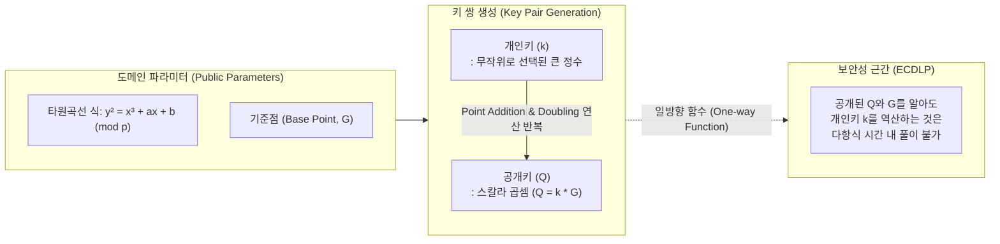

# 타원곡선 암호 (Elliptic Curve Cryptography)

---

## I. 짧은 키 길이로 고강도 보안을 제공하는 경량 공개키 암호, 타원곡선의 개요

* **정의**: 유한체(Finite Field) 상의 타원곡선이 이루는 대수적 구조와 이산대수 문제(ECDLP)의 난해성을 기반으로, 짧은 키 길이로도 높은 수준의 보안을 제공하는 공개키(비대칭키) [[암호 알고리즘]]
* **등장 배경**: [[RSA (Rivest Shamir Adleman)|RSA]] 기반 암호 체계의 키 길이 증가(2048bit 이상)로 인한 연산 부하 극복 필요, 스마트카드·IoT·모바일 기기 등 컴퓨팅 자원이 제한된 환경에서의 경량 [[암호화]] 요구 증대
* **특징**:
* **경량성 및 고효율**: RSA 대비 매우 짧은 키 길이로 동등한 보안 강도(Security Level) 달성 ([[ECC]] 256bit $\approx$ RSA 3072bit)
* **처리 속도 향상**: 키 길이가 짧아 메모리 사용량, 네트워크 대역폭, 전력 소비량이 대폭 감소
* **강력한 역산 방지**: 스칼라 곱셈(Scalar Multiplication) 기반 일방향 함수 특성으로 비밀키 유추 원천 차단

---

## II. 타원곡선 암호의 개념도 및 핵심 기술 요소

### 가. 타원곡선 암호의 키 생성 및 동작 원리

* 송수신자는 사전에 합의된 타원곡선 식과 기준점(G)을 공유하며, 난수로 생성된 개인키(k)를 G에 반복적으로 더하는 '스칼라 곱셈'을 통해 공개키(Q)를 생성함

### 나. 타원곡선 암호의 핵심 기술 및 구성 요소

| 구분 | 요소기술(키워드) | 세부 설명 |
| --- | --- | --- |
| **수학적 기반** | 유한체 (Finite Field) | 무한한 실수가 아닌 한정된 정수 범위 $GF(p)$(소수체) 또는 $GF(2^m)$(이진체) 상에서 연산 수행 |
| **수학적 기반** | 바이어슈트라스 방정식 | $y^2 = x^3 + ax + b \pmod p$ 형태의 비특이(Non-singular) 타원곡선 기본 방정식 |
| **기본 연산** | 점 덧셈 (Point Addition) | 타원곡선 위의 두 점 P와 Q를 지나는 직선이 곡선과 만나는 또 다른 점을 x축 대칭한 점(P+Q)을 구하는 연산 |
| **기본 연산** | 점 두배 (Point Doubling) | 타원곡선 위의 한 점 P에서의 접선이 곡선과 만나는 점을 x축 대칭하여 2P를 구하는 연산 |
| **핵심 기제** | 스칼라 곱셈 (Scalar Multi) | 점 덧셈과 점 두배 연산을 k번 반복하여 $Q = k \times G$ 를 산출하는 핵심 연산 메커니즘 |
| **보안 난제** | ECDLP | 타원곡선 이산대수 문제 (Elliptic Curve Discrete Logarithm Problem), Q와 G로부터 k를 구하기 어려운 성질 |
| **응용 [[알고리즘]]** | ECDSA (전자서명) | 디지털 서명에 타원곡선 암호를 적용한 표준 알고리즘 (비트코인, [[FIDO]] 등에서 [[무결성]] 및 인증 제공) |
| **응용 알고리즘** | ECDH (키 교환) | 디피-헬만(Diffie-Hellman) 키 교환 알고리즘을 타원곡선 상에 구현하여 안전하게 세션키(비밀키)를 공유 |

---

## III. 전통적 공개키 암호화(RSA)와의 비교 및 향후 전망

### 가. ECC와 RSA 암호 알고리즘 비교

| 비교 항목 | 타원곡선 암호 (ECC) | RSA 알고리즘 |
| --- | --- | --- |
| **수학적 난제 (근간)** | **타원곡선 이산대수 문제 (ECDLP)** | **소인수분해 문제 (IFP)** |
| **동등 보안성 키 길이** | **256 bit** (NIST 권고 기준) | **3072 bit** (NIST 권고 기준) |
| **연산 속도 / 효율성** | 빠름 / 메모리 및 전력 소모 매우 적음 | 느림 / 메모리 및 전력 소모 많음 |
| **주요 적용 분야** | IoT, 모바일, [[01_IT Tech/블록체인]](암호화폐), IC 카드 | 웹 서버(SSL/TLS), 이메일 암호화, 공인인증 체계 |
| **표준화 및 발전** | SECG, NIST 표준 (초경량 기기로 확산) | 공개키 암호의 사실상(De facto) 범용 표준 |

### 나. 타원곡선 암호의 동향 및 양자 컴퓨터 시대의 보안 전망

* **블록체인 및 모바일 보안의 핵심 인프라**: 연산 자원이 부족한 환경에서도 고강도 보안을 제공하여 비트코인(secp256k1), FIDO 생체인증, IoT 보안 통신(DTLS)의 핵심 알고리즘으로 지속 활용 중
* **양자 컴퓨터의 위협 (쇼어 알고리즘)**: 양자 컴퓨팅 환경에서 쇼어 알고리즘(Shor's Algorithm)이 실용화될 경우, ECDLP 역시 다항 시간 내에 해독될 수 있는 치명적인 취약점 존재
* **하이브리드 암호 및 [[양자내성암호]](PQC)로의 전환**: 양자 컴퓨팅 위협에 대비하여 미국 NIST 주도로 격자(Lattice) 기반 암호 등 PQC 표준화가 진행 중이며, 과도기적으로 ECC와 PQC를 결합한 하이브리드 키 교환 스킴(Hybrid Key Exchange)이 브라우저 및 통신 프로토콜에 도입되는 추세임

---

### 🔗 연관 토픽

- **소속 도메인**: [[00_보안_MOC|🛡️ 보안]]
- **세부 분류**: `2. 현대 암호학 & 키 관리 · 전자서명`
- **핵심 연관 토픽**:
  - [[RSA (Rivest Shamir Adleman)]]
  - [[ECC|ECC(Elliptic Curve Cryptography)]]
  - [[양자내성암호]]
  - [[FIDO]]
  - [[암호화|암호화 (Encryption)]]
