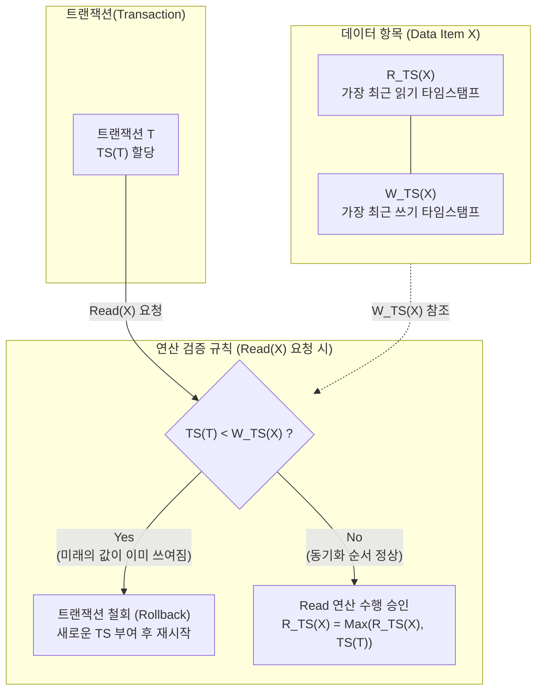

# 타임스탬프 순서 기법 (Timestamp Ordering)

---

## I. 락킹(Locking) 없는 트랜잭션 직렬가능성 보장 기법, 타임스탬프 순서 기법의 개요

* **정의**: [[데이터베이스]] 병행제어(Concurrency Control)를 위해 트랜잭션이 시스템에 진입하는 순서대로 고유한 타임스탬프(시간표)를 부여하고, 데이터의 읽기/쓰기 연산 시 이를 비교하여 직렬가능성(Serializability)을 보장하는 기법
* **등장 배경**: 전통적인 락(Lock) 기반 병행제어 체계에서 발생하는 대기(Waiting)와 [[교착상태]](Deadlock) 문제 원천 해결 필요
* **특징**: 락 미사용(Non-[[Locking]])으로 교착상태 원천 차단, [[트랜잭션]] 간 선점 방식의 충돌 해결, 철회된 트랜잭션의 재시작 시 새로운 타임스탬프 부여

---

## II. 타임스탬프 순서 기법의 개념도 및 핵심 기술 요소

### 가. 타임스탬프 순서 기법의 동작 원리 (Read 연산 기준)

* 트랜잭션 T가 데이터 X를 읽으려 할 때, 해당 데이터가 이미 더 늦게 시작된 트랜잭션에 의해 수정되었다면(W_TS가 더 크면) 연산을 거부하고 트랜잭션을 철회함

### 나. 타임스탬프 순서 기법의 핵심 기술 및 구성 요소

| 구분 | 요소기술(키워드) | 세부 설명 |
| --- | --- | --- |
| **기준 지표** | 타임스탬프 (TS) | 트랜잭션이 시스템에 진입한 순서에 따라 할당되는 고유 식별자 (논리적 계수기 또는 시스템 클럭 활용) |
| **상태 관리** | R_TS(X) (Read TS) | 데이터 항목 X를 성공적으로 읽은 트랜잭션들의 타임스탬프 중 가장 큰 값 (최신 읽기 시간) |
| **상태 관리** | W_TS(X) (Write TS) | 데이터 항목 X를 성공적으로 기록(갱신)한 트랜잭션들의 타임스탬프 중 가장 큰 값 (최신 쓰기 시간) |
| **동작 규칙** | 읽기 규칙 (Read Rule) | `TS(T) < W_TS(X)` 이면 T를 철회(Rollback), 아니면 Read 허용 및 `R_TS(X)` 갱신 |
| **동작 규칙** | 쓰기 규칙 (Write Rule) | `TS(T) < R_TS(X)` 또는 `TS(T) < W_TS(X)` 이면 T를 철회, 아니면 Write 허용 및 `W_TS(X)` 갱신 |
| **최적화** | 토마스 기록 규칙(Thomas Write Rule) | `TS(T) < W_TS(X)` 인 쓰기 충돌 시, 트랜잭션을 철회하지 않고 해당 쓰기 연산만 무시(Ignore)하여 병행성 향상 |
| **장점/특성** | 무교착상태(Deadlock-Free) | 데이터에 대한 Lock을 획득/대기하는 과정이 없으므로 교착상태가 수학적으로 발생하지 않음 |
| **단점/한계** | 연쇄 복귀(Cascading Rollback) | 특정 트랜잭션 철회 시, 해당 트랜잭션이 갱신한 데이터를 참조한 다른 트랜잭션들도 연쇄적으로 철회되는 현상 |

---

## III. 타임스탬프 순서 기법과 2단계 로킹(2PL) 기법 비교

### 가. 주요 병행제어 기법 간 비교

| 비교 항목 | 타임스탬프 순서 ([[Timestamp Ordering]]) | 2단계 로킹 ([[2PL]] : Two-Phase Locking) |
| --- | --- | --- |
| **기본 원리** | 트랜잭션 진입 시간 기준의 선후 관계 검사 | 트랜잭션의 락(Lock) 획득(확장) 및 해제(수축) 기반 통제 |
| **제어 방식** | 낙관적 (Optimistic) 접근 기반 / Lock 미사용 | 비관적 (Pessimistic) 접근 기반 / Lock 사용 |
| **교착상태(Deadlock)** | **발생하지 않음 (Deadlock-Free)** | **발생 가능성 높음 (탐지 및 회피 [[알고리즘]] 필요)** |
| **연쇄 복귀 발생** | 발생 가능성 높음 | 제한적 (엄격한 2PL 적용 시 원천 방지 가능) |
| **직렬가능성 보장** | 보장함 (시간 순서대로 직렬화) | 보장함 (충돌 직렬성 보장) |
| **적용 환경** | 트랜잭션 간 충돌이 적고 읽기 비중이 높은 환경 | 갱신(Update)이 빈번하고 데이터 충돌 확률이 높은 환경 |

### 나. 기술 적용 동향 및 발전 방향

* **다중 버전 [[병행 제어]](MVCC)로의 발전**: 타임스탬프 기법의 철회(Rollback) 오버헤드를 줄이기 위해, 데이터의 갱신 시점마다 새로운 버전을 생성하여 락 없이 일관된 읽기를 제공하는 MVCC(Oracle, PostgreSQL 등)의 기반 기술로 채택됨
* **[[분산 데이터베이스]] 적용**: 분산 환경에서 전역 클럭(Global Clock) 동기화 문제를 해결하기 위해, 논리적 타임스탬프(Vector Clock) 등과 결합하여 데이터 일관성 및 순서를 통제하는 핵심 알고리즘으로 발전 중

---

### 🔗 연관 토픽

- **소속 도메인**: [[00_데이터베이스_MOC|🗄️ 데이터베이스]]
- **세부 분류**: `2. 트랜잭션 & 동시성 제어 (Concurrency)`
- **핵심 연관 토픽**:
  - [[트랜잭션]]
  - [[2PL|2PL (Two-Phase Locking Protocol)]]
  - [[Timestamp Ordering]]
  - [[Locking]]
  - [[분산 데이터베이스|분산 데이터베이스 (Distributed Database)]]
