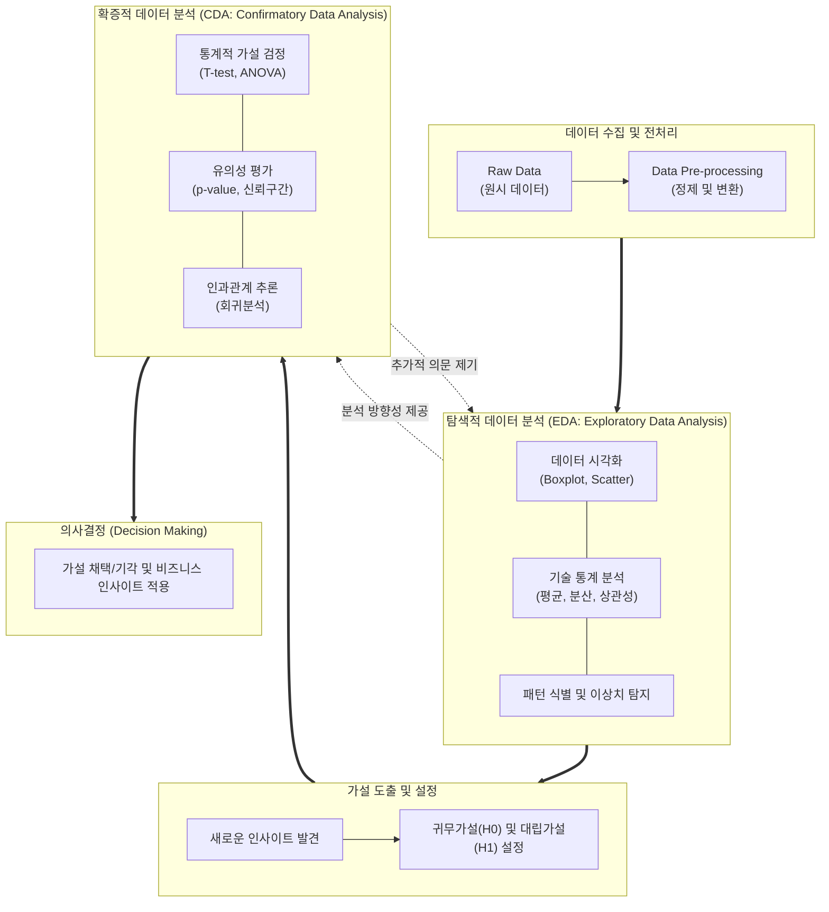

# 탐색적 데이터 분석과 확증적 데이터 분석 (EDA & CDA)

---

## I. 데이터 통찰 도출과 가설 검증의 핵심, 탐색적/확증적 데이터 분석의 개요

* **정의**: 수집된 원시 데이터에서 숨겨진 패턴과 구조를 직관적으로 파악해 가설을 도출하는 탐색적 데이터 분석([[EDA]])과, 통계적 추론을 기반으로 사전 설정된 가설의 참/거짓을 객관적으로 검증하는 확증적 데이터 분석(CDA)의 상호보완적 데이터 분석 [[프레임워크]]
* **등장 배경**: 전통적 통계학(CDA)의 엄격한 가설 검증만으로는 복잡한 데이터 이면의 의미를 발견하기 어렵다는 한계를 극복하기 위해, 존 튜키(John Tukey)가 데이터 자체의 특성을 자유롭게 시각화하고 탐색하는 EDA를 제창함
* **특징**: 귀납적(EDA)과 연역적(CDA) 접근의 조화, 시각화 기반의 직관성(EDA), 확률 모델 및 유의성 기반의 엄밀성(CDA)

---

## II. 탐색적/확증적 데이터 분석의 개념도 및 핵심 기술 요소

### 가. EDA와 CDA의 유기적 분석 프로세스 및 동작 원리

* 데이터 수집 후 EDA를 통해 데이터의 본질적 형태를 이해하고 귀납적으로 가설을 도출하며, 이후 CDA를 통해 해당 가설을 통계적 유의수준 하에서 연역적으로 검증하는 반복적 순환 구조임

### 나. EDA와 CDA의 핵심 기술 및 구성 요소

| 구분 | 요소기술(키워드) | 세부 설명 |
| --- | --- | --- |
| **EDA (탐색)** | [[기술 통계]] (Descriptive Stats) | 데이터의 중심경향성(평균, 중앙값)과 산포도(분산, 표준편차), 왜도 및 첨도 산출 |
| **EDA (탐색)** | [[데이터 가시화|데이터 시각화]] (Visualization) | 히스토그램, 산점도(Scatter Plot), 박스 플롯(Box Plot)을 통한 데이터 분포 및 [[이상치]] 직관적 파악 |
| **EDA (탐색)** | 다변량 분석 및 [[차원 축소]] | [[PCA(Principal Component Analysis)|PCA]](주성분 분석), t-SNE 등을 활용하여 고차원 데이터의 복잡도를 낮추고 주요 [[변동성]] 파악 |
| **CDA (확증)** | 가설 설정 (Hypothesis) | 검증하고자 하는 대립가설(H1)과 이를 기각하기 위해 설정하는 귀무가설(H0)의 명확한 정의 |
| **CDA (확증)** | 유의확율 ([[유의확률|p-value]]) | 귀무가설이 참일 때, 관측된 통계치 이상이 나타날 확률 (통상 0.05 미만 시 귀무가설 기각) |
| **CDA (확증)** | 신뢰 구간 (Confidence Interval) | 모수(모집단의 실제 값)가 특정 확률(예: 95%)로 포함될 것으로 추정되는 값의 범위 계산 |
| **CDA (확증)** | [[t-검정 (t-test)|T-test]] / [[ANOVA(Analysis of variance)|ANOVA]] (분산분석) | 두 집단 간 평균 차이(T-test) 또는 세 개 이상 집단 간 평균 차이(ANOVA)의 통계적 유의성 검증 |
| **CDA (확증)** | 회귀 분석 (Regression Analysis) | 독립변수가 종속변수에 미치는 영향력을 모델링하여 변수 간의 통계적 인과관계 추정 및 검증 |

---

## III. 탐색적(EDA)과 확증적(CDA) 데이터 분석의 비교 및 발전 동향

### 가. EDA와 CDA의 상세 비교

| 비교 항목 | 탐색적 데이터 분석 (EDA) | 확증적 데이터 분석 (CDA) |
| --- | --- | --- |
| **분석 철학 및 접근** | **귀납적 (Inductive)** / 데이터에서 출발 | **연역적 (Deductive)** / 가설에서 출발 |
| **주요 목적** | 데이터의 숨은 패턴 발견, 형태 파악, 가설 도출 | 설정된 가설의 통계적 검증 및 인과관계 증명 |
| **데이터 활용 방식** | 모델의 가정이나 제약 없이 자유롭게 탐색 | 엄격한 통계적 가정(정규성, [[등분산성]] 등) 충족 필요 |
| **결과물 및 산출물** | 시각적 차트, 변수 간 상관관계, 새로운 인사이트 | 통계적 유의성(p-value, F-value), 가설의 채택/기각 |
| **분석가의 태도** | 형사(Detective) - 증거(데이터)를 수집하고 단서를 찾음 | 판사(Judge) - 증거를 바탕으로 엄격하게 판결을 내림 |

### 나. 최신 기술 적용 동향 및 향후 전망

* **AutoEDA(자동화된 탐색적 분석)의 확산**: Pandas Profiling, Sweetviz, ydata-profiling 등 라이브러리 발전으로 기초적인 기술 통계 및 시각화 리포팅 과정이 완전 자동화되어 데이터 과학자의 분석 효율 극대화
* **생성형 AI와 데이터 분석의 융합**: Advanced Data Analysis(ChatGPT) 등 [[초거대 언어 모델|LLM]]을 활용하여 자연어 질의응답만으로 복잡한 EDA 파이프라인 수행 및 CDA 결과(p-value) 해석 리포팅 지원 가속화
* **머신러닝 파이프라인 통합([[MLOps]])**: 피처 엔지니어링(Feature Engineering)을 위한 선행 단계로서 EDA의 중요성이 커지고 있으며, 도출된 인사이트가 모델 평가 지표 검증(CDA)으로 자연스럽게 이어지는 통합 분석 체계 정착

---

### 🔗 연관 토픽

- **소속 도메인**: [[00_데이터베이스_MOC|🗄️ 데이터베이스]]
- **세부 분류**: `6. SQL 표준 문법 & 쿼리 성능 튜닝`
- **핵심 연관 토픽**:
  - [[데이터 가시화|데이터 가시화 (Data Visualization)]]
  - [[차원 축소|차원 축소(Dimensionality Reduction)]]
  - [[t-검정 (t-test)]]
  - [[ANOVA(Analysis of variance)]]
  - [[등분산성|등분산성 (Homoscedasticity)]]
