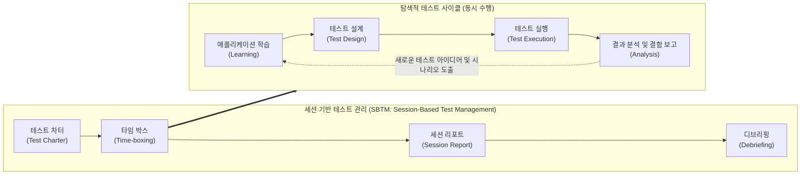

# 탐색적 테스트 (Exploratory Testing)

---

## I. 테스트 설계와 실행의 동시 수행을 통한 결함 발견 극대화 기법, 탐색적 테스트의 개요

* **정의**: 사전에 엄격하게 정의된 테스트 케이스 없이, 테스터의 경험, 직관, 도메인 지식을 바탕으로 애플리케이션에 대한 학습, 테스트 설계, 테스트 실행을 동시에 수행하는 휴리스틱(Heuristic) 기반의 동적 테스트 기법
* **등장 배경**: 요구사항 명세서의 부재 또는 불명확함 극복, 프로젝트 일정 단축 압박에 따른 문서화 오버헤드 감소 필요, 애자일([[Agile]]) 방법론의 확산
* **특징**: [[세션]] 기반 테스트 관리(SBTM)를 통한 체계성 확보, 테스터의 역량에 크게 의존, 스크립트 기반 테스트가 찾지 못하는 예외적이고 복잡한 결함 발견에 탁월

---

## II. 탐색적 테스트의 개념도 및 핵심 구성 요소

### 가. 탐색적 테스트의 아키텍처 및 동작 원리

* 타임 박스로 제한된 시간 내에 테스트 차터의 목표에 따라 시스템을 탐색하며, 학습-설계-실행-분석의 주기를 매우 짧고 지속적으로 반복하여 결함을 식별함

### 나. 탐색적 테스트의 핵심 기술 및 구성 요소

| 구분 | 요소기술(키워드) | 세부 설명 |
| --- | --- | --- |
| **관리 [[프레임워크]]** | SBTM | 무계획적인 Ad-hoc 테스트의 한계를 극복하고 탐색적 테스트를 통제/추적하기 위한 세션 기반 관리 기법 |
| **목표 설정** | 테스트 차터 (Test Charter) | 해당 세션에서 테스터가 집중해야 할 테스트의 목표, 범위, 주요 관점 및 수행 지침을 명시한 선언문 |
| **수행 통제** | 타임 박스 (Time-boxing) | 테스터의 집중력을 극대화하기 위해 한 세션을 1~2시간 내외의 엄격하게 제한된 시간으로 설정 |
| **수행 기법** | 휴리스틱 (Heuristic) | 테스터의 과거 경험, 도메인 지식, 직관 및 통찰력을 활용하여 결함 가능성이 높은 경로를 유추하는 기법 |
| **수행 기법** | 투어 메타포 (Tour Metaphor) | 목적지를 탐험하듯 특정 관점을 가지고 테스트를 수행 (예: 쓰레기차 투어, 뒷골목 투어, 가이드 투어 등) |
| **실행 주체** | 동시성 (Simultaneous) | 테스트 계획-설계-실행-평가 단계가 선형적으로 분리되지 않고 피드백 루프를 통해 즉각적으로 병행됨 |
| **결과 기록** | 세션 리포트 ([[Session Layer|Session]] Report) | 테스트 중 발견한 결함, 새롭게 제기된 의문점, 수행한 테스트 내용 등을 자유 형식으로 기록한 문서 |
| **사후 리뷰** | 디브리핑 (Debriefing) | 세션 종료 후 테스터와 관리자(Test Manager)가 리포트를 바탕으로 결과를 리뷰하고 후속 차터를 계획하는 회의 |

---

## III. 스크립트 기반 테스트와의 비교 및 향후 전망

### 가. 스크립트 기반 테스트와 탐색적 테스트 비교

| 비교 항목 | 스크립트 기반 테스트 (Scripted Testing) | 탐색적 테스트 (Exploratory Testing) |
| --- | --- | --- |
| **기본 접근법** | 사전에 정의된 명세서 및 테스트 케이스(TC) 기반 | 테스터의 경험, 직관, 학습을 통한 동적 접근 |
| **테스트 수행 시점** | 상세 테스트 설계가 완전히 종료된 이후 실행 | **테스트 설계와 실행이 동시에 (병행) 이루어짐** |
| **주요 산출물** | 테스트 계획서, 테스트 케이스 명세서, 결함 보고서 | **테스트 차터, 세션 리포트** |
| **강점 (장점)** | 재사용성 높음, 커버리지 측정 용이, 자동화 적합 | **빠른 결함 발견, 예상치 못한([[EDGE|Edge]]-case) 결함 도출** |
| **약점 (단점)** | 문서 작성 오버헤드 큼, 테스터의 창의성 제한 | 테스터의 개인 역량에 극도로 의존, 객관적 커버리지 측정 난해 |
| **적합한 환경** | 명확한 요구사항, 정형화된 [[리그레션 테스트|회귀 테스트]](Regression) | **요구사항 변경이 잦은 애자일, 명세서 부재, 시간 제약** |

### 나. 탐색적 테스트의 활용 동향 및 향후 전망

* **애자일(Agile) 및 [[DevOps]] 환경의 핵심 상호보완재**: 지속적 통합/배포(CI/CD) 파이프라인에서 정형화된 기능 및 회귀 테스트는 자동화([[TDD]]/BDD)에 위임하고, 인간의 인지 능력이 필요한 신규 기능이나 복잡한 비즈니스 로직 검증에는 탐색적 테스트를 집중하는 하이브리드 전략이 표준으로 자리 잡음
* **AI 기반 증강 테스팅(Augmented Testing) 도입**: 테스터의 직관에만 의존하던 기존 방식에서 탈피하여, 기계학습 모델이 과거의 결함 패턴과 소스코드 변경 이력을 분석하여 결함 발생 확률이 높은 화면이나 경로를 테스터에게 우선적으로 추천하는 AI 어시스턴트 기반 탐색적 테스트로 진화 중

---

### 🔗 연관 토픽

- **소속 도메인**: [[00_소프트웨어공학_MOC|🏗️ 소프트웨어공학]]
- **세부 분류**: `2. 애자일(Agile) & 지속적 통합/배포(CI/CD)`
- **핵심 연관 토픽**:
  - [[리그레션 테스트|리그레션(회귀, Regression) 테스트]]
  - [[TDD|TDD (Test Driven Development)]]
  - [[소프트웨어 테스트|소프트웨어 테스트 (Software Test)]]
  - [[소프트웨어 테스트 원리|테스트 원리]]
  - [[DevOps|데브옵스 (DevOps)]]
