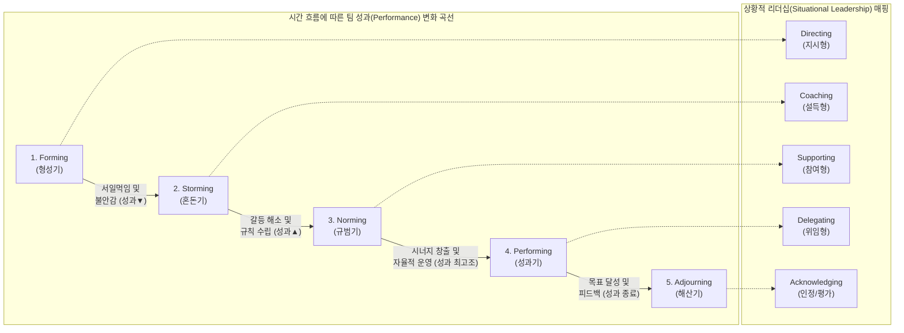

# 터크만 팀 개발 5단계 (Tuckman's Stages of Team Development)

---

## I. 프로젝트 팀의 성장과 역학 관계를 설명하는 조직 행동 모델, 터크만 팀 개발 5단계의 개요

* **정의**: 브루스 터크만(Bruce Tuckman)이 제안한 모델로, 프로젝트 팀이 구성되어 목표를 달성하고 해산하기까지 겪는 발달 과정을 5개의 순차적 단계(형성, 혼돈, 규범, 성과, 해산)로 체계화한 [[프레임워크]]
* **등장 배경**: 프로젝트 관리 및 애자일([[Agile]]) 조직에서 팀 빌딩(Team Building)의 일관된 기준 제공 필요, 팀의 성숙도에 따른 맞춤형 리더십 발휘의 중요성 증대
* **특징**: 갈등(Storming)을 부정적 요소가 아닌 팀의 성장을 위한 필수적이고 자연스러운 과정으로 인식, 각 단계별로 구성원의 [[관계성]](Relationship)과 과업 수행 능력(Task)의 수준이 변화함

---

## II. 터크만 팀 개발 5단계의 개념도 및 핵심 구성 요소

### 가. 터크만 팀 개발 5단계의 프로세스 및 성과 곡선 (개념도)

* 팀은 초기 형성 이후 역할 분담 과정에서 갈등(혼돈기)을 겪으며 일시적으로 성과가 하락하나, 이를 극복하고 규범을 확립하면 최고 수준의 성과(성과기)를 창출하게 됨

### 나. 터크만 팀 개발 5단계의 핵심 단계 및 리더의 역할

| 분류 (단계) | 요소기술(키워드) | 세부 설명 및 팀의 특징 | 리더의 역할 (리더십) |
| --- | --- | --- | --- |
| **1단계** | **Forming (형성기)** | 팀이 처음 구성되어 서로 눈치를 보며, 목표와 역할이 불명확하고 개인적 성향을 탐색하는 단계 | **지시적 리더십 (Directing)**: 명확한 목표 제시 및 팀의 비전/기대치 설정 |
| **2단계** | **Storming (혼돈기)** | 리더십에 대한 도전, 역할 및 권한 배분을 둘러싼 팀원 간의 충돌과 갈등이 표출되는 위기 단계 | **설득적 리더십 (Coaching)**: 갈등 중재, 열린 소통 장려 및 긍정적 타협 유도 |
| **3단계** | **Norming (규범기)** | 갈등이 해소되고 팀의 규칙(Ground Rule), 협업 [[프로세스]], 상호 신뢰와 결속력이 형성되는 단계 | **참여적 리더십 (Supporting)**: 의사결정 참여 유도, 팀원 간의 협업 촉진 |
| **4단계** | **Performing (성과기)** | 팀이 시너지를 발휘하여 자율적이고 독립적으로 문제를 해결하며, 고도의 성과를 창출하는 단계 | **위임적 리더십 (Delegating)**: 권한 위임, 간섭 최소화 및 리소스 지원 집중 |
| **[[PMBOK 프로세스 그룹 (5단계)|5단계]]** | **Adjourning (해산기)** | 프로젝트 목표를 성공적으로 달성(또는 중단)하고 팀이 해체되며, 구성원들이 이별의 감정을 겪는 단계 | **인정 및 평가 (Acknowledging)**: 성과 보상, Lesson Learned 작성 및 지식 자산화 |

---

## III. 상황적 리더십(Hersey-Blanchard)과의 연계 및 최신 적용 동향

### 가. 터크만 모델과 허시-블랜차드 상황적 리더십 모델의 연계

| 터크만 5단계 | 팀원 성숙도 (과업 능력 / 의지) | 적용 리더십 스타일 | 주요 통제 포인트 |
| --- | --- | --- | --- |
| **형성기 (Forming)** | 능력 낮음 / 의지 높음 (열정적 초보자) | **지시형 (Telling / S1)** | 높은 과업 지시, 낮은 관계성 지원 |
| **혼돈기 (Storming)** | 능력 낮음 / 의지 낮음 (좌절한 학습자) | **설득형 (Selling / S2)** | 높은 과업 지시, 높은 관계성 지원 |
| **규범기 (Norming)** | 능력 중간 / 의지 변동 (소극적 기여자) | **참여형 (Participating / S3)** | 낮은 과업 지시, 높은 관계성 지원 |
| **성과기 (Performing)** | 능력 높음 / 의지 높음 (자기 주도적 성취자) | **위임형 (Delegating / S4)** | 낮은 과업 지시, 낮은 관계성 지원 |

### 나. 애자일(Agile) 환경에서의 터크만 모델 적용 동향 및 시사점

* **스프린트(Sprint) 단위의 미시적 발달 과정 반복**: 애자일 조직은 2~4주의 짧은 반복 주기를 가지므로, 팀 멤버 교체나 백로그(Backlog) 변경 시마다 형성기-혼돈기-규범기의 사이클을 매우 빠르게 겪으며 성장하는 특징을 보임
* **[[스크럼]] 마스터([[SCRUM|Scrum]] Master)의 서번트 리더십(Servant Leadership) 중요**: 자율 편성 팀(Self-Organizing Team)을 지향하는 애자일 환경에서는, 혼돈기(Storming)의 갈등을 억누르기보다는 건설적인 회고(Retrospective)를 통해 규범기(Norming)로 신속히 전환시키는 퍼실리테이터(Facilitator) 역량이 필수적임

---

### 🔗 연관 토픽

- **소속 도메인**: [[00_프로젝트관리_MOC|📋 프로젝트관리]]
- **세부 분류**: `5. 애자일 프로젝트 관리 & 개발 운영 (Agile PM)`
- **핵심 연관 토픽**:
  - [[스크럼|스크럼 (SCRUM)]]
  - [[SCRUM]]
  - [[PMBOK 프로세스 그룹 (5단계)]]
  - [[Agile]]
  - [[린 방법론|린 (Lean) 방법론]]
