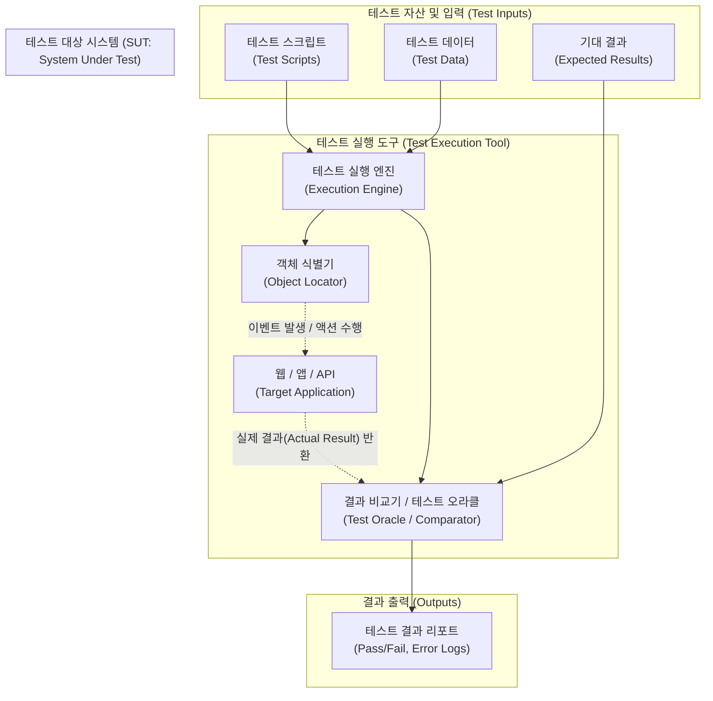

# 테스트 실행 도구 (Test Execution Tool)

---

## I. 소프트웨어 테스팅 효율화 및 지속적 통합의 핵심, 테스트 실행 도구의 개요

* **정의**: 사전에 작성된 테스트 스크립트를 기반으로 대상 시스템(SUT)을 자동으로 실행하고, 그 결과(실제 결과)를 기대 결과와 비교하여 결함 여부를 보고하는 소프트웨어 테스팅 자동화 도구
* **등장 배경**: 애자일([[Agile]]) 및 데브옵스([[DevOps]]) 환경에서 빈번한 배포에 따른 [[리그레션 테스트|회귀 테스트]]([[Regression Test]]) 비용 증가, 인적 오류(Human Error) 최소화 및 365일 무인 자동화 테스팅 요구 증대
* **특징**: 테스트 반복 수행의 효율성 극대화, 다양한 테스트 자동화 [[프레임워크]](데이터 주도, 키워드 주도 등) 지원, CI/CD 파이프라인과의 강력한 연동 체계 제공

---

## II. 테스트 실행 도구의 개념도 및 핵심 구성 요소

### 가. 테스트 실행 도구의 아키텍처 및 동작 원리

* 테스트 실행 엔진은 스크립트와 데이터를 해석하여 대상 시스템(SUT)에 동작을 지시하고, SUT에서 반환된 실제 결과와 기대 결과를 비교기(Oracle)가 대조하여 최종 리포트를 생성함

### 나. 테스트 실행 도구의 핵심 기술 및 구성 요소

| 구분 | 요소기술(키워드) | 세부 설명 |
| --- | --- | --- |
| **실행 제어** | 실행 엔진 (Execution Engine) | 작성된 테스트 스크립트를 파싱하고 순차적 또는 병렬로 테스트를 구동하는 핵심 모듈 |
| **입력 관리** | 데이터 풀 (Data Pool) | 하드코딩을 방지하기 위해 외부 저장소(CSV, Excel, DB)에서 테스트 파라미터를 동적으로 로드 |
| **객체 제어** | 식별자 (Object Locator) | 대상 애플리케이션의 UI 요소(버튼, 입력창 등)를 식별하는 기술 (XPath, CSS Selector, ID 등) |
| **결과 검증** | [[테스트 오라클]] (Test Oracle) | 실제 출력값과 기대 결과값이 일치하는지 자동으로 판단하는 비교 메커니즘 (참/거짓 판별) |
| **결과 검증** | 어설션 (Assertion) | 스크립트 내에서 특정 조건의 성립 여부를 강제 검사하고, 실패 시 예외를 발생시키는 구문 |
| **결과 출력** | 리포트 제너레이터 (Reporter) | 테스트 수행 이력, 성공/실패 통계, 스크린샷 캡처 및 로그를 포함한 시각적 대시보드 생성 |
| **개발 환경** | 테스트 IDE / 레코더 | 코드 작성 없이 사용자의 화면 조작을 녹화(Capture)하여 자동으로 스크립트로 변환하는 기능 |
| **외부 연동** | CI/CD 통합 플러그인 | Jenkins, GitHub Actions 등 빌드 파이프라인과 API로 연동되어 코드 커밋 시 자동 트리거링 지원 |

---

## III. 테스트 실행 도구의 자동화 프레임워크 비교 및 향후 전망

### 가. 테스트 실행 도구의 스크립트 작성 방식(자동화 프레임워크) 비교

| 비교 항목 | 캡처 앤 플레이백 (Capture & Playback) | 데이터 주도 테스팅 (Data-Driven Testing) | 키워드 주도 테스팅 (Keyword-Driven Testing) |
| --- | --- | --- | --- |
| **동작 방식** | 사용자의 마우스/키보드 입력을 녹화 후 그대로 재생 | 하나의 테스트 스크립트에 다양한 데이터셋을 반복 주입하여 실행 | 비즈니스 로직(키워드)과 테스트 데이터를 조합하여 실행 |
| **주요 장점** | 스크립트 지식 없이 초보자도 빠르게 테스트 자동화 가능 | 테스트 스크립트 양 감소, 다양한 케이스에 대한 높은 커버리지 확보 | 비개발자(도메인 전문가)도 직관적인 키워드 표를 통해 테스트 설계 가능 |
| **한계점** | UI 변경 시 기존 녹화본 전면 폐기 및 재녹화 필요 ([[유지보수]] 취약) | 스크립트와 데이터 연동을 위한 프로그래밍 기술 및 데이터 관리 공수 발생 | 초기 키워드(Action Word) 정의 및 라이브러리 구축 비용이 큼 |

### 나. 테스트 실행 도구의 최신 동향 및 발전 방향

* **자가 치유(Self-Healing) 기술의 도입**: UI 객체의 속성(ID, XPath)이 개발 과정에서 변경되더라도, AI/ML 알고리즘이 객체의 시각적/구조적 특징을 분석하여 자동으로 스크립트를 수정(Healing)함으로써 유지보수 비용을 획기적으로 절감 (예: Mabl, Testim)
* **코드리스/로우코드(Codeless/Low-code) 테스팅 확산**: 복잡한 프로그래밍 언어 대신, 자연어 처리(NLP)나 시각적 플로우 차트를 통해 누구나 쉽게 테스트 실행 스크립트를 작성할 수 있는 도구 생태계 성장
* **클라우드 기반 병렬 테스트 환경(Device Farm) 통합**: Selenium Grid나 Appium을 기반으로, 모바일 기기와 다양한 브라우저 환경을 클라우드 상에서 동시에 실행(Cross-browser/Cross-device Testing)하여 테스트 소요 시간을 대폭 단축하는 방향으로 진화

---

### 🔗 연관 토픽

- **소속 도메인**: [[00_소프트웨어공학_MOC|🏗️ 소프트웨어공학]]
- **세부 분류**: `2. 애자일(Agile) & 지속적 통합/배포(CI/CD)`
- **핵심 연관 토픽**:
  - [[리그레션 테스트|리그레션(회귀, Regression) 테스트]]
  - [[DevOps|데브옵스 (DevOps)]]
  - [[테스트 오라클]]
  - [[Regression Test]]
  - [[소프트웨어 테스트|소프트웨어 테스트 (Software Test)]]
