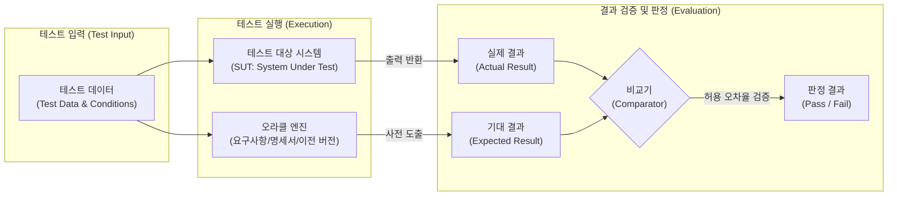

# 테스트 오라클 (Test Oracle)

---

## I. 테스트 결과의 참/거짓을 판별하는 절대 기준, 테스트 오라클의 개요

* **정의**: 테스트 대상 시스템(SUT)을 실행하여 도출된 실제 결과(Actual Result)와 사전에 정의된 기대 결과(Expected Result)를 비교하여, 테스트의 성공(Pass)/실패(Fail) 여부를 객관적으로 판단하는 메커니즘 및 도구
* **등장 배경**: 테스트 자동화 과정에서 인간의 수동 검증(Manual Verification)에 따른 휴먼 에러(Human Error) 방지, 대규모 테스트 실행 시 결과 판별의 비용 및 시간적 병목 현상 극복 필요
* **특징**: 완벽한 오라클(True Oracle) 구축의 현실적 어려움(비용/시간 제약), 테스터의 경험과 직관을 활용하는 휴리스틱 접근의 병행, [[리그레션 테스트|회귀 테스트]] 시 자동화된 판정 기준 제공

---

## II. 테스트 오라클의 개념도 및 핵심 기술 요소

### 가. 테스트 오라클의 아키텍처 및 동작 원리

* 동일한 테스트 데이터를 SUT와 오라클 엔진(명세서 등)에 주입한 후, SUT에서 반환된 실제 결과와 오라클이 도출한 기대 결과를 비교기(Comparator)가 대조하여 최종 성공 여부를 판정함

### 나. 테스트 오라클의 핵심 구성 요소 및 오라클 유형

| 구분 | 요소기술(키워드) | 세부 설명 |
| --- | --- | --- |
| **핵심 요소** | 기대 결과 (Expected Result) | [[요구사항 명세서]], 사용자 매뉴얼, 혹은 기존 시스템을 바탕으로 사전에 정의된 '참(True)' 값 |
| **핵심 요소** | 실제 결과 (Actual Result) | 테스트 대상 시스템에 입력값을 주고 코드를 실행한 결과로 시스템이 반환한 데이터 |
| **핵심 요소** | 비교기 (Comparator) | 두 결과값의 일치 여부를 자동화된 스크립트나 도구를 통해 검증하는 [[알고리즘]] (Assertion 등) |
| **핵심 요소** | 허용 오차 (Tolerance) | 부동소수점 연산이나 난수 생성 등에서 두 값의 차이가 인정되는 합리적 오차 범위 |
| **오라클 유형** | **참 오라클 (True)** | 모든 테스트 입력값에 대해 기대하는 결과를 **100% 생성**하여 검증 (항공, 우주 등 미션 크리티컬) |
| **오라클 유형** | **샘플링 오라클 (Sampling)** | 특정한 **몇몇 샘플 입력값**에 대해서만 기대 결과를 도출하여 검증 (일반적인 업무 시스템) |
| **오라클 유형** | **휴리스틱 오라클 (Heuristic)** | 샘플링된 값은 정확히 검증하고, 나머지는 **휴리스틱(직관, 경험)을 활용**하여 성공 여부 추정 |
| **오라클 유형** | **일관성 오라클 (Consistent)** | 애플리케이션 변경 시 수행 전과 후의 **결과값이 동일한지(일관성)**를 검증 (회귀 테스트에 활용) |

---

## III. 테스트 오라클 유형 간 비교 및 향후 전망

### 가. 4대 테스트 오라클 유형 비교

| 비교 항목 | 참 오라클 (True) | 샘플링 오라클 (Sampling) | 휴리스틱 오라클 (Heuristic) | 일관성 오라클 (Consistent) |
| --- | --- | --- | --- | --- |
| **커버리지** | 모든 입력값 (100%) | 특정 일부 입력값 | 전수(추정 포함) | 특정 기능 및 전체 변경 건 |
| **비용 및 리소스** | 매우 높음 (현실적 적용 어려움) | 낮음 ~ 중간 | 중간 (테스터 역량 의존) | 중간 (자동화 도구 의존) |
| **정확도/[[신뢰성]]** | 완벽한 신뢰성 보장 | 미검증 구간에 대한 결함 누락 위험 | 추정에 의한 오판(False Positive) 가능성 존재 | 변경 전 시스템의 신뢰성에 결과가 종속됨 |
| **주요 적용 분야** | 항공, 우주, 원자력 시스템 | 일반 웹/앱, 엔터프라이즈 시스템 | AI, 머신러닝, 복잡한 비즈니스 로직 | 리팩토링, 마이그레이션, 회귀 테스트 |

### 나. 테스트 오라클의 한계 및 최신 대응 동향

* **AI 모델 검증 한계와 메타모픽 테스팅(Metamorphic Testing)**: 머신러닝/AI 모델, [[Smart Car(자율주행)|자율주행]] 등은 입력값에 대한 '정답(참 오라클)'을 사전에 알기 불가능한 '오라클 문제(Oracle Problem)'를 가짐. 이를 해결하기 위해 입력 변환 관계에 따른 출력의 변화성(Metamorphic Relation)을 기반으로 검증하는 대안적 테스팅 기법 확산
* **생성형 AI 기반 오라클 자동 생성**: 과거의 결함 이력, 요구사항 명세서(자연어), 시스템 로그를 [[초거대 언어 모델|LLM]](거대 언어 모델)이 분석하여 테스트 데이터와 기대 결과(Expected Result)를 자동으로 생성하는 AI 기반 Auto-Oracle 연구 활발

---

### 🔗 연관 토픽

- **소속 도메인**: [[00_소프트웨어공학_MOC|🏗️ 소프트웨어공학]]
- **세부 분류**: `2. 애자일(Agile) & 지속적 통합/배포(CI/CD)`
- **핵심 연관 토픽**:
  - [[리그레션 테스트|리그레션(회귀, Regression) 테스트]]
  - [[테스트 실행 도구]]
  - [[테스트 하네스]]
  - [[소프트웨어 테스트|소프트웨어 테스트 (Software Test)]]
  - [[STPA|STPA (System-Theoretic Process Analysis)]]
