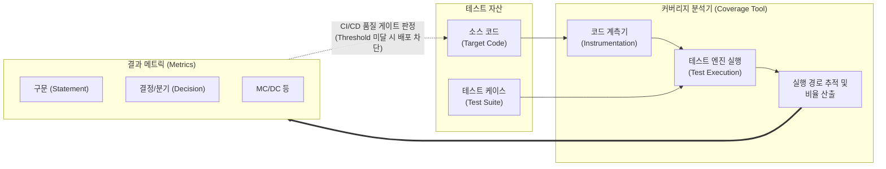

# 테스트 커버리지 (Test Coverage)

---

## I. 소프트웨어 테스팅의 충분성 및 품질 측정 지표, 테스트 커버리지의 개요

* **정의**: [[소프트웨어 테스트]] 수행 시, 전체 소스 코드 중 테스트 케이스에 의해 실제 실행(Execution)된 코드의 비율을 정량적으로 측정하는 화이트박스(White-box) 테스트 메트릭
* **등장 배경**: 테스트의 누락(Dead Code 등) 방지 및 [[신뢰성]] 확보, 미션 크리티컬 시스템(의료, 항공, 자동차 등)의 안전성 규제 준수([[ISO 26262]], DO-178C), CI/CD 환경에서의 품질 게이트(Quality Gate) 자동화 요구 증대
* **특징**: 소스 코드 내부 논리 구조 기반 측정(제어흐름/데이터흐름), 테스트 종료 조건의 정량적 기준(Exit Criteria) 제공, 100% 커버리지가 무결점(Zero Defect)을 보장하지는 않음(품질의 한계)

---

## II. 테스트 커버리지의 개념도 및 핵심 측정 기법

### 가. 테스트 커버리지 측정 아키텍처 및 동작 원리

* 분석 도구(JaCoCo, SonarQube 등)가 소스 코드에 계측 코드(Instrumentation)를 삽입한 후 테스트를 실행하여, 구문 및 분기의 통과 여부를 모니터링하고 정량적 지표를 산출함

### 나. 테스트 커버리지의 핵심 측정 기법 (구조적 커버리지 중심)

| 구분 | 요소기술(키워드) | 세부 설명 |
| --- | --- | --- |
| **기본 기법** | 구문 커버리지 (Statement) | 프로그램 내의 **모든 [[명령문]](Statement)**이 적어도 한 번 이상 실행될 수 있도록 테스트 케이스 설계 |
| **분기 검증** | 결정 커버리지 (Decision / Branch) | 전체 조건식이 결과적으로 **참(True)과 거짓(False)**을 최소 한 번씩 갖도록 테스트 설계 |
| **조건 검증** | 조건 커버리지 (Condition) | 전체 조건식의 결과와 무관하게, 내부의 **개별 조건식들이 참과 거짓**을 한 번씩 갖도록 설계 |
| **조합 검증** | 조건/결정 커버리지 (C/D) | 전체 조건식뿐만 아니라 개별 조건식도 모두 참/거짓을 한 번씩 충족하도록 결합한 커버리지 |
| **독립성 검증** | MC/DC (변경 조건/결정) | **타 조건에 영향을 받지 않고**, 개별 조건식이 전체 결정에 독립적으로 영향을 미치는 조건을 도출하여 테스트 |
| **완전 조합** | 다중 조건 커버리지 (Multiple Condition) | 조건식 내부 개별 조건들의 **가능한 모든 논리적 조합( $2^n$ )**을 100% 보장하는 테스트 |
| **흐름 검증** | 경로 커버리지 (Path Coverage) | 순환(Loop)을 포함하여 프로그램 내에 존재하는 **모든 가능한 실행 경로**를 테스트 |
| **보완 기법** | 데이터 흐름 커버리지 | 제어 흐름이 아닌, 변수의 정의(Definition)와 사용(Use) 경로(DU Path)를 추적하여 이상 현상 탐지 |

---

## III. 핵심 테스트 커버리지 기법 비교 및 향후 전망

### 가. 주요 테스트 커버리지 기법 비교 (포함 관계 및 특성)

| 비교 항목 | 구문 (Statement) | 결정/분기 (Decision) | 조건 (Condition) | MC/DC |
| --- | --- | --- | --- | --- |
| **검증 대상** | 단순 코드 실행 여부 | 조건문의 전체 결과 (T/F) | 조건문 내 개별 조건식 (T/F) | 개별 조건의 독립적 영향도 |
| **포함 관계** | 가장 약한 커버리지 | 구문 커버리지를 포함 | 구문은 포함하나 분기는 미포함 | 구문, 결정, 조건 커버리지 모두 포함 |
| **테스트 케이스 수** | 매우 적음 | 적음 | 조건식 수에 비례 | $N+1$ 개 (N=조건의 수), 효율성 극대화 |
| **주요 적용 분야** | 일반적인 [[단위 테스트]] | 기본적인 로직 검증 필수 지표 | 복잡한 논리 연산 검증 | **ISO 26262 등 안전 필수(Safety-Critical) 시스템** |

### 나. 테스트 커버리지의 최신 동향 및 발전 방향

* **커버리지의 질적 한계를 극복하는 뮤테이션 테스팅(Mutation Testing)**: 100% 코드 커버리지가 '테스트의 품질' 자체를 보장하지 못하는 허점을 보완하기 위해, 소스 코드를 인위적으로 변형(Mutant)한 후 테스트 스위트가 이를 찾아내는지(Kill) 측정하여 테스트 케이스의 실제 결함 검출력을 평가
* **AI 기반 테스트 코드 자동 생성**: [[초거대 언어 모델|LLM]](거대 언어 모델) 및 AI 코딩 어시스턴트(GitHub Copilot, CodiumAI 등)를 활용하여, 엣지 케이스([[EDGE|Edge]] Case)를 자동으로 분석하고 커버리지 목표치에 도달할 수 있는 테스트 스크립트를 자동 생성하는 파이프라인 도입 확산
* **AI/머신러닝 모델 대상의 커버리지 확장**: 기존 논리적 코드 구조가 없는 [[딥러닝]] 모델의 검증을 위해, 뉴런 활성화 정도를 측정하는 뉴런 커버리지(Neuron Coverage) 등 AI 특화 커버리지 메트릭에 대한 연구 및 표준화 진행 중

---

### 🔗 연관 토픽

- **소속 도메인**: [[00_소프트웨어공학_MOC|🏗️ 소프트웨어공학]]
- **세부 분류**: `2. 애자일(Agile) & 지속적 통합/배포(CI/CD)`
- **핵심 연관 토픽**:
  - [[소프트웨어 테스트|소프트웨어 테스트 (Software Test)]]
  - [[Clean Architecture]]
  - [[초거대 언어 모델|초거대 언어 모델(Large Language Model)]]
  - [[단위 테스트]]
  - [[ISO 26262]]
