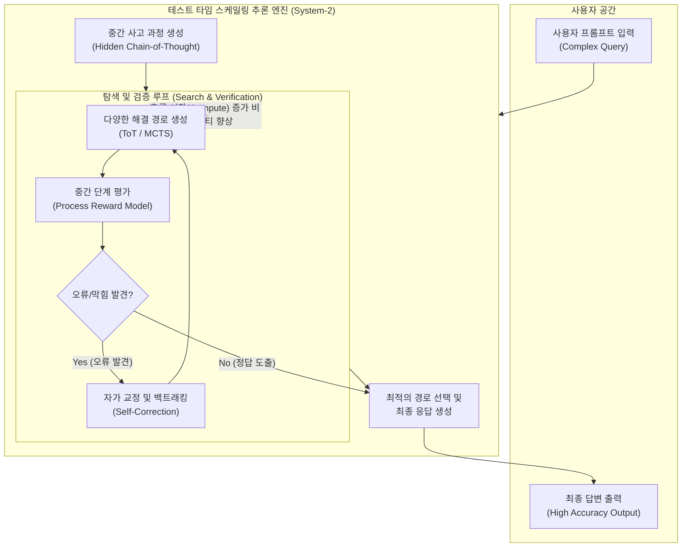

# 테스트 타임 스케일링 (Test-Time Scaling)

---

## I. 시스템-2(System-2) 사고를 위한 추론 최적화 기법, 테스트 타임 스케일링의 개요

* **정의**: 대형 언어 모델([[초거대 언어 모델|LLM]])이 사용자 질의에 즉각적으로 답변하는 대신, 추론(Inference, Test-Time) 단계에서 컴퓨팅 연산량을 동적으로 증대시켜 다단계 논리적 사고, 탐색, 검증을 수행함으로써 복잡한 문제 해결 능력을 극대화하는 기법
* **등장 배경**:
* 데이터 및 컴퓨팅 비용 한계: 사전 학습(Pre-training) 규모 확장에 의존하는 기존 스케일링 법칙(Scaling Law)의 한계 봉착
* 논리적 추론 요구: 수학, 코딩, 과학 등 직관적 답변(System-1)으로는 해결 불가능한 복잡한 다단계 추론(System-2) 필요성 증대 (예: OpenAI o1, DeepSeek-R1 모델)

* **특징**:
* 응답 시간(Latency)과 답변 품질 간의 트레이드오프: 더 오래 '생각'할수록 더 높은 정확도와 논리력 제공
* 자가 교정(Self-Correction): 중간 사고 과정(Hidden Chain-of-Thought)에서 오류를 식별하고 이전 단계로 회귀(Backtracking)하여 수정

---

## II. 테스트 타임 스케일링의 개념도 및 핵심 기술 요소

### 가. 테스트 타임 스케일링의 아키텍처 및 동작 원리

* 사용자 프롬프트가 입력되면 즉각 답변을 생성하지 않고, 숨겨진 사고 과정(Hidden [[COT|CoT]]) 영역에서 탐색(Search)과 평가(PRM), 자가 교정(Self-Correction)의 반복 루프를 거치며 최적의 답을 도출함

### 나. 테스트 타임 스케일링의 핵심 기술 요소

| 구분 | 요소기술(키워드) | 세부 설명 |
| --- | --- | --- |
| **사고 체계** | System-2 Thinking | 빠르고 직관적인 생성(System-1)을 억제하고, 의도적이고 논리적인 다단계 분석 절차를 수행하는 인지 메커니즘 |
| **중간 표현** | 숨겨진 CoT (Hidden Chain-of-Thought) | 최종 답변을 도출하기 전, 모델 내부에서 생성하고 평가하는 일련의 중간 논리 전개 토큰(Tokens) |
| **경로 탐색** | 트리 탐색 ([[ToT]] / MCTS) | 사고의 흐름(Tree of Thoughts)을 트리 구조로 전개하고, 몬테카를로 트리 탐색(MCTS) 등을 통해 최적의 노드(해결책) 탐색 |
| **평가 메커니즘** | PRM (Process Reward Model) | 최종 결과(Outcome)만 평가하는 것이 아니라, 논리 전개의 매 중간 단계(Process)마다 정확성과 유효성을 점수화하여 보상 |
| **오류 복구** | 자가 교정 (Self-Correction) | 논리 전개 중 모순이나 막힘(Dead end)을 스스로 인지하고, 이전 단계로 되돌아가(Backtracking) 새로운 경로를 시도 |
| **최적화/학습** | [[강화학습]] (RL) 기반 최적화 | 추론 시점에 컴퓨팅을 효율적으로 사용하고, 오류를 스스로 찾아내도록 모델을 사후 학습(Post-training)시키는 기법 |
| **자원 관리** | 동적 컴퓨팅 할당 (Compute Allocation) | 질문의 복잡도(쉬운 질문 vs 어려운 수학 문제)에 따라 탐색의 깊이와 추론에 소요되는 시간/자원을 동적으로 조절 |
| **성능 확장** | 외부 도구 통합 및 병렬화 | 병렬 추론 메커니즘을 적용하거나, 추론 도중 웹 검색(Search), 시뮬레이션 등 외부 환경 피드백을 실시간 통합하여 정확도 향상 |

---

## III. 훈련 타임 스케일링과의 비교 및 향후 전망

### 가. 훈련 타임 스케일링(Pre-training) vs 테스트 타임 스케일링(Test-time)

| 비교 항목 | 훈련 타임 스케일링 (Pre-training Scaling) | 테스트 타임 스케일링 (Test-Time Scaling) |
| --- | --- | --- |
| **핵심 목적** | 방대한 지식의 압축 및 패턴 학습 | 학습된 지식을 기반으로 한 **논리적 추론 및 문제 해결력 극대화** |
| **연산 집중 구간** | 모델 훈련 (Training) 시점 | 모델 실행 및 **추론 (Inference / Test-Time) 시점** |
| **사고 메커니즘** | System-1 (빠른 직관, 단순 다음 단어 예측) | **System-2 (느리고 깊은 사고, 다단계 논리 검증)** |
| **입출력 반응** | 입력 즉시 결과 출력 (Low Latency) | **중간 사고 과정 소요로 인해 응답 지연 발생 (High Latency)** |
| **대표 모델 적용** | GPT-3, GPT-4, Llama-3 (초기) | **OpenAI o1, DeepSeek-R1** |

### 나. 한계점 및 향후 발전 전망

* **지연성(Latency) 및 비용 한계 극복**: 복잡도에 관계없이 일관되지 않은 응답 시간(Latency Variability)과 과잉 사고(Overthinking) 문제를 해결하기 위해, 쿼리 난이도를 사전 분류하여 동적으로 연산(Compute)을 할당하는 최적화 라우팅 기술(Adaptive Compute)로 발전
* **에이전틱 워크플로우(Agentic Workflow)의 핵심 엔진**: 단일 응답 생성을 넘어, 기획(Planning)-실행(Action)-피드백(Feedback)-수정(Revision)을 거치는 완전 자율형 AI 에이전트 구축의 기반 아키텍처로 자리매김하며, 검색 기능 결합 등을 통해 환각(Hallucination)을 획기적으로 낮출 것으로 전망

---

### 🔗 연관 토픽

- **소속 도메인**: [[00_인공지능_MOC|🤖 인공지능]]
- **세부 분류**: `4. 거대언어모델 (LLM) & 생성형 AI`
- **핵심 연관 토픽**:
  - [[COT|COT(Chain of Thought)]]
  - [[ToT|tot Tree of thought]]
  - [[초거대 언어 모델|초거대 언어 모델(Large Language Model)]]
  - [[강화학습]]
  - [[프롬프트 엔지니어링|프롬프트 엔지니어링(Prompt Engineering)]]
