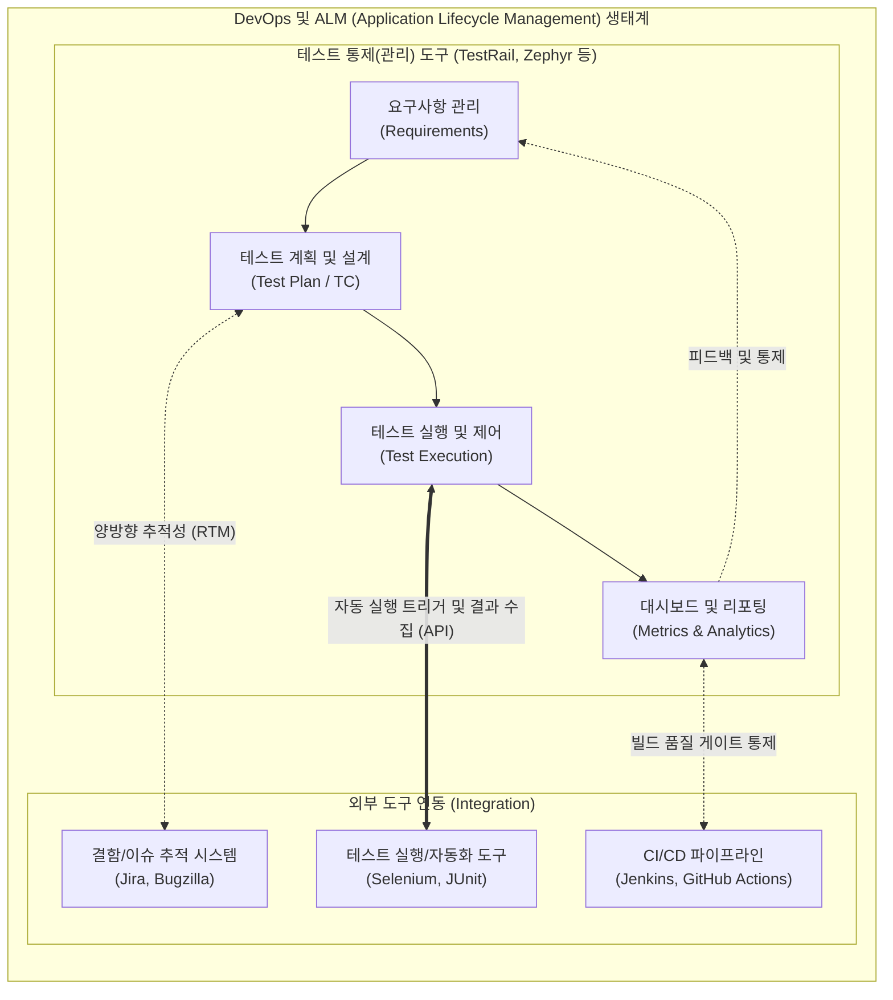

# 테스트 통제 도구 (Test Management Tool)

---

## I. 전체 테스트 수명주기의 통합 관리와 추적성 확보, 테스트 통제 도구의 개요

* **정의**: 소프트웨어 테스트의 계획, 설계, 실행, 결함 추적, 리포팅 등 전체 [[프로세스]](Test Lifecycle)를 중앙 집중적으로 통제하고 모니터링하여 가시성과 품질을 확보하는 통합 관리 시스템
* **등장 배경**: 테스트 자산(Test Case, Script)의 파편화 방지, 복잡한 요구사항과 결함 간의 양방향 추적성(Traceability) 부재 해결, 애자일/[[DevOps]] 환경에서의 CI/CD 파이프라인 연동 필요성 증대
* **특징**: 테스트 진척도 및 품질 메트릭 실시간 시각화, 요구사항-TC-결함 간 요구사항 추적 매트릭스(RTM) 자동 구성, 타 개발/협업 도구(형상관리, 이슈 트래커)와의 완벽한 통합 플러그인 지원

---

## II. 테스트 통제 도구의 개념도 및 핵심 기술 요소

### 가. 테스트 통제 도구의 아키텍처 및 동작 원리

* 테스트 통제 도구는 단독으로 동작하기보다 요구사항 관리, 자동화 테스트 도구, 결함 추적 시스템(BTS)의 중앙에 위치하여 데이터 흐름을 중계하고 테스트 현황을 종합 통제함

### 나. 테스트 통제 도구의 핵심 기술 및 구성 요소

| 구분 | 요소기술(키워드) | 세부 설명 |
| --- | --- | --- |
| **자산 관리** | 테스트 케이스(TC) 저장소 | 분산된 스프레드시트를 대체하여 TC의 생성, 리뷰, 버전 관리, [[재사용]](Test Suite)을 지원하는 중앙 저장소 |
| **추적성 확보** | 요구사항 추적 매트릭스 (RTM) | [[요구사항 명세서]], 테스트 케이스, 식별된 결함을 1:N 양방향으로 매핑하여 누락된 테스트 검증 |
| **결함 통제** | 이슈 트래커 연동 (BTS Integration) | 테스트 실패 시 Jira 등의 결함 관리 도구에 자동으로 이슈를 생성하고, 결함의 상태(Open/Closed)를 실시간 동기화 |
| **실행 통제** | 오픈 API / Webhook | 외부 [[테스트 실행 도구]](Selenium 등)의 실행 결과를 REST API로 수신하여 자동화 테스트 결과를 통합 관리 |
| **품질 가시성** | 실시간 대시보드 (Dashboard) | 전체 TC 진행률, 결함 밀도, 모듈별 커버리지 등 핵심 성과 지표(KPI)를 차트로 시각화하여 제공 |
| **일정/형상** | 마일스톤 및 릴리즈 통제 | 소프트웨어 빌드 및 릴리즈 버전별로 테스트 주기를 매핑하여 버전별 품질 수준 추적 관리 |
| **협업 통제** | 워크플로우 제어 (Workflow Engine) | 테스터, 개발자, 관리자 간의 역할 기반 접근 제어([[RBAC]]) 및 테스트 상태(Ready, In-Progress, Done) 전이 통제 |
| **지속성 보장** | CI/CD 플러그인 연동 | 코드 커밋 후 빌드 파이프라인 상에서 통제 도구가 자동화 테스트를 트리거하고, 결과에 따라 배포를 승인/차단 |

---

## III. 테스트 도구 분류 간 비교 및 향후 전망

### 가. 테스트 통제 도구와 테스트 실행 도구의 비교

| 비교 항목 | 테스트 통제 도구 (Test Management/Control) | 테스트 실행 도구 (Test Execution Tool) |
| --- | --- | --- |
| **주요 목적** | 전체 테스트 프로세스의 관리, 추적, 가시성 확보 | 특정 대상(SUT)에 대한 테스트 행위 자체의 자동 수행 |
| **관리 대상** | 테스트 계획, TC, 결함 이력, 진행률, 리소스 | 테스트 스크립트, 테스트 데이터, 타겟 UI/API 객체 |
| **주 사용 계층** | QA 매니저, 테스트 리더, 프로젝트 관리자(PM) | 자동화 테스터(SDET), 소프트웨어 엔지니어 |
| **입력 및 출력** | 입력: 요구사항, 이슈 / 출력: 품질 리포트, 메트릭 | 입력: 스크립트, 데이터 / 출력: Pass/Fail 로그, 스크린샷 |
| **대표 솔루션** | Zephyr, TestRail, Xray, ALM | Selenium, Appium, JMeter, Cypress |

### 나. 테스트 통제 도구의 향후 전망 및 동향

* **AI 기반 예측 분석(Predictive Analytics) 도입**: 단순히 과거의 테스트 결과를 기록하는 것을 넘어, 머신러닝 알고리즘이 소스코드의 복잡도와 과거 결함 이력을 분석하여 다음 릴리즈에서 결함 발생 확률이 높은 모듈을 예측하고 우선순위 테스트 케이스를 자동 추천
* **가치 흐름 관리(VSM: Value Stream Management)로의 진화**: 단일 테스트 관리를 뛰어넘어, 아이디어 생성부터 운영 환경 배포까지 이어지는 전체 데브옵스 가치 사슬 내의 병목(Bottleneck)을 식별하고 최적화하는 전사적 ALM 플랫폼으로 기능 확장

---

### 🔗 연관 토픽

- **소속 도메인**: [[00_소프트웨어공학_MOC|🏗️ 소프트웨어공학]]
- **세부 분류**: `3. 요구사항 공학 & UML 객체지향 분석/설계`
- **핵심 연관 토픽**:
  - [[테스트 실행 도구]]
  - [[요구 공학|요구 공학 (Requirements Engineering)]]
  - [[Product Line (Software Product Line)]]
  - [[소프트웨어 프로덕트 라인]]
  - [[DevOps|데브옵스 (DevOps)]]
