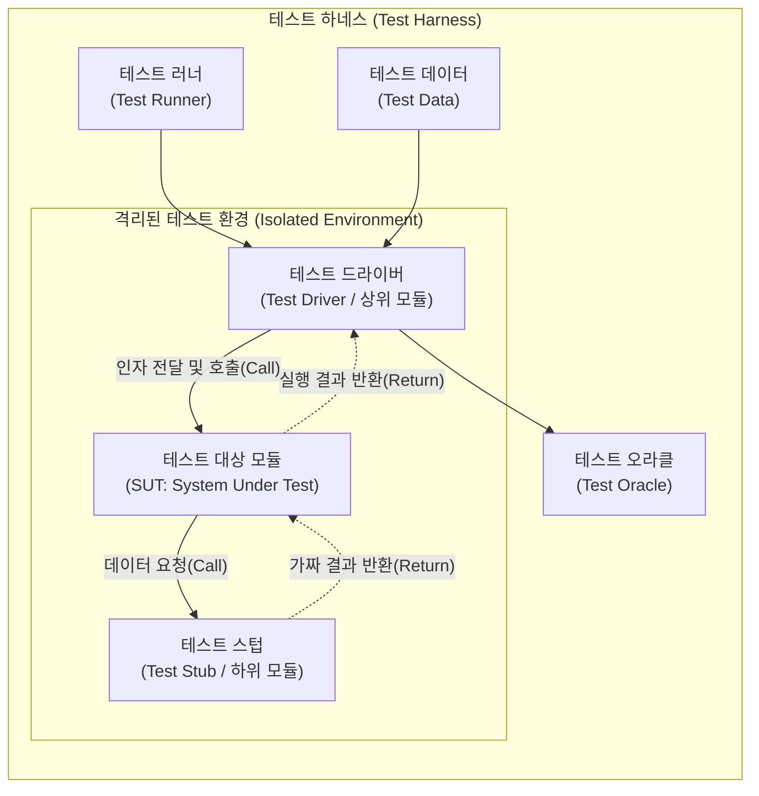

# 테스트 하네스 (Test Harness)

---

## I. 시스템의 자동화된 검증 환경 제공을 위한, 테스트 하네스(Test Harness)의 개요

* **정의**: 애플리케이션 및 컴포넌트를 테스트하기 위해 생성된 코드와 데이터의 집합체로, 대상 시스템을 실행하고 동작을 모니터링하며 결과를 출력하도록 구성된 테스트 자동화 환경 및 도구
* **등장 배경**: 상·하위 의존성 모듈이 아직 개발되지 않은 상태에서의 독립적인 [[단위 테스트]](Unit Test) 수행 필요, [[TDD]](테스트 주도 개발) 및 CI/CD 환경에서의 반복적이고 지속적인 자동화 검증 요구 증대
* **특징**: 대상 컴포넌트의 완벽한 격리(Isolation) 보장, 테스트 실행 및 결과 검증의 자동화, 모듈 간 결합도를 낮추어 개발 주기(Feedback Loop)의 획기적 단축

---

## II. 테스트 하네스의 개념도 및 핵심 구성 요소

### 가. 테스트 하네스의 아키텍처 및 동작 원리

* 테스트 러너에 의해 구동되는 드라이버가 테스트 데이터를 SUT(테스트 대상 모듈)에 전달하며, 아직 구현되지 않은 하위 모듈은 스텁이 대신하여 반환값을 제공하고, 최종 결과를 오라클이 검증함

### 나. 테스트 하네스의 핵심 기술 및 구성 요소

| 구분 | 요소기술(키워드) | 세부 설명 |
| --- | --- | --- |
| **모듈 대체** | 테스트 드라이버 (Test Driver) | SUT를 호출하는 **상위 모듈을 대체**하는 더미(Dummy) 모듈로, 테스트 데이터를 인자로 전달하고 결과를 수신 |
| **모듈 대체** | 테스트 스텁 (Test Stub) | SUT가 호출하는 **하위 모듈을 대체**하는 더미 모듈로, 특정한 하드코딩된 가짜(Fake) 결과값을 SUT로 반환 |
| **모듈 대체** | 목 객체 (Mock Object) | 상태뿐만 아니라 객체의 **동작/행위(Behavior)까지 검증**할 수 있도록 사전에 프로그래밍된 모의 객체 |
| **실행 통제** | 테스트 러너 (Test Runner) | 작성된 테스트 스크립트와 케이스를 순차적 혹은 병렬로 실제 구동하고 테스트의 전체 흐름을 제어하는 엔진 |
| **테스트 자산** | 테스트 케이스 (Test Case) | 입력값(Input), 실행 조건(Execution Condition), 기대 결과(Expected Result)의 집합 |
| **테스트 자산** | 테스트 슈트 (Test Suite) | 특정한 목적이나 기능 단위로 관련된 테스트 케이스들을 논리적으로 하나로 묶어놓은 [[컨테이너]] |
| **실행 입력** | 테스트 스크립트 (Test Script) | 테스트 실행 절차를 자동화 도구가 인식하고 실행할 수 있는 형태의 코드(Python, Java 등)로 구현한 명세서 |
| **결과 검증** | [[테스트 오라클]] (Test Oracle) | 실행 결과가 참인지 거짓인지 판단하기 위해 사전에 정의된 '기대 결과(Expected Result)' 메커니즘 |

---

## III. 핵심 컴포넌트(드라이버 vs 스텁) 비교 및 향후 전망

### 가. 테스트 드라이버와 테스트 스텁의 비교

| 비교 항목 | 테스트 드라이버 (Test Driver) | 테스트 스텁 (Test Stub) |
| --- | --- | --- |
| **모듈 대체 역할** | 호출하는 **상위 모듈 (제어 모듈)** 대체 | 호출받는 **하위 모듈 (종속 모듈)** 대체 |
| **수행 동작** | 테스트 대상(SUT)을 **호출(Call)하고 인자 전달** | 테스트 대상(SUT)으로부터 호출받아 **결과 반환(Return)** |
| **[[통합 테스트]] 유형** | **상향식 (Bottom-up) 통합 테스트** 시 주로 사용 | **하향식 (Top-down) 통합 테스트** 시 주로 사용 |
| **구현 복잡도** | 파라미터 구성 및 결과 검증 로직이 필요하여 **복잡도 높음** | 단순히 정해진 값만 반환하므로 **복잡도 낮음** |
| **주요 목적** | 컴포넌트 구동 환경 시뮬레이션 | 시스템 내부의 미구현 로직 우회 및 종속성 제거 |

### 나. 테스트 하네스의 최신 동향 및 발전 방향

* **서비스 [[가상화]](Service Virtualization)로의 확장**: 단순한 단위 테스트 수준의 스텁(Stub)을 넘어, 외부 마이크로서비스([[MSA (Micro Service Architecture)|MSA]]), 서드파티 API, 레거시 DB 등을 통째로 에뮬레이션하는 서비스 가상화 환경으로 테스트 하네스의 규모가 확장 중
* **지속적 테스팅(Continuous Testing) 기반 CI/CD 통합**: GitHub Actions, Jenkins 등의 빌드 파이프라인 상에 테스트 하네스가 완전 통합되어, 코드 커밋과 동시에 테스트 환경 [[프로비저닝]](IaC 기반)부터 테스트 실행 및 품질 게이트 통제가 전자동화([[End-to-End]])되는 체계 정착

---

### 🔗 연관 토픽

- **소속 도메인**: [[00_소프트웨어공학_MOC|🏗️ 소프트웨어공학]]
- **세부 분류**: `2. 애자일(Agile) & 지속적 통합/배포(CI/CD)`
- **핵심 연관 토픽**:
  - [[TDD|TDD (Test Driven Development)]]
  - [[단위 테스트]]
  - [[통합 테스트]]
  - [[테스트 오라클]]
  - [[MSA (Micro Service Architecture)]]
