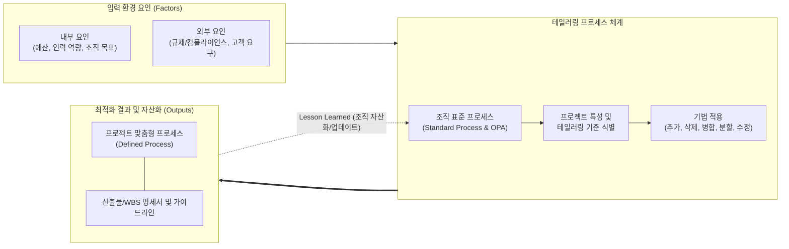

# 테일러링 (Tailoring)

---

## I. 프로젝트 환경에 맞춘 프로세스 최적화 기법, 테일러링의 개요

* **정의**: 조직의 표준 [[프로세스]](기본 방법론)를 바탕으로, 프로젝트의 고유한 특성(규모, 위험, 복잡도 등)에 맞게 프로세스, 산출물, 수행 절차 등을 최적화(추가, 수정, 삭제)하여 적용하는 일련의 활동
* **등장 배경**: 획일화된 프로세스(Heavyweight) 적용 시 발생하는 문서화 및 관리 오버헤드 방지, 프로젝트의 다양성(애자일, 하이브리드 등)을 수용하기 위한 유연성 요구 증대
* **특징**: 품질과 생산성의 균형(Trade-off) 달성, 프로젝트 환경 요인(내/외부)에 따른 가변적 적용, 조직 표준 프로세스의 지속적 개선(피드백) 생태계 형성

---

## II. 테일러링의 개념도 및 핵심 기술 요소

### 가. 테일러링의 아키텍처 및 수행 프로세스

* 프로젝트의 내·외부 환경 요인을 분석하여 조직의 표준 프로세스에 가감 및 수정 기법을 적용하며, 적용 결과는 종료 시점에 조직 프로세스 자산(OPA)으로 피드백되어 성숙도를 향상시킴

### 나. 테일러링의 핵심 구성 요소 및 기법

| 구분 | 요소기술(키워드) | 세부 설명 |
| --- | --- | --- |
| **기준 (Criteria)** | 사업 규모 및 복잡도 | 프로젝트의 예산, 기간, 참여 인원, 기술적 난이도에 따른 관리 수준 및 프로세스의 깊이(Depth) 결정 |
| **기준 (Criteria)** | 위험도 (Risk) | 재무적, 기술적 위험 수준에 따라 품질 통제(QC) 활동의 횟수, 보안 리뷰, 감리 단계 등을 조절 |
| **기법 (Methods)** | 생략/삭제 (Deletion) | 프로젝트 성격상 불필요하거나 중복되는 특정 활동, 단계, 산출물을 표준 프로세스에서 제거 |
| **기법 (Methods)** | 추가 (Addition) | 신기술(AI, [[01_IT Tech/블록체인]] 등) 적용이나 강화된 보안 규정으로 인해 표준에 없는 새로운 활동이나 산출물 편입 |
| **기법 (Methods)** | 수정/병합 (Mod/Merge) | 기존 표준 프로세스의 순서를 변경하거나, 유사한 검토 회의 및 산출물 양식을 하나로 통합하여 효율화 |
| **수행 절차** | 테일러링 가이드라인 | 테일러링을 임의로 수행하지 않도록 조직 차원에서 허용 범위, 필수 준수 항목(Baselines)을 정의한 지침 |
| **통제 메커니즘** | 품질보증 (QA) 연계 | 테일러링 결과물이 [[CMMI]], SP인증, ISO 9001 등 품질 성숙도 표준에 부합하는지 QA 조직이 검토 및 승인 |
| **사후 관리** | OPA (조직 프로세스 자산) | 테일러링 적용 사례와 프로젝트 회고(Retrospective)를 모범 사례(Best Practice)화하여 표준 프로세스 갱신 |

---

## III. 테일러링과 커스터마이징 비교 및 향후 전망

### 가. 테일러링과 커스터마이징(Customizing) 비교

| 비교 항목 | 테일러링 (Tailoring) | 커스터마이징 (Customizing) |
| --- | --- | --- |
| **주요 대상** | **프로세스 (Process), 방법론, 관리 절차** | **제품 (Product), 솔루션, 소스코드** |
| **핵심 목적** | 프로젝트 관리 효율성 및 수행 품질 극대화 | 고객/사용자의 구체적인 비즈니스 요구사항(기능) 충족 |
| **수행 주체** | 프로젝트 관리자(PM), 품질관리자(QA), SE | 시스템 아키텍트(SA), 소프트웨어 개발자(Developer) |
| **수행 시점** | 프로젝트 착수 및 초기 계획 수립 단계 | 프로젝트 설계, 구현 및 통합 단계 |
| **결과물** | 맞춤형 개발 생명주기, [[WBS]], 산출물 테일러링 목록 | 고객 맞춤형 UI/UX, 신규 기능 모듈, 수정된 패키지(ERP 등) |

### 나. 테일러링의 최근 적용 동향 및 발전 방향

* **애자일([[Agile]]) 테일러링 및 하이브리드 방법론의 확산**: 고정된 [[워터폴|폭포수]](Waterfall) 방법론을 탈피하여, 기획/설계는 폭포수 기반으로 수행하고 개발/테스트는 스프린트 단위의 애자일을 적용하는 '워터-[[스크럼]]-폴(Water-[[SCRUM|Scrum]]-Fall)' 등 하이브리드 형태의 프로세스 테일러링 주류화
* **동적 테일러링(Dynamic Tailoring)**: 프로젝트 초기에 한 번 수행하고 고정하는 정적 방식에서 벗어나, 데브옵스([[DevOps]]) 파이프라인과 결합하여 프로젝트 진행 중에도 환경 변화에 맞춰 프로세스를 실시간으로 조정하는 지속적 테일러링 생태계 구축

---

### 🔗 연관 토픽

- **소속 도메인**: [[00_소프트웨어공학_MOC|🏗️ 소프트웨어공학]]
- **세부 분류**: `2. 애자일(Agile) & 지속적 통합/배포(CI/CD)`
- **핵심 연관 토픽**:
  - [[워터폴]]
  - [[CMMI]]
  - [[Agile]]
  - [[DevOps|데브옵스 (DevOps)]]
  - [[SCRUM]]
