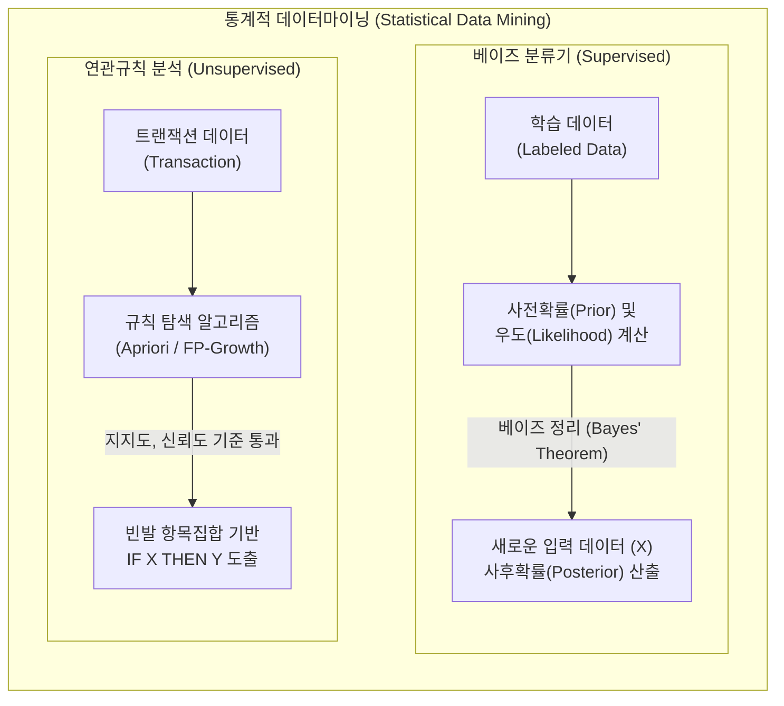

# 통계데이터마이닝 (연관규칙 & 베이즈)

---

## I. 통계 기반 데이터 패턴 탐색과 예측의 핵심, 연관규칙과 베이즈 모델의 개요

* **정의**: 대규모 데이터셋 내에서 사건 간의 동시 발생 확률을 기반으로 의미 있는 규칙을 도출하는 연관규칙(Association Rule)과, 조건부 확률 및 사전확률을 기반으로 데이터의 클래스를 분류하고 예측하는 **베이즈(Bayesian) 모델**을 활용한 통계적 데이터마이닝 기법
* **등장 배경**: 커머스 환경의 장바구니 분석(Market Basket Analysis)을 위한 동시 구매 패턴 식별 요구, 스팸 메일 필터링 및 텍스트 분류와 같은 확률 기반의 빠르고 직관적인 예측 모델(분류기)의 필요성 대두
* **특징**: 조건부 확률(Conditional Probability) 등 통계학적 수리 모델에 근간, [[딥러닝]] [[블랙박스 모델]] 대비 연산이 가볍고 결과에 대한 해석력이 매우 뛰어난 화이트박스(White-box) 모델

---

## II. 연관규칙과 베이즈 통계마이닝의 개념도 및 핵심 기술 요소

### 가. 연관규칙과 베이즈 모델의 아키텍처 및 동작 원리

* 연관규칙은 데이터 항목 간의 동시 발생빈도(Support)를 바탕으로 규칙을 찾아내며, 베이즈 모델은 기존 관측 데이터의 확률(Likelihood)을 바탕으로 새로운 데이터의 레이블을 확률적으로 추론함

### 나. 연관규칙과 베이즈 모델의 핵심 평가/구성 요소

| 분류 | 요소기술(키워드) | 세부 설명 |
| --- | --- | --- |
| **연관규칙** | [[지지도]] (Support) | 전체 [[트랜잭션]] 중 항목 A와 항목 B가 동시에 포함되는 비율 ($P(A \cap B)$) |
| **연관규칙** | 신뢰도 (Confidence) | 항목 A가 포함된 트랜잭션 중에서 항목 B가 포함될 조건부 확률 ($P(B \vert A)$) |
| **연관규칙** | 향상도 (Lift) | A와 B가 독립적으로 발생할 확률 대비, 함께 발생할 확률의 비율 ($P(B \vert A)/P(B)$). 1보다 크면 양의 상관관계 |
| **연관규칙** | [[Apriori 알고리즘]] | 최소 지지도(Minimum Support) 이상의 빈발 항목 집합(Frequent Itemset)만을 탐색하여 불필요한 규칙 생성을 가지치기(Pruning)하는 [[알고리즘]] |
| **베이즈** | 사전 확률 (Prior) | 새로운 데이터(증거)가 주어지기 전, 특정 가설 또는 [[클래스]](Y)가 이미 발생할 확률 ($P(Y)$) |
| **베이즈** | 우도 (Likelihood) | 특정 가설(Y)이 참일 때, 관측된 데이터(증거, X)가 발생할 확률 ($P(X \vert Y)$) |
| **베이즈** | 사후 확률 (Posterior) | 새로운 증거(X)가 관측된 후, 베이즈 정리를 통해 업데이트된 가설(Y)의 확률 ($P(Y \vert X)$) |
| **베이즈** | 나이브 (Naive) 가정 | 데이터를 구성하는 모든 특징(Feature)이 결과(Class)에 독립적으로 영향을 미친다는 통계적 가정 (연산량 획기적 감소) |

---

## III. 연관규칙과 나이브 베이즈 알고리즘 비교 및 향후 전망

### 가. 연관규칙 분석과 베이즈 분류기의 상세 비교

| 비교 항목 | 연관규칙 분석 (Association Rules) | 나이브 베이즈 분류기 (Naive Bayes) |
| --- | --- | --- |
| **마이닝 목적** | 데이터 항목 간의 **숨겨진 연관성(패턴)** 발견 | 입력 데이터를 특정 범주(Class)로 **예측 및 분류** |
| **학습 유형** | [[비지도 학습]] (Unsupervised Learning) | 지도 학습 (Supervised Learning) |
| **주요 평가지표** | 지지도, 신뢰도, 향상도 | 정확도, 정밀도, 재현율, F1-Score |
| **산출물 형태** | 규칙 집합 (IF A, THEN B 형태) | 가장 높은 사후확률을 가진 카테고리 (클래스 레이블) |
| **주요 한계점** | 항목 증가 시 연산량 기하급수적 증가 및 무의미한 규칙 양산 | 변수 간 완전 독립이라는 비현실적 가정(Naive)으로 인한 한계 존재 |
| **적용 사례** | 대형마트 상품 진열 최적화, 웹사이트 교차 판매(Cross-selling) 추천 | 스팸 메일 필터링, 감성 분석(긍정/부정), 텍스트 문서 자동 분류 |

### 나. 통계데이터마이닝의 최신 활용 동향 및 전망

* **설명 가능한 AI ([[XAI]]) 관점의 재조명**: 신경망 기반 블랙박스 딥러닝 모델의 [[신뢰성]] 문제가 대두되면서, 결과 도출 과정을 확률식과 명시적 규칙(Rule)으로 증명할 수 있는 통계 기반 마이닝 기법이 금융/의료 산업에서 보완재로 각광받음
* **하이브리드 추천 시스템(Hybrid Recommendation)으로 진화**: 단일 연관규칙 분석의 한계(콜드 스타트 등)를 극복하기 위해 협업 필터링(CF), 콘텐츠 기반 필터링 등과 결합하여 개인화 추천 알고리즘의 앙상블 체계로 발전 중

---

### 🔗 연관 토픽

- **소속 도메인**: [[00_인공지능_MOC|🤖 인공지능]]
- **세부 분류**: `1. 수학 · 통계학 & 데이터 전처리`
- **핵심 연관 토픽**:
  - [[비지도 학습]]
  - [[XAI]]
  - [[지지도]]
  - [[블랙박스 모델]]
  - [[딥러닝]]
