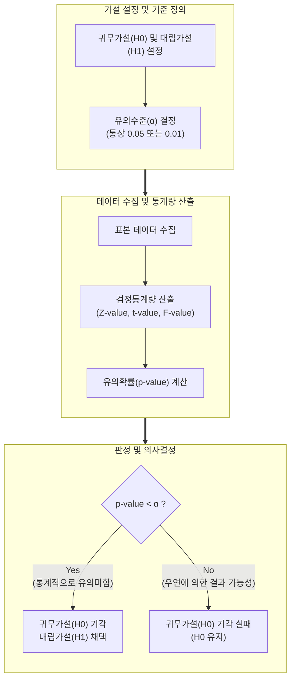

# 통계적 가설검정 (Hypothesis Testing)

---

## I. 표본을 통한 모집단 모수 추론의 객관적 기준, 통계적 가설검정의 개요

* **정의**: 표본(Sample)에서 얻은 통계량을 바탕으로 모집단(Population)의 모수에 대한 가설(Hypothesis)을 설정하고, 그 가설의 채택 또는 기각 여부를 통계적 확률에 근거하여 객관적으로 판별하는 [[추론 통계]] 기법
* **등장 배경**: 모집단 전수조사의 시간적/비용적 한계 극복, 직관이나 경험이 아닌 데이터 기반의 과학적이고 객관적인 의사결정(Data-Driven Decision) 요구 증대
* **특징**: 반증주의에 입각한 귀무가설 기각(Reject) 메커니즘 활용, 100% 확실성이 아닌 확률적 유의성(Significance)에 기반한 결론 도출, 제1종 오류와 제2종 오류 간의 상충관계(Trade-off) 존재

---

## II. 통계적 가설검정의 개념도 및 핵심 기술 요소

### 가. 통계적 가설검정의 프로세스 및 동작 원리

* 연구자가 입증하고자 하는 대립가설을 세우고, 이에 상반되는 귀무가설을 기각하기 위해 표본 데이터로부터 유의확률(p-value)을 산출하여 사전 설정된 유의수준($\alpha$)과 비교 판정함

### 나. 통계적 가설검정의 핵심 통계 및 구성 요소

| 구분 | 요소기술(키워드) | 세부 설명 |
| --- | --- | --- |
| **가설 설정** | 귀무가설 (Null Hypothesis, $H_0$) | 기각될 것을 예상하고 세우는 가설, 통상 "차이가 없다", "효과가 없다"로 설정되는 기본 상태 |
| **가설 설정** | 대립가설 (Alternative Hypothesis, $H_1$) | 귀무가설에 대립하는 가설로, 연구자가 표본 데이터를 통해 적극적으로 입증하고자 하는 주장 |
| **판단 기준** | 유의수준 (Significance Level, $\alpha$) | 귀무가설이 참임에도 이를 기각하는 제1종 오류를 범할 최대 허용 한계 확률 (주로 5% 적용) |
| **판단 기준** | 기각역 (Critical Region) | 검정통계량이 취할 수 있는 값들 중 귀무가설을 기각하게 되는 확률 분포 상의 영역 |
| **통계 지표** | [[유의확률|유의확률 (p-value)]] | 귀무가설이 참이라고 가정할 때, 표본에서 관측된 검정통계량 값보다 더 극단적인 값이 나올 확률 |
| **통계 지표** | 검정통계량 (Test Statistic) | 가설 검정을 위해 표본 데이터로부터 계산된 통계치 (Z분포, t분포, 카이제곱 분포 등 활용) |
| **검정 기법** | 모수적 검정 (Parametric) | 모집단의 분포(주로 [[정규분포]])를 가정하고 분산, 평균 등의 모수를 추론하는 기법 ([[t-검정 (t-test)|T-test]], [[ANOVA(Analysis of variance)|ANOVA]]) |
| **검정 기법** | 비모수적 검정 (Non-parametric) | 모집단의 특정 분포를 가정하지 않고 데이터의 순위나 빈도를 기반으로 검정 (Wilcoxon, Kruskal-Wallis) |

---

## III. 통계적 가설검정의 오류 유형 비교 및 향후 전망

### 가. 가설검정의 두 가지 오류 비교 (제1종 오류 vs 제2종 오류)

| 비교 항목 | 제1종 오류 (Type I Error) | 제2종 오류 (Type II Error) |
| --- | --- | --- |
| **정의** | **귀무가설($H_0$)이 참(True)인데, 기각하는 오류** | **귀무가설($H_0$)이 거짓(False)인데, 채택하는 오류** |
| **비유적 표현** | 없는 효과를 있다고 오판 (False Positive) | 있는 효과를 없다고 오판 (False Negative) |
| **확률 기호** | **$\alpha$ (유의수준)** | **$\beta$** |
| **통계적 검정력** | 제1종 오류를 통제하는 기준치로 직접 설정됨 | 검정력(Power)은 $1 - \beta$ 로 표현됨 |
| **상충관계(Trade-off)** | $\alpha$를 낮추면(엄격한 기준), $\beta$는 증가함 | $\beta$를 낮추면, $\alpha$가 필연적으로 증가함 (표본 크기 고정 시) |
| **심각성 및 관리** | 일반적으로 제1종 오류가 더 치명적으로 간주됨 | 표본의 크기(n)를 늘려 검정력($1 - \beta$)을 확보하여 관리 |

### 나. 가설검정의 최신 활용 동향 및 시사점

* **빅데이터 환경에서의 p-hacking 경계**: 대규모 데이터셋에서는 미세한 차이도 p-value가 유의미하게($<0.05$) 도출되는 현상이 빈번하므로, 단순 통계적 유의성(Statistical Significance)을 넘어 실제 비즈니스적 효과 크기(Effect Size)를 함께 고려하는 실무적 유의성 평가 필수화
* **A/B 테스트 기반 지속적 최적화**: 디지털 마케팅 및 UI/UX 개선 영역에서 사용자 트래픽을 두 집단으로 나누어 전환율 변화를 실시간 가설 검정하는 A/B 테스트가 애자일([[Agile]]) 제품 개발의 핵심 의사결정 도구로 정착
* **베이지안 통계(Bayesian Statistics)와의 융합**: 전통적 빈도주의(Frequentist) 가설검정의 사후 분석 한계를 극복하기 위해, 사전 확률을 지속적으로 업데이트하며 가설의 신뢰도를 실시간 평가하는 베이지안 A/B 테스트 방법론 도입 확대

---

### 🔗 연관 토픽

- **소속 도메인**: [[00_인공지능_MOC|🤖 인공지능]]
- **세부 분류**: `1. 수학 · 통계학 & 데이터 전처리`
- **핵심 연관 토픽**:
  - [[t-검정 (t-test)]]
  - [[추론 통계|추론 통계(Inferential Statistics)]]
  - [[ANOVA(Analysis of variance)]]
  - [[다중공선성|다중공선성 (Multicolinearity)]]
  - [[정규분포|정규분포(Normal Distribution)]]
