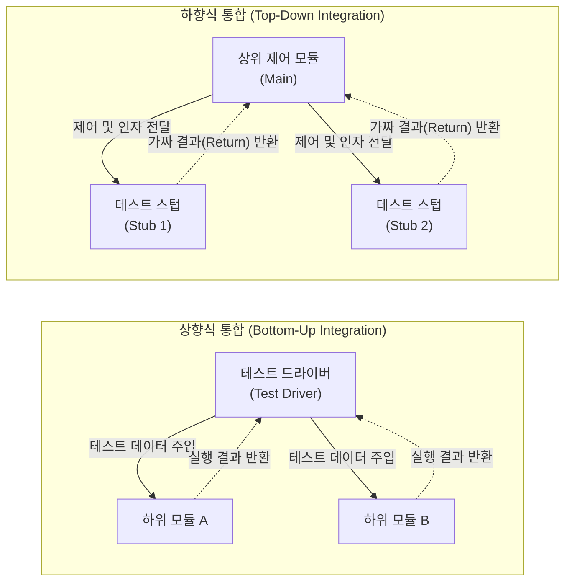

# 통합 테스트 (Integration Test)

---

## I. 모듈 간 인터페이스 및 상호작용 검증, 통합 테스트의 개요

* **정의**: 소프트웨어 설계 구조에 따라 [[단위 테스트]](Unit Test)가 완료된 개별 모듈을 결합하여, 모듈 간의 인터페이스, 데이터 교환, 상호작용 시 발생하는 오류를 식별하고 검증하는 테스트 단계
* **등장 배경**: 단위 모듈 내부 로직이 정상이어도 결합 시 발생하는 전역 데이터 참조 오류, 파라미터 불일치, 통신 지연 등의 아키텍처 결함을 사전 차단하기 위함
* **특징**: [[소프트웨어 아키텍처]] 설계서 기반 수행, 그레이박스(Gray-box) 테스트 성격 내포, 점진적(상향식/하향식) 및 비점진적(빅뱅) 결합 전략 활용, 가상의 컴포넌트(Driver, Stub) 사용

---

## II. 통합 테스트의 개념도 및 핵심 기술 요소

### 가. 통합 테스트의 결합 전략 및 동작 원리

* **하향식 통합**은 미구현된 하위 모듈을 대체하기 위해 스텁(Stub)을 사용하며, **상향식 통합**은 미구현된 상위 제어 모듈을 대체하기 위해 드라이버(Driver)를 사용하여 점진적으로 모듈을 결합함

### 나. 통합 테스트의 핵심 기술 및 구성 요소

| 구분 | 요소기술(키워드) | 세부 설명 |
| --- | --- | --- |
| **비점진적 방식** | 빅뱅 (Big-bang) 통합 | 모든 모듈을 한 번에 결합하여 테스트하는 방식으로, 소규모 시스템에 적합하나 결함 추적이 매우 난해함 |
| **점진적 방식** | 하향식 (Top-down) 통합 | 메인 제어 모듈부터 아래로 통합하며, 시스템의 주요 제어 흐름을 조기에 검증 (Stub 필요) |
| **점진적 방식** | 상향식 (Bottom-up) 통합 | 최하위 기능 모듈부터 위로 통합하며, 핵심 유틸리티 및 데이터 처리 로직 검증에 유리 (Driver 필요) |
| **점진적 방식** | 샌드위치 (Sandwich) 통합 | 상향식과 하향식을 결합한 하이브리드 방식으로, 중간(Backbone) 계층을 중심으로 병렬 테스트 수행 |
| **가상 컴포넌트** | 테스트 드라이버 (Driver) | 상향식 테스트 시 상위 모듈을 대체하여 테스트 데이터를 하위 모듈로 전달하고 결과를 검증하는 제어기 |
| **가상 컴포넌트** | 테스트 스텁 (Stub) | 하향식 테스트 시 하위 모듈을 대체하여, 상위 모듈의 호출에 대해 하드코딩된 가짜(Dummy) 결과값을 반환 |
| **자동화 체계** | 지속적 통합 (CI) | 코드 병합(Merge) 시 자동으로 빌드 및 통합 테스트(Integration Test) 스크립트를 실행하여 회귀 결함 방지 |
| **검증 영역** | 인터페이스 오류 | 모듈 간 함수 호출 시 파라미터 타입 불일치, 전역 변수 충돌, 외부 API 연동 시 [[프로토콜]] 오류 등 검증 |

---

## III. V-모델 테스트 단계 비교 및 통합 테스트 발전 동향

### 가. 단위, 통합, 시스템 테스트 비교

| 비교 항목 | 단위 테스트 (Unit Test) | 통합 테스트 (Integration Test) | [[시스템 테스트]] (System Test) |
| --- | --- | --- | --- |
| **주요 목적** | 개별 모듈의 내부 로직 검증 | **모듈 간 인터페이스 및 상호작용 검증** | 전체 시스템의 요구사항 충족 여부 검증 |
| **참조 문서** | 상세 설계서 (모듈 설계) | **아키텍처 설계서 (구조 설계)** | [[요구사항 명세서]], 사용자 매뉴얼 |
| **테스트 기법** | [[화이트박스 테스트]] | **블랙박스 + 화이트박스 (그레이박스)** | [[블랙박스 테스트]] |
| **수행 주체** | 개발자 | **개발자 또는 통합 테스터** | 독립적인 QA 팀 |
| **발견 결함** | [[알고리즘]] 오류, 조건문 결함 | **파라미터 불일치, 연동 오류, 타이밍 결함** | 성능 저하, 기능 누락, 보안 취약점 |

### 나. 마이크로서비스(MSA) 환경에서의 통합 테스트 최신 동향

* **소비자 주도 계약 테스트(CDCT, Consumer-Driven Contract Testing)**: [[MSA (Micro Service Architecture)|MSA]] 환경에서 수많은 서비스 간의 통합 테스트 복잡성을 줄이기 위해, 서비스 제공자(Provider)와 소비자(Consumer) 간의 API 스펙 '계약(Contract)'을 사전에 정의하고 검증하는 기법 도입 확산 (Pact 등 활용)
* **서비스 [[가상화]](Service Virtualization) 확대**: 상용 연동 시스템, 타사 API 등 외부 의존성으로 인해 실제 환경 통합 테스트가 어려울 경우, 해당 의존 시스템의 응답 동작을 통째로 에뮬레이션(Mocking)하여 독립적이고 중단 없는 통합 테스트 수행 체계 정착

---

### 🔗 연관 토픽

- **소속 도메인**: [[00_소프트웨어공학_MOC|🏗️ 소프트웨어공학]]
- **세부 분류**: `4. 아키텍처 스타일 & 객체지향 설계 원리`
- **핵심 연관 토픽**:
  - [[시스템 테스트]]
  - [[단위 테스트]]
  - [[블랙박스 테스트]]
  - [[MSA (Micro Service Architecture)]]
  - [[카오스 엔지니어링|카오스 엔지니어링 (Chaos Engineering)]]
