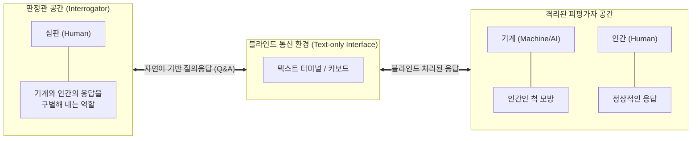

# 튜링 테스트 (Turing Test)

---

## I. 기계 지능의 실증적 판별 기준, 튜링 테스트의 개요

* **정의**: 기계가 인간과 구별할 수 없을 만큼 유사한 지능적 행동을 할 수 있는가를 판별하기 위해 앨런 튜링(Alan Turing)이 1950년에 제안한 모방 게임(Imitation Game) 기반의 [[인공지능]] 판별 검사
* **등장 배경**: "기계가 생각할 수 있는가?"라는 철학적이고 추상적인 질문을, 기계의 지능을 객관적이고 조작적(Operational)으로 측정할 수 있는 실증적 기준으로 전환하기 위해 고안됨
* **특징**: 블라인드 텍스트 대화 기반의 판별, 내면적 의식이 아닌 외부로 표출되는 행동주의적 지능에 초점, 자연어 처리(NLP)를 통한 인간 언어 모방 능력 검증 중심

---

## II. 튜링 테스트의 개념도 및 핵심 기술 요소

### 가. 튜링 테스트의 아키텍처 및 동작 원리

* 격리된 공간에 있는 판정관(C)이 단말기를 통해 질문을 던지고, 피평가자인 기계(A)와 인간(B)의 텍스트 응답을 분석하여 어느 쪽이 기계인지 판별하지 못한다면 테스트를 통과한 것으로 간주함

### 나. 튜링 테스트의 핵심 개념 및 구성 요소

| 구분 | 요소기술(키워드) | 세부 설명 |
| --- | --- | --- |
| **기본 구조** | 모방 게임 (Imitation Game) | 기계가 자신을 인간이라고 속이도록 프로그램되어 판정관을 기만하는 테스트의 본질적 메커니즘 |
| **요소 기술** | 자연어 처리 (NLP) | 판정관의 의도를 파악하고 문맥에 맞는 자연스러운 언어를 생성하는 기계 지능의 핵심 기반 |
| **요소 기술** | 지식 표현 및 추론 | 텍스트 이면에 존재하는 상식과 세상에 대한 지식을 저장하고 논리적으로 추론하여 응답하는 능력 |
| **파생 기법** | 역 튜링 테스트 (Reverse) | 기계가 역으로 대상이 인간인지 봇(Bot)인지 판별하는 시스템 (예: CAPTCHA) |
| **파생 기법** | 멀티모달 튜링 테스트 | 텍스트를 넘어 음성(오디오), 이미지(비전), 물리적 로보틱스 상호작용까지 포괄하는 차세대 판별법 |
| **철학적 반박** | 중국어 방 논증 (Searle) | 튜링 테스트를 통과하더라도 기계는 규칙(구문론)에 따라 기호를 조작할 뿐 의미론적 '이해'는 없다는 존 설의 반박 |
| **철학적 반박** | 통계적 앵무새 (Stochastic) | 현대 [[초거대 언어 모델|LLM]]이 맥락에 맞는 단어 확률을 계산할 뿐, 실질적 의식이나 사고 체계를 가지지 않음을 꼬집는 비판 |
| **평가 진화** | 다차원 지능 평가 ([[AGI]] Test) | 단순 대화 능력을 넘어 코딩, 수학, 윤리적 판단 등 [[범용 인공지능]](AGI) 수준을 종합 측정하는 벤치마크 (MMLU 등) |

---

## III. 튜링 테스트의 한계 및 향후 전망

### 가. 튜링 테스트와 현대 AI 평가 체계 비교

| 비교 항목 | 전통적 튜링 테스트 | 현대 AI/AGI 벤치마크 (LLM 기반) |
| --- | --- | --- |
| **평가 대상** | 텍스트 기반 대화의 자연스러움 및 기만 능력 | 추론 능력, 수학/논리 해결력, 코드 생성, 상식 |
| **평가 방식** | 인간 심판관에 의한 정성적, 주관적 판별 | 데이터셋(MMLU, HumanEval) 기반 정량적 자동 평가 |
| **지능의 정의** | 행동 모방 중심 (행동주의적 지능) | 다중 도메인 태스크 해결 역량 (범용 지능) |
| **통과 여부** | ChatGPT 등 최신 LLM의 등장으로 사실상 통과 | AGI(범용 인공지능) 달성을 향해 지표 고도화 진행 중 |

### 나. 튜링 테스트의 향후 전망 및 동향

* **튜링 테스트의 사실상 종료**: GPT-4, Gemini 등 대규모 언어 모델(LLM)이 인간의 작문, 대화 수준을 상회하게 됨으로써, 단순히 '자연스러운 대화'를 판단하는 전통적 튜링 테스트의 기준은 더 이상 유효한 지능 평가 척도가 되지 못함
* **행동형 튜링 테스트(Embodied Turing Test)로의 진화**: 가상 공간의 텍스트 봇을 넘어 물리적 세계에서 로봇이 인간처럼 행동하고 인지할 수 있는지 평가하는 공간 지능(Spatial Intelligence) 검증으로 패러다임 전환 중
* **AGI 평가 [[프레임워크]] 제정**: 기계의 의식(Consciousness), 윤리성 통제(Alignment), 장기 기억 및 추론 능력을 다차원적으로 검증하기 위해 OpenAI, DeepMind 등 주도로 새로운 범용 지능 벤치마크 제정 활발

---

### 🔗 연관 토픽

- **소속 도메인**: [[00_소프트웨어공학_MOC|🏗️ 소프트웨어공학]]
- **세부 분류**: `6. 소프트웨어 테스팅 & 품질 보증 (QA/QC)`
- **핵심 연관 토픽**:
  - [[인공지능]]
  - [[AGI|AGI (Artificial General Intelligence)]]
  - [[범용 인공지능]]
  - [[프레임워크]]
  - [[SW 사업대가 ('25년 개정판)]]
