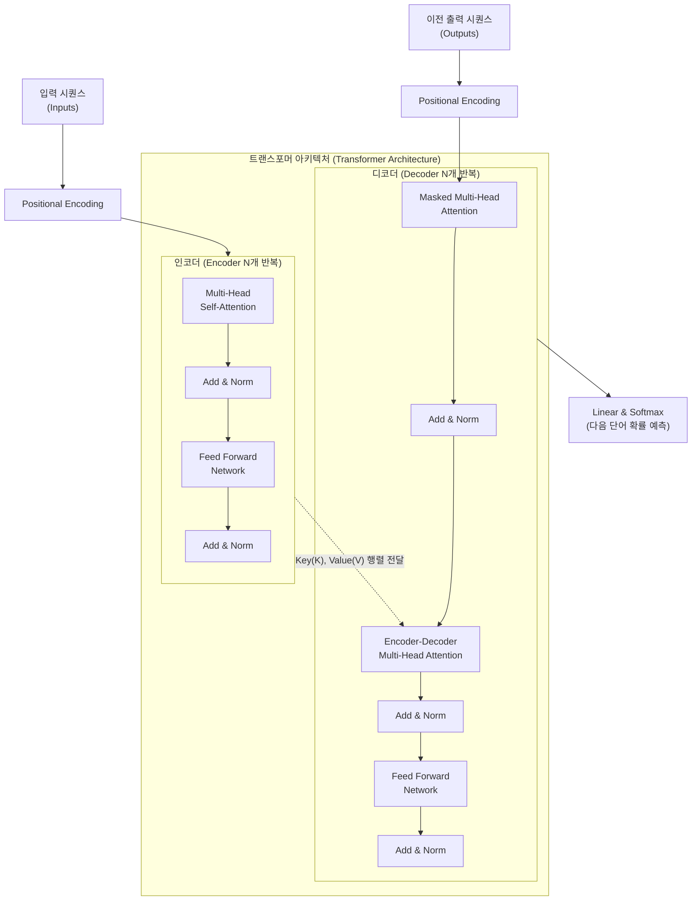

# 트랜스포머 (Transformer)

---

## I. 자연어 처리 패러다임을 바꾼 어텐션 기반 모델, 트랜스포머의 개요

* **정의**: 기존의 [[RNN (Recurrent Neural Network)|RNN]]이나 [[CNN]] 구조를 완전히 배제하고, 셀프 어텐션(Self-Attention) 메커니즘만을 활용하여 시퀀스 데이터를 병렬로 처리하는 혁신적인 [[딥러닝]] 아키텍처
* **등장 배경**: 기존 RNN 모델의 장기 의존성(Long-Term Dependency) 문제 극복, 순차적 연산으로 인한 병렬 처리 불가 및 학습 속도 저하 문제 해결 필요
* **특징**: 100% 어텐션 기반(Attention is all you need), 입력 데이터의 병렬 처리를 통한 [[GPU]] 연산 효율성 극대화, 단어의 위치 정보를 수리적으로 보완하는 포지셔널 인코딩(Positional Encoding) 적용

---

## II. 트랜스포머의 개념도 및 핵심 기술 요소

### 가. 트랜스포머의 개념도 및 동작 원리

* 입력된 시퀀스는 포지셔널 인코딩을 거쳐 인코더에서 문맥적 표현(Context)으로 압축되며, 디코더는 인코더의 정보(K, V)와 자신의 정보(Q)를 결합하여 다음 단어를 순차적(Auto-regressive)으로 예측함

### 나. 트랜스포머의 핵심 기술 및 구성 요소

| 분류 | 요소기술(키워드) | 세부 설명 |
| --- | --- | --- |
| **입력 처리** | Positional Encoding | 단어의 위치(순서) 정보를 사인(Sine) 및 코사인(Cosine) 함수를 이용해 임베딩 벡터에 더해주는 기술 |
| **문맥 이해** | Self-Attention | 문장 내 각 단어가 서로 어떤 연관성을 가지는지 Query, Key, Value 행렬의 내적(Dot-product)으로 계산 |
| **문맥 이해** | Multi-Head Attention | 어텐션 연산을 N개의 독립적인 헤드(Head)로 분할 병렬 처리하여, 다양한 관점의 문맥 특징을 동시에 학습 |
| **문맥 이해** | Masked Attention | 디코더에서 타겟 문장 생성 시, 미래 시점의 단어를 참조하지 못하도록 행렬을 마스킹(Masking) 처리 |
| **최적화** | Residual Connection | 입력값을 층(Layer)을 건너뛰어 출력값에 더해주는 잔차 연결로 [[역전파]] 시 기울기 소실(Vanishing Gradient) 방지 |
| **최적화** | Layer Normalization | 각 층의 활성화 출력을 정규화하여 학습 속도를 향상시키고 모델의 가중치 초기화에 대한 민감도 완화 |
| **신경망** | Position-wise FFN | 어텐션 층의 출력값을 입력으로 받아, 비선형성(ReLU)을 부여하는 은닉층을 포함한 완전 연결 피드포워드 신경망 |
| **출력 계층** | Linear & Softmax | 디코더의 최종 출력 벡터를 어휘(Vocabulary) 크기로 선형 변환 후, 소프트맥스를 통해 단어 발생 확률로 변환 |

---

## III. 트랜스포머와 기존 RNN(LSTM) 비교 및 향후 전망

### 가. 트랜스포머와 RNN(LSTM)의 주요 특성 비교

| 비교 항목 | 트랜스포머 (Transformer) | RNN / [[LSTM (Long Short-Term Memory)|LSTM]] |
| --- | --- | --- |
| **데이터 처리 방식** | **병렬 처리 (Parallel)** / 시퀀스 전체를 동시 입력 | 순차 처리 (Sequential) / 토큰 단위로 순차 입력 |
| **장기 의존성 문제** | **원천 극복** (거리 관계없이 O(1)로 직접 연관성 계산) | 발생 (거리가 멀어질수록 정보 손실 및 희석 우려) |
| **연산 속도 (학습)** | **매우 빠름** (GPU 연산 및 병렬화에 극도로 최적화) | 느림 (이전 단계 연산 종료 후 다음 단계 연산 가능) |
| **핵심 메커니즘** | **Self-Attention** (Q, K, V 연산) | Hidden State (은닉 상태) 순환 및 게이트(Gate) 조절 |
| **대표 응용 모델** | GPT(디코더), [[BERT]](인코더), T5, Gemini 등 | [[seq2seq]], 초기 기계 번역 모델 등 |

### 나. 트랜스포머의 활용 동향 및 향후 전망

* **[[초거대 언어 모델|LLM]] 파운데이션 모델의 절대적 근간**: OpenAI의 GPT 시리즈(디코더 중심)와 구글의 BERT(인코더 중심), T5 등 현재 산업계를 주도하는 모든 초거대 AI(LLM)의 핵심 아키텍처로 표준화됨
* **컴퓨터 비전(CV) 및 다중 양식(Multimodal)으로의 확장**: 자연어 처리(NLP)를 넘어, 이미지를 패치(Patch) 단위로 분할하여 처리하는 비전 트랜스포머(ViT: Vision Transformer)가 등장하며 CNN을 대체/보완 중
* **장문맥(Long-Context) 처리 한계 극복 기술 발전**: 어텐션 연산의 $O(N^2)$ 시공간 복잡도(Quadratic Complexity) 한계를 극복하기 위해, FlashAttention, 선형 어텐션(Linear Attention), 희소 어텐션(Sparse Attention) 등 구조 최적화 연구가 활발히 진행 중

---

### 🔗 연관 토픽

- **소속 도메인**: [[00_인공지능_MOC|🤖 인공지능]]
- **세부 분류**: `3. 딥러닝 핵심 아키텍처 & 신경망`
- **핵심 연관 토픽**:
  - [[초거대 언어 모델|초거대 언어 모델(Large Language Model)]]
  - [[seq2seq]]
  - [[BERT]]
  - [[딥러닝]]
  - [[RNN (Recurrent Neural Network)]]
