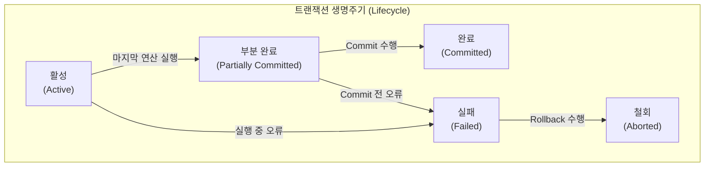

# 트랜잭션 (Transaction)

---

## I. 데이터베이스 무결성 보장을 위한 논리적 작업 단위, 트랜잭션의 개요

* **정의**: 데이터베이스의 상태를 변화시키기 위해 수행하는 하나 이상의 [[DML]](데이터 조작어) 연산들의 집합이자, 복구와 병행 제어의 기본이 되는 논리적 작업 단위
* **등장 배경**: 다중 사용자 환경에서 동시성(Concurrency) 접근에 따른 데이터 모순성 방지, 시스템 장애 발생 시 데이터의 일관성 및 복구(Recovery) 기준 제공
* **특징**: "All or Nothing" 수행 보장(부분 실행 불가), 4대 핵심 특성(ACID) 준수, TCL(Transaction Control Language)을 통한 명시적 제어

---

## II. 트랜잭션의 상태 전이도 및 핵심 구성 요소

### 가. 트랜잭션의 상태 전이도 및 동작 원리

* 트랜잭션은 시작(Active)되어 모든 연산이 실행되면 부분 완료 상태가 되며, 영구 반영(Commit) 시 완료 상태로, 오류 발생(Rollback) 시 철회 상태로 전이됨

### 나. 트랜잭션의 핵심 특성 (ACID) 및 제어 기술

| 특성 (구분) | 요소기술(키워드) | 세부 설명 및 보장 기법 |
| --- | --- | --- |
| **원자성 (Atomicity)** | All or Nothing | 트랜잭션의 연산은 모두 DB에 반영되거나, 하나도 반영되지 않아야 함 (부분 실행 불가) |
| **원자성 보장** | Undo / 회복 기법 | 트랜잭션 실패 시 이전 상태로 복구하기 위해 로그(Log) 기반의 Undo 연산 수행 |
| **일관성 (Consistency)** | 제약조건 및 [[무결성]] | 트랜잭션 수행 전후의 데이터베이스는 항상 일관된 모순 없는 상태를 유지해야 함 |
| **고립성 (Isolation)** | 간섭 배제 / 직렬성 | 여러 트랜잭션 동시 수행 시, 특정 트랜잭션의 연산이 다른 트랜잭션에 끼어들 수 없음 |
| **고립성 보장** | 병행제어 (Concurrency) | [[Locking]](로킹), [[타임스탬프 순서 기법]], MVCC(다중 버전 동시성 제어) 등을 통해 격리성 보장 |
| **영속성 (Durability)** | 영구 보존 | 성공적으로 완료(Commit)된 트랜잭션의 결과는 시스템 장애가 발생하더라도 영구적으로 보존됨 |
| **영속성 보장** | Redo / 복구 시스템 | 시스템 크래시 발생 시, 로그를 바탕으로 재실행(Redo)하여 영구 반영을 보장 |
| **상태 제어** | TCL (Commit/Rollback) | 성공적인 종료를 알리는 `COMMIT`, 실패 시 원상 복구하는 `ROLLBACK`, 중간 저장점 `SAVEPOINT` |

---

## III. 현대 분산 아키텍처에서의 트랜잭션 기술 동향

### 가. 단일 DB와 분산/MSA 환경의 트랜잭션 비교

| 비교 항목 | 단일 / 모놀리식 환경 | 전통적 [[분산 데이터베이스]] | [[MSA (Micro Service Architecture)|MSA]] (마이크로서비스) 환경 |
| --- | --- | --- | --- |
| **트랜잭션 범위** | 단일 [[데이터베이스]] | 이기종 데이터베이스 간 | 다수의 독립된 마이크로서비스 간 |
| **핵심 제어 [[프로토콜]]** | [[DBMS]] 자체 ACID 통제 | **2PC (Two-Phase Commit)** | **Saga Pattern (사가 패턴)** |
| **일관성 수준** | 강한 일관성 (Strong) | 강한 일관성 (동기식) | **최종 일관성 (Eventual Consistency)** |
| **구현 특징** | 로컬 트랜잭션 매니저 | 코디네이터(Coordinator) 필수 | 보상 트랜잭션(Compensating) 기반 |

### 나. MSA 및 클라우드 환경의 트랜잭션 최신 동향

* **보상 트랜잭션 기반의 사가 패턴(Saga Pattern) 확산**: 데이터베이스가 서비스별로 분리(Database per Service)된 MSA 환경에서는 중앙 통제식 2PC가 성능 병목을 유발하므로, 비동기 이벤트 기반으로 로컬 트랜잭션을 체인처럼 연결하고 실패 시 보상 트랜잭션(역방향 연산)을 발생시키는 사가 패턴이 표준으로 정착됨
* **[[NoSQL (CAP 이론 BASE 속성)|NoSQL]] 및 [[New SQL|NewSQL]]의 등장**: 기존 NoSQL의 제한적인 트랜잭션(BASE 속성) 한계를 극복하기 위해, 수평적 확장성을 제공하면서도 구글 스패너(Google Spanner), 코크로치DB([[CockroachDB]])와 같이 RDBMS 수준의 ACID 분산 트랜잭션을 완벽히 지원하는 NewSQL 데이터베이스 활용 증가

---

### 🔗 연관 토픽

- **소속 도메인**: [[00_데이터베이스_MOC|🗄️ 데이터베이스]]
- **세부 분류**: `2. 트랜잭션 & 동시성 제어 (Concurrency)`
- **핵심 연관 토픽**:
  - [[무결성]]
  - [[DML]]
  - [[New SQL]]
  - [[CockroachDB|CockroachDB(코크로치DB)]]
  - [[타임스탬프 순서 기법|타임스탬프 순서 기법 (Timestamp Ordering)]]
