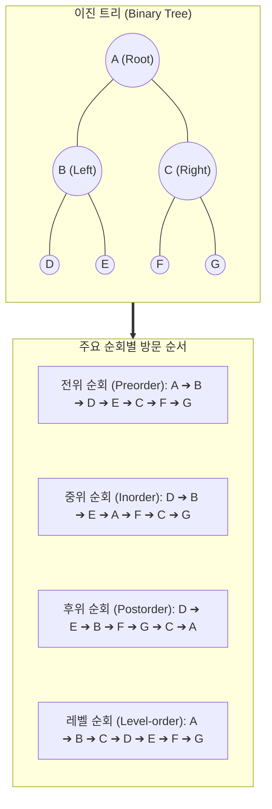

# 트리 순회 (Tree Traversal)

---

## I. 비선형 자료구조의 체계적 탐색 체계, 트리 순회의 개요

* **정의**: 트리를 구성하는 모든 노드(Node)를 중복되거나 누락되지 않도록 체계적으로 단 한 번씩 방문하여 데이터를 처리하는 탐색 [[알고리즘]]
* **등장 배경**: 계층적, 비선형적 자료구조인 트리의 데이터를 컴퓨터가 처리할 수 있는 선형적인 순서로 가공하고 활용하기 위한 표준화된 탐색 방법론 필요
* **특징**:
* 루트(Root) 노드의 방문 시점에 따른 분류 (전위, 중위, 후위)
* 시스템 호출 스택(재귀 함수) 및 큐([[Queue]]) 자료구조의 적극적 활용
* [[이진 탐색 트리]](BST), 수식 트리, 디렉토리 구조 등 목적에 맞춘 순회 기법 선택 가능

---

## II. 트리 순회의 개념도 및 핵심 기술 요소

### 가. 트리 순회의 개념도 및 동작 원리

* 트리 탐색은 현재 노드(V)의 방문 시점과 왼쪽(L), 오른쪽(R) 자식 노드의 방문 순서 조합에 따라 경로가 완전히 달라지며, 이는 트리의 활용 목적과 직결됨

### 나. 트리 순회의 핵심 기법 및 구성 요소

| 구분 | 요소기술(키워드) | 세부 설명 |
| --- | --- | --- |
| **깊이 우선 (DFS)** | 전위 순회 (Preorder) | Root ➔ Left ➔ Right (VLR) 순서로 방문, 자식을 방문하기 전 현재 노드 우선 처리 |
| **깊이 우선 (DFS)** | 중위 순회 (Inorder) | Left ➔ Root ➔ Right (LVR) 순서로 방문, 왼쪽 서브 트리를 모두 처리한 후 현재 노드 처리 |
| **깊이 우선 (DFS)** | 후위 순회 (Postorder) | Left ➔ Right ➔ Root (LRV) 순서로 방문, 하위 자식 노드를 모두 처리한 후 현재 노드 처리 |
| **너비 우선 (BFS)** | 레벨 순회 (Level-order) | 트리의 최고 레벨(Root)부터 시작하여 동일 레벨의 노드를 좌에서 우로 차례대로 방문 |
| **자료구조** | 스택 ([[Stack]]) / 재귀 | 전위, 중위, 후위 순회 시 호출된 노드로 되돌아가기 위해(Backtracking) 시스템 스택(재귀) 활용 |
| **자료구조** | 큐 (Queue) | 레벨 순회 시 방문한 노드의 자식 노드들을 차례대로 큐에 삽입(Enqueue) 및 추출(Dequeue)하여 [[FIFO]] 탐색 |
| **시간 복잡도** | O(N) | 트리에 존재하는 노드의 총 개수가 N개일 때, 모든 노드를 정확히 한 번씩 방문하므로 선형 시간 소요 |
| **그래프 연장** | DFS / BFS 기반 | 사이클(Cycle)이 없는 무방향 그래프 탐색 원리를 적용하여 순차적 데이터 엑세스 달성 |

---

## III. 트리 순회 기법의 주요 활용 사례 비교 및 향후 전망

### 가. 트리 순회 3대 기법(DFS 기반)의 특성 및 활용 비교

| 비교 항목 | 전위 순회 (Preorder) | 중위 순회 (Inorder) | 후위 순회 (Postorder) |
| --- | --- | --- | --- |
| **방문 원리 (VLR)** | **V**isiting ➔ **L**eft ➔ **R**ight | **L**eft ➔ **V**isiting ➔ **R**ight | **L**eft ➔ **R**ight ➔ **V**isiting |
| **수식 트리 표기법** | 전위 표기법 (Prefix, 폴란드 표기법) | 중위 표기법 (Infix, 인간의 일반적 수식) | 후위 표기법 (Postfix, 역폴란드 표기법) |
| **핵심 활용 사례 1** | **트리의 구조 복제 및 복사** | **이진 탐색 트리(BST)의 오름차순 정렬** | **수식 트리의 컴퓨터 계산 처리 (스택 기반)** |
| **핵심 활용 사례 2** | 디렉토리 트리 출력 시 상위 폴더 우선 표시 | 이진 트리의 대칭 검증 | 디렉토리 구조 삭제 (하위 폴더부터 완전 삭제) |

### 나. 트리 탐색 기술의 적용 동향 및 발전 방향

* **컴파일러 구문 분석 최적화**: 프로그래밍 언어의 구문 트리(Syntax Tree)를 구성하고 코드를 생성할 때 후위 순회 방식을 적용하여 연산자의 우선순위를 컴퓨터가 스택으로 자동 처리하도록 설계하는 뼈대로 활용
* **대규모 그래프 탐색 및 AI 탐색 알고리즘으로의 확장**: 단순한 이진 트리 순회를 넘어, A* 알고리즘, 미니맥스(Minimax) 트리의 몬테카를로 트리 탐색(MCTS) 등 인공지능과 거대 신경망의 최적 경로 서치 메커니즘의 기초 논리로 지속 발전 중

---

### 🔗 연관 토픽

- **소속 도메인**: [[00_컴퓨터구조_MOC|💻 컴퓨터구조]]
- **세부 분류**: `4. 기본 자료구조 (Data Structures)`
- **핵심 연관 토픽**:
  - [[Queue]]
  - [[Stack]]
  - [[이진 탐색 트리|이진 탐색 트리(Binary Search Tree)]]
  - [[FIFO]]
  - [[힙|힙 (Heap)]]
