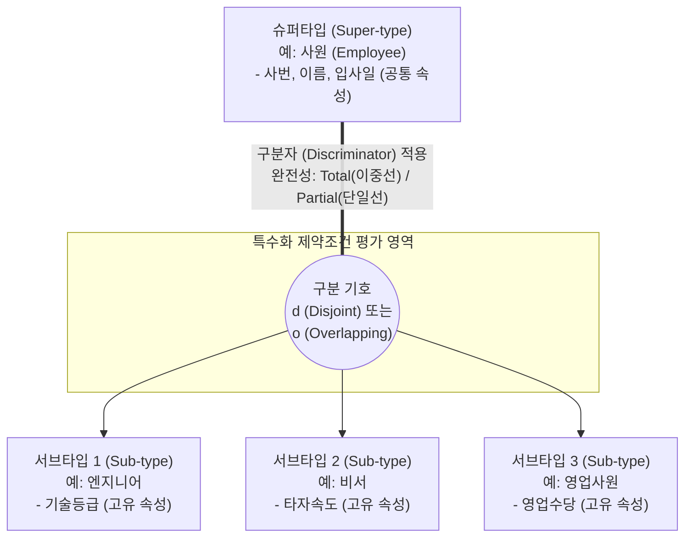

# 특수화 (Specialization)

---

## I. 계층적 데이터 및 객체 구조 설계의 핵심, 특수화의 개요

* **정의**: 하나의 상위 [[엔티티]](또는 [[클래스]])로부터 고유한 속성과 관계를 지닌 여러 개의 하위 엔티티를 도출해내는 하향식(Top-Down) 데이터 모델링 기법
* 확장된 개체-관계(EER) 모델과 [[객체지향]](OOP) 패러다임에서 부모-자식 간의 'is-a' 계층 관계를 명확히 정의하고 데이터의 세부 특성을 정교화하기 위해 사용됨
* **특징**:
* **하향식 세분화**: 상위(슈퍼타입)에서 하위(서브타입)로 구체화하며 모델 구조를 확장함
* **속성 상속(Inheritance)**: 하위 모델은 상위 모델의 공통 속성 및 관계를 물려받아 재사용성을 극대화함
* **차이점(Difference) 부각**: 서브타입만이 가지는 고유한 속성과 특수 행위를 명시하여 도메인 규칙을 명확히 함

---

## II. 특수화의 개념도 및 핵심 설계 제약조건

### 가. 특수화의 개념도 (EER 모델 기반 슈퍼타입/서브타입 구조)

* 공통 속성을 가진 슈퍼타입에서 식별된 특정 구분자(예: '직종')를 통해 서브타입으로 분기됨
* 물리적 [[데이터베이스]] 설계 시, 이 논리적 특수화 관계를 Roll-up(단일 테이블 통합) 또는 Roll-down(서브타입별 개별 테이블 분할) 기법으로 매핑함

### 나. 특수화의 핵심 모델링 요소 및 제약조건 (Constraints)

| 분류 | 요소기술(키워드) | 세부 설명 |
| --- | --- | --- |
| **구성 요소** | **슈퍼타입 (Super-type)** | - 모든 서브타입들이 공유하는 공통 속성(Attribute)과 타 엔티티와의 관계를 정의하는 상위 개체 |
| **구성 요소** | **서브타입 (Sub-type)** | - 슈퍼타입으로부터 상속받은 속성 외에 자신만의 고유한 속성과 관계를 가지는 하위 개체 |
| **분류 기준** | **구분자 (Discriminator)** | - 상위 인스턴스가 어떤 하위 서브타입으로 특수화될지를 결정 짓는 기준 속성 |
| **상호배타 제약** | **비연접 (Disjoint, 'd')** | - 슈퍼타입의 하나의 인스턴스가 여러 서브타입 중 **오직 하나**의 서브타입에만 속해야 함 (상호 배타적) |
| **상호배타 제약** | **중첩 (Overlapping, 'o')** | - 슈퍼타입의 하나의 인스턴스가 동시에 **두 개 이상**의 서브타입에 중복하여 속할 수 있음을 허용함 |
| **완전성 제약** | **전체 특수화 (Total)** | - 슈퍼타입의 모든 인스턴스는 **반드시** 하나 이상의 서브타입에 무조건 포함되어야 함 (다이어그램 이중선 표기) |
| **완전성 제약** | **부분 특수화 (Partial)** | - 슈퍼타입의 인스턴스가 어떤 서브타입에도 속하지 않고 **상위 개체로 독립 존재**할 수 있음 (단일선 표기) |
| **구조 특성** | **속성 상속 (Inheritance)** | - 서브타입이 슈퍼타입의 기본키(PK)를 포함한 모든 식별자, 일반 속성, 관계를 자동으로 물려받는 객체지향적 특성 |

---

## III. 일반화와의 비교 및 최신 '특수화(Specialization)' 동향

### 가. 일반화 vs 특수화 모델링 기법 비교

| 비교 항목 | 특수화 (Specialization) | [[일반화]] (Generalization) |
| --- | --- | --- |
| **설계 패러다임** | **하향식 (Top-Down)** 접근 | **상향식 (Bottom-Up)** 접근 |
| **데이터 도출 과정** | 상위 공통 개체에서 하위 특수 개체들을 **분할(세분화)** | 하위 개체들의 공통 속성을 도출하여 상위 개체로 **병합** |
| **설계의 초점** | 서브타입 간의 **차이점(Difference)** 부각 및 도출 | 서브타입 간의 **공통점(Commonality)** 추출 및 통합 |
| **주요 목적** | 고유 속성 및 특정 관계를 명확히 하여 [[무결성]] 제어 | 데이터의 [[추상화]] 수준을 높여 시스템의 복잡도 감소 |

### 나. 최신 IT 아키텍처 및 AI 모델 관점의 '특수화' 발전 동향

* **AI 파운데이션 모델의 도메인 특수화(Domain Specialization)**: 방대한 범용 지식을 지닌 일반화된 거대언어모델([[초거대 언어 모델|LLM]])을 의료, 금융, 법률 등 특정 산업 영역의 목적에 맞게 [[PEFT]], [[LoRA(Low-rank adaptation)|LoRA]] 등의 기법을 적용하여 높은 정확도를 갖는 도메인 특화 모델([[sLLM (Smaller Large Language Model)|sLLM]])로 **특수화**하는 트렌드가 산업 표준으로 확산 중임
* **하드웨어 가속기 특수화(Domain-Specific Architecture)**: 전통적 [[CPU]] 중심의 범용 처리(General-Purpose)에서 벗어나, 대규모 텐서 연산 등 특정 태스크만 압도적으로 빠르게 처리하기 위해 설계된 [[NPU]], [[TPU (Tensor Processing Unit)|TPU]], LPU 기반의 도메인 특화 하드웨어 아키텍처 적용이 가속화되고 있음

---

### 🔗 연관 토픽

- **소속 도메인**: [[00_데이터베이스_MOC|🗄️ 데이터베이스]]
- **세부 분류**: `1. 데이터 모델링 & 관계형 DB 설계`
- **핵심 연관 토픽**:
  - [[클래스]]
  - [[객체지향]]
  - [[데이터베이스]]
  - [[엔티티|엔티티(Entity)]]
  - [[관계성]]
