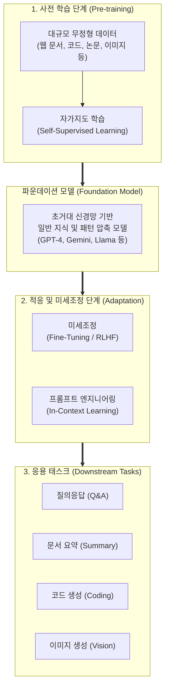

# 파운데이션 모델 (Foundation Model)

---

## I. 범용 인공지능 시대를 여는 초거대 AI의 근간, 파운데이션 모델의 개요

* **정의**: 대규모의 레이블링 되지 않은 데이터(Unlabeled Data)를 자가지도 학습(Self-Supervised Learning) 방식으로 사전 학습(Pre-training)하여, 텍스트 요약, 번역, 코드 생성 등 광범위한 하위 작업(Downstream Tasks)에 유연하게 적응(Adaptation)할 수 있는 [[범용 인공지능]] 모델
* **등장 배경**: 스탠포드 대학교 HAI(Human-Centered AI) 연구소에서 처음 명명함. 특정 작업마다 개별 모델을 처음부터 학습시키는 기존 방식의 한계(비용 및 데이터 부족)를 극복하고, 컴퓨팅 파워와 [[트랜스포머|트랜스포머(Transformer)]] 아키텍처의 비약적 발전에 힘입어 등장
* **특징**:
* **창발성(Emergence)**: 모델의 규모(파라미터 수)가 일정 수준 이상 커질 때, 명시적으로 학습하지 않은 복잡한 추론이나 수학적 문제 해결 능력이 발현되는 현상
* **균질화(Homogenization)**: 단일 파운데이션 모델이 수많은 애플리케이션의 공통된 기반(Foundation) 인프라로 작용하여 방법론이 통합되는 현상

---

## II. 파운데이션 모델의 개념도 및 핵심 기술 요소

### 가. 파운데이션 모델의 아키텍처 및 동작 원리

* 막대한 양의 범용 데이터를 사전 학습한 하나의 파운데이션 모델을 기반으로, 목적에 맞는 약간의 미세조정([[Fine-Tuning]])이나 프롬프팅만을 거쳐 다양한 애플리케이션을 파생시키는 구조임

### 나. 파운데이션 모델의 핵심 기술 및 구성 요소

| 구분 | 요소기술(키워드) | 세부 설명 |
| --- | --- | --- |
| **핵심 아키텍처** | 트랜스포머 (Transformer) | 병렬 처리에 최적화된 Self-Attention 구조를 통해 대규모 데이터 학습을 가능하게 한 기본 신경망 구조 |
| **학습 메커니즘** | 자가지도 학습 (Self-Supervised) | 사람이 정답(Label)을 달아주지 않아도, 텍스트 내에서 다음 단어를 예측(Next-token Prediction)하거나 빈칸을 추론하며 스스로 학습 |
| **성능 확장성** | 스케일링 법칙 (Scaling Law) | 모델의 파라미터 크기, 학습 데이터 양, 투입되는 컴퓨팅 연산량(Compute)에 비례하여 모델의 성능이 예측 가능하게 향상된다는 법칙 |
| **적응 기술** | 파인튜닝 (Fine-Tuning) | 사전 학습된 범용 모델의 가중치를 특정 도메인(의료, 법률 등)의 소규모 데이터로 추가 학습시켜 최적화하는 기법 |
| **적응 기술** | RLHF (인간 피드백 기반 [[강화학습]]) | 인간의 가치관, 윤리 기준, 선호도를 모델의 출력에 반영하여 안전하고 유용한 답변을 하도록 정렬(Alignment)하는 학습법 |
| **적응 기술** | In-Context Learning (문맥 내 학습) | 모델의 파라미터 가중치를 수정하지 않고, 프롬프트(Prompt) 내에 몇 가지 예시(Few-shot)를 제시하여 새로운 작업을 수행하게 하는 기술 |
| **입출력 확장** | 멀티모달 (Multimodal) | 텍스트(언어)뿐만 아니라 이미지, 음성, 비디오 등 다양한 형태의 데이터 양식을 동시에 이해하고 생성하는 기술 |

---

## III. 특정 태스크 모델과의 비교 및 향후 전망

### 가. 태스크 특화 모델 (Task-Specific) vs 파운데이션 모델 (Foundation) 비교

| 비교 항목 | 태스크 특화 모델 (Task-Specific Model) | 파운데이션 모델 (Foundation Model) |
| --- | --- | --- |
| **개발 패러다임** | 해결하려는 작업마다 별도의 모델 개발 | **하나의 초거대 모델로 수많은 작업을 커버** |
| **데이터 요구사항** | 고비용의 전문가 레이블링 데이터 (Supervised) | **웹 상의 방대한 무정형 데이터 (Self-Supervised)** |
| **확장성 및 범용성** | 낮음 (번역 모델은 번역만 수행 가능) | **매우 높음 (번역, 요약, 추론, 코딩 등 동시 수행)** |
| **컴퓨팅 및 비용** | 비교적 저렴한 초기 학습 비용 | **사전 학습(Pre-training)에 천문학적 컴퓨팅/비용 소요** |
| **주요 한계점** | 새로운 작업마다 데이터 수집/학습 [[프로세스]] 반복 | [[할루시네이션|환각 현상]](Hallucination), 편향성(Bias), 독점화 우려 |

### 나. 파운데이션 모델의 최신 기술 동향 및 향후 전망

* **SLM (Small Language Model)의 부상**: 천문학적 운영 비용과 프라이버시 문제를 해결하기 위해, 파운데이션 모델을 경량화(양자화, 가지치기, [[지식 증류]])하여 엣지 디바이스(스마트폰, PC)에서 오프라인으로 구동하는 온디바이스(On-Device) AI로 생태계 다변화 (예: Llama-3 8B, Gemma 2 등)
* **[[에이전틱 AI]] (Agentic AI)로의 진화**: 사용자의 텍스트 질의에 수동적으로 답하는 수준을 넘어, 파운데이션 모델이 스스로 목표를 수립하고, 외부 도구(웹 검색, API 호출, 코드 실행)를 사용하며 복잡한 문제를 다단계로 해결하는 자율형 AI 에이전트의 두뇌(Brain)로 진화 중
* **AI 정렬(Alignment) 및 거버넌스 중요성 증대**: 모델이 사회 전반의 기반 인프라로 작용(균질화 현상)함에 따라, 단일 모델의 편향이나 보안 취약점이 모든 응용 서비스로 전파되는 치명적 리스크(Single Point of Failure)를 방지하기 위한 레드티밍(Red Teaming)과 글로벌 AI 규제 논의 가속화

---

### 🔗 연관 토픽

- **소속 도메인**: [[00_인공지능_MOC|🤖 인공지능]]
- **세부 분류**: `4. 거대언어모델 (LLM) & 생성형 AI`
- **핵심 연관 토픽**:
  - [[Fine-Tuning]]
  - [[파인 튜닝|파인 튜닝(Fine-tuning)]]
  - [[지식 증류|지식 증류 (Knowledge Distillation)]]
  - [[전이학습|전이학습 (Transfer Learning)]]
  - [[Downstream Task]]
