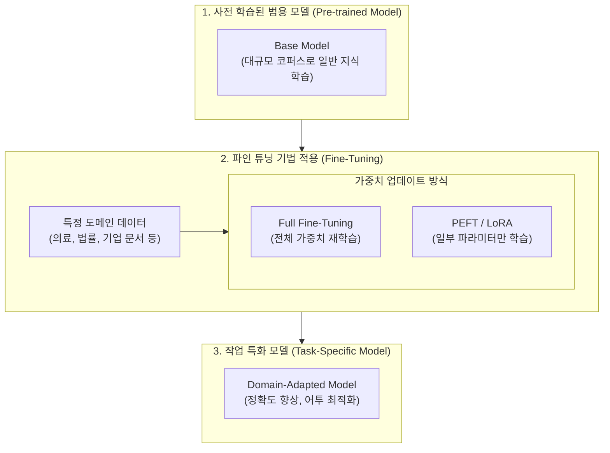

# 파인 튜닝 (Fine-tuning)

---

## I. 사전 학습된 지식의 도메인 특화 전이 기술, 파인 튜닝의 개요

* **정의**: 대규모 데이터셋으로 이미 사전 학습(Pre-training)이 완료된 [[범용 인공지능]] 모델([[파운데이션 모델]])의 가중치를 기반으로, 특정 도메인이나 목적(Task)에 맞는 소규모 데이터를 추가 학습시켜 모델을 최적화하는 기법
* **등장 배경**: 바닥부터(From Scratch) 거대 모델을 학습시키는 데 소요되는 천문학적인 컴퓨팅 비용과 데이터 수집의 한계 극복, 의료/법률/금융 등 전문 도메인에 특화된 고성능 AI 모델의 신속한 구축 필요성 대두
* **특징**: 전이 학습(Transfer Learning)의 핵심 방법론, 사전 학습 대비 적은 비용과 시간 소요, 파라미터 업데이트 방식에 따라 전체 파인 튜닝(Full)과 효율적 파인 튜닝([[PEFT]])으로 구분됨

---

## II. 파인 튜닝의 개념도 및 핵심 기술 요소

### 가. 파인 튜닝의 동작 프로세스 및 개념도

* 방대한 일반 지식을 가진 Base Model에 도메인 특화 데이터를 주입하여, 전체 또는 일부 파라미터를 업데이트함으로써 특정 목적에 최적화된 새로운 모델을 생성함

### 나. 파인 튜닝의 핵심 기술 및 구성 요소

| 구분 | 요소기술(키워드) | 세부 설명 |
| --- | --- | --- |
| **전통적 방식** | Full [[Fine-Tuning]] | 신경망을 구성하는 **모든 층(Layer)의 가중치를 업데이트**하는 방식으로, 성능은 높으나 리소스 소모가 매우 큼 |
| **효율적 방식** | PEFT (Parameter-Efficient) | 거대 모델의 가중치 대부분을 동결(Freeze)하고, **극히 일부의 파라미터만 학습**시켜 연산량과 메모리를 최적화하는 기법 |
| **PEFT 기법** | LoRA ([[LoRA(Low-rank adaptation)|Low-Rank Adaptation]]) | 사전 학습된 가중치는 고정하고, 학습 시 **저랭크 행렬(Low-Rank Matrix) 두 개를 곱한 형태의 어댑터(Adapter)만 추가로 학습**하여 병합하는 대표적 기법 |
| **PEFT 기법** | QLoRA (Quantized LoRA) | LoRA에 양자화(Quantization, 예: 4-bit) 기술을 결합하여, 단일 [[GPU]] 환경에서도 초거대 [[초거대 언어 모델|LLM]]을 파인 튜닝할 수 있도록 메모리 사용량을 극단적으로 줄인 기법 |
| **학습 데이터** | 인스트럭션 튜닝 (Instruction) | 모델이 사용자의 지시를 잘 따르도록 **(명령어, 응답) 쌍**으로 구성된 고품질 데이터셋을 활용하여 모델을 미세조정하는 기법 |
| **부작용/위험** | 파국적 망각 (Catastrophic Forgetting) | 새로운 도메인 데이터를 파인 튜닝하는 과정에서, 모델이 기존에 사전 학습을 통해 알고 있던 **일반 지식을 잊어버리거나 성능이 저하**되는 현상 |

---

## III. 도메인 최적화 기법 비교 및 향후 전망

### 가. LLM 도메인 적용을 위한 핵심 기법 비교 (RAG vs Fine-Tuning)

| 비교 항목 | RAG (검색 증강 생성) | 파인 튜닝 (Fine-Tuning) | 사전 학습 (Pre-training from scratch) |
| --- | --- | --- | --- |
| **핵심 원리** | 외부 DB에서 최신/전문 정보를 **검색하여 프롬프트에 주입** | 도메인 데이터로 모델의 **내부 가중치 자체를 업데이트** | 무정형 데이터로 모델의 **기반 지식 체계를 처음부터 형성** |
| **지식 업데이트** | DB 교체만으로 즉각적 대응 가능 (용이) | 데이터 변경 시 재학습 필요 (번거로움) | 전체 재학습 필요 (불가능에 가까움) |
| **어투 및 스타일** | 텍스트 스타일이나 출력 포맷 변경 제어에 약함 | **특정 어투, 출력 양식([[JSON]] 등) 최적화에 매우 강함** | 범용적인 언어 능력 획득 |
| **[[할루시네이션]]** | 검색된 근거 기반으로 답변하여 크게 감소 | 가중치에 지식을 구워 넣으므로(Baking) 발생 가능성 존재 | 팩트 체크 메커니즘 부재 시 발생 높음 |
| **비용 및 리소스** | 구축 비용 상대적 저렴 / 추론(검색) 비용 발생 | **초기 GPU 학습 비용 발생** / 추론 비용은 동일 | 천문학적 GPU 및 시간 소요 |

### 나. 파인 튜닝의 최신 기술 동향 및 시사점

* **PEFT(특히 LoRA/QLoRA)의 표준화**: 수백억~수천억 개의 파라미터를 가진 LLM을 Full Fine-tuning 하는 것은 비용적으로 불가능에 가까워짐에 따라, 원본 모델의 1% 미만 파라미터만 학습하고도 유사한 성능을 내는 LoRA 기반 기법이 오픈소스 LLM 진영의 절대적인 표준으로 자리 잡음
* **RAG와 파인 튜닝의 하이브리드(Hybrid) 접근**: 기업용 AI 구축 시 두 기법을 경쟁 관계로 보지 않고 상호보완재로 활용함. 파인 튜닝을 통해 모델이 사내 특유의 용어, 말투, 문서 양식을 이해하도록 만들고, 실제 정확한 수치나 최신 규정은 RAG를 통해 주입하여 할루시네이션을 제어하는 투트랙(Two-track) 전략이 대세로 굳어지고 있음
* **인간 피드백 기반 [[강화학습]](RLHF) 결합**: 단순한 텍스트 완성(Completion)을 넘어, 인간의 윤리적 가치관이나 선호도를 모델에 정렬(Alignment)시키기 위한 최종 파인 튜닝 단계로 RLHF 및 DPO(Direct Preference Optimization) 기법이 필수적으로 적용됨

---

### 🔗 연관 토픽

- **소속 도메인**: [[00_인공지능_MOC|🤖 인공지능]]
- **세부 분류**: `4. 거대언어모델 (LLM) & 생성형 AI`
- **핵심 연관 토픽**:
  - [[Fine-Tuning]]
  - [[파운데이션 모델|파운데이션 모델(Foundation Model)]]
  - [[PEFT|PEFT(Parameter-Efficient Fine-Tuning)]]
  - [[초거대 언어 모델|초거대 언어 모델(Large Language Model)]]
  - [[LoRA(Low-rank adaptation)]]
