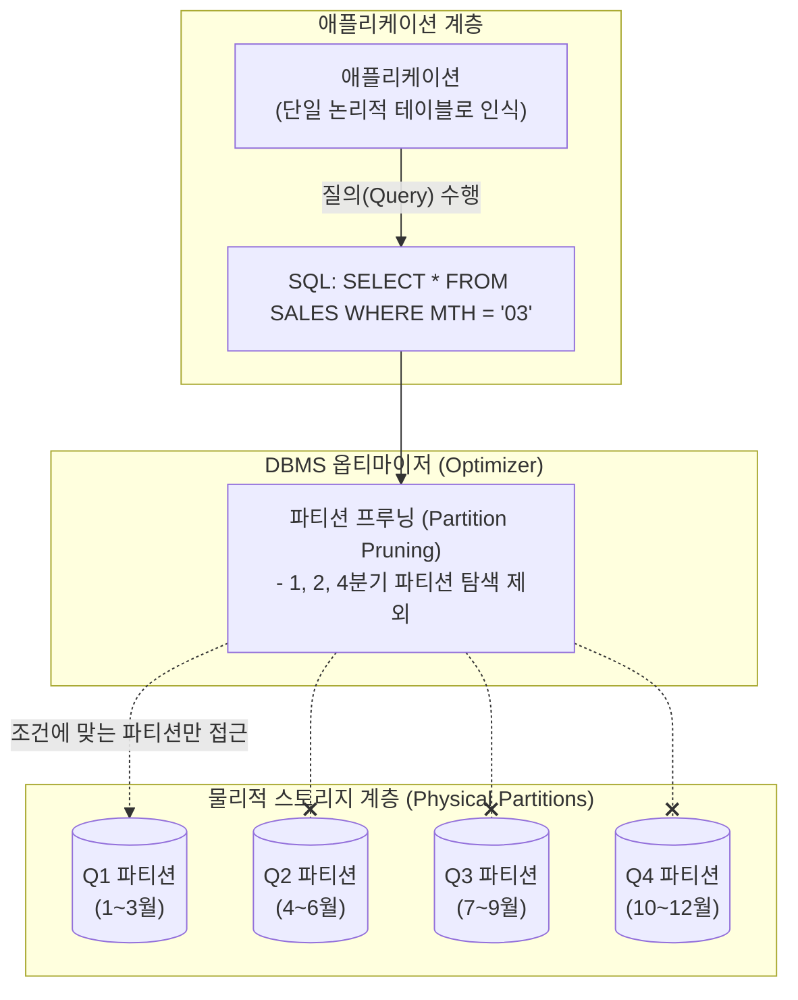

# 데이터베이스 파티셔닝 (Database Partitioning)

---

## I. 대용량 데이터베이스의 성능 및 관리 효율성 극대화 기법, 파티셔닝의 개요

* **정의**: 대용량의 논리적 테이블이나 인덱스를 관리하기 쉽고 접근 속도가 빠른 단위(파티션, Partition)로 물리적으로 분할하여 저장하는 [[데이터베이스]] 설계 및 튜닝 기법
* **등장 배경**: 데이터 용량의 기하급수적 증가에 따른 조회 성능 저하(Full Table Scan 부담), 백업 및 복구 시간의 기하급수적 증가 극복, 특정 디스크 I/O에 집중되는 병목 현상 해소 필요
* **특징**: 애플리케이션 입장에서는 논리적으로 하나의 테이블로 인식(투명성 보장), 물리적으로는 분산 저장되어 I/O 부하 분산, 파티션 단위의 독립적 백업/복구 가능([[HA(High Availability)|가용성]] 향상)

---

## II. 데이터베이스 파티셔닝의 개념도 및 핵심 기술 요소

### 가. 파티셔닝의 아키텍처 및 동작 원리

* [[DBMS]]는 사용자의 [[SQL(Structured Query Language)|SQL]] 쿼리 조건(WHERE 절)에 파티션 키가 포함되어 있을 경우, 조건과 무관한 물리적 파티션은 탐색 대상에서 제외(Pruning)하여 디스크 I/O를 획기적으로 줄임

### 나. 파티셔닝의 핵심 기술 및 구성 요소

| 구분 | 요소기술(키워드) | 세부 설명 |
| --- | --- | --- |
| **분할 기준** | 파티션 키 (Partition Key) | 데이터를 어떤 기준(날짜, 부서 코드, 고객 ID 등)으로 나눌지 결정하는 기준 컬럼 |
| **성능 최적화** | 파티션 프루닝 (Pruning) | SQL 실행 시 옵티마이저가 조건절을 분석하여, 데이터가 존재하지 않는 파티션을 스캔 대상에서 제외하는 기법 |
| **성능 최적화** | 파티션 와이즈 [[조인]](Partition Wise Join) | 조인(Join)되는 두 테이블이 동일한 파티션 키로 분할되어 있을 때, 각 파티션 쌍끼리 독립적/병렬적으로 조인을 수행하는 기법 |
| **인덱스 전략** | 로컬 인덱스 (Local [[RDBMS 인덱스(index)|Index]]) | 데이터 파티션과 인덱스 파티션이 1:1로 매핑되도록 생성된 인덱스 (파티션 관리가 독립적이고 용이함) |
| **인덱스 전략** | 글로벌 인덱스 (Global Index) | 테이블 전체 데이터를 대상으로 하나의 거대한 인덱스를 생성하거나, 데이터 파티션과 다른 기준으로 분할된 인덱스 |
| **데이터 독립성** | 파티션 투명성 (Transparency) | 파티셔닝이 적용되더라도 사용자나 애플리케이션의 SQL 구문을 수정할 필요가 없는 성질 |
| **가용성 보장** | 파티션 독립성 | 특정 물리적 파티션(디스크)에 장애가 발생하더라도, 다른 파티션의 데이터는 정상적으로 조회/입력 가능한 특성 |

---

## III. 파티셔닝 기법 비교 및 최신 동향

### 가. 3대 주요 파티셔닝 기법 비교

| 비교 항목 | 범위 파티셔닝 (Range Partitioning) | 해시 파티셔닝 (Hash Partitioning) | 리스트 파티셔닝 (List Partitioning) |
| --- | --- | --- | --- |
| **분할 기준** | 연속된 숫자나 날짜 범위 | 파티션 키에 해시 함수 적용 결과값 | 특정 값(Value)들의 목록 |
| **주요 특징** | 이력(History)성 데이터 관리에 최적 | 데이터를 모든 파티션에 고르게 분산 | 명시적인 값(지역, 부서 등) 기준의 그룹화 |
| **장점** | 관리가 직관적이며 오래된 데이터 보관/삭제(Drop)에 유리 | 특정 디스크에 데이터가 편중되는 병목 현상 방지 | 도메인 비즈니스 요건에 맞는 명확한 데이터 분류 가능 |
| **단점** | 최신 데이터가 특정 파티션에 몰려 I/O 경합 발생 가능 | 특정 데이터가 어느 파티션에 저장되었는지 예측 불가 | 파티션 키 값의 종류가 너무 많거나 유동적일 경우 부적합 |
| **적용 사례** | 일별/월별/연도별 매출 데이터 | 고객 ID 기반 대규모 사용자 원장 | 지역별(서울, 부산 등) 영업 실적 테이블 |

* ※ 필요에 따라 두 가지 기법을 결합하는 **복합 파티셔닝 (Composite Partitioning)**(예: Range로 먼저 나누고 Hash로 재분할)을 활용하여 장점을 극대화함.

### 나. 파티셔닝 기술의 진화 동향 및 시사점

* **[[샤딩]](Sharding)으로의 개념 확장**: 단일 데이터베이스 [[인스턴스]] 내부의 디스크 분산인 파티셔닝을 넘어, 분산 시스템([[NoSQL (CAP 이론 BASE 속성)|NoSQL]], [[MSA (Micro Service Architecture)|MSA]] 환경)에서는 데이터를 물리적으로 완전히 분리된 여러 서버 노드(DB)로 쪼개어 저장하는 수평적 분할 방식인 샤딩으로 아키텍처가 진화함
* **클라우드 데이터웨어하우스의 오토 파티셔닝(Auto-Partitioning)**: Snowflake, Google BigQuery 등 [[클라우드 네이티브]] 분석 DB는 사용자가 명시적으로 파티션 키를 설계하지 않아도, 데이터 적재 시 마이크로 파티션(Micro-partition) 형태로 자동 분할하고 통계 메타데이터를 관리하여 프루닝을 극대화하는 자동화 아키텍처를 채택함

---

### 🔗 연관 토픽

- **소속 도메인**: [[00_데이터베이스_MOC|🗄️ 데이터베이스]]
- **세부 분류**: `4. 물리 저장 구조 & 인덱스 최적화`
- **핵심 연관 토픽**:
  - [[샤딩|샤딩 (Sharding)]]
  - [[분산 데이터베이스|분산 데이터베이스 (Distributed Database)]]
  - [[데이터베이스]]
  - [[DBMS]]
  - [[NoSQL (CAP 이론 BASE 속성)]]
