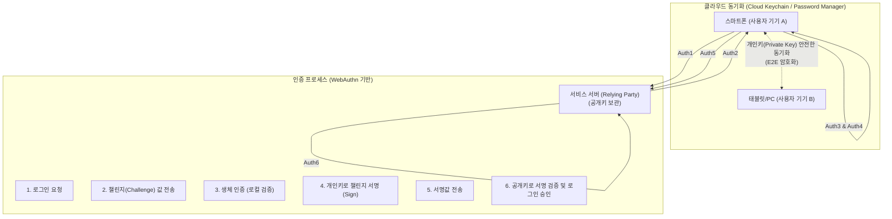

# 패스키 (Passkey)

---

## I. 패스워드 없는 안전한 인증의 표준, 패스키의 개요

* **정의**: [[FIDO]] 얼라이언스와 W3C의 WebAuthn 표준을 기반으로, 비밀번호 대신 사용자 기기의 생체 인식(지문, 얼굴)이나 PIN을 활용하여 생성된 비대칭 암호 키 쌍(Key Pair)으로 로그인하는 차세대 패스워드리스(Passwordless) 인증 기술
* **등장 배경**: 비밀번호 [[재사용]] 및 유출로 인한 크리덴셜 스터핑(Credential Stuffing) 공격 증가, 피싱(Phishing) 위협 고도화, 기존 FIDO 인증의 단일 기기 종속성(Device-bound) 한계 극복 및 다중 기기 환경(Multi-Device) 지원 필요성 대두
* **특징**: 피싱 저항성(Phishing-resistant) 보장, 클라우드(Apple iCloud, Google Password Manager 등)를 통한 크리덴셜 동기화, 사용자 생체 정보의 서버 미전송(로컬 검증)으로 완벽한 개인정보 보호

---

## II. 패스키의 개념도 및 핵심 기술 요소

### 가. 패스키의 동작 원리 및 클라우드 동기화 아키텍처

* 서버에는 '공개키(Public Key)'만 저장되고, '개인키(Private Key)'는 사용자의 기기 내 안전한 영역에 저장된 후 클라우드를 통해 다른 기기들과 동기화됨. 인증 시 기기의 생체 인식을 통해 개인키를 활성화하여 서버가 보낸 챌린지 값을 서명(Sign)함.

### 나. 패스키의 핵심 기술 및 구성 요소

| 구분 | 요소기술(키워드) | 세부 설명 |
| --- | --- | --- |
| **표준 [[프로토콜]]** | FIDO2 / WebAuthn | 웹 브라우저 및 운영체제에 내장된 인증자(Authenticator)를 활용하여 표준화된 공개키 기반 [[암호화]] 인증을 수행하는 W3C/FIDO 표준 |
| **암호화 기술** | 비대칭 키 암호화 (Public Key Cryptography) | 패스키 생성 시 기기 내부에서 고유한 **개인키(Private Key)**와 서버로 전송되는 **공개키(Public Key)** 쌍을 생성하여 자격 증명으로 활용 |
| **자격 증명 동기화** | 다중 기기 FIDO 크리덴셜 (Multi-Device FIDO) | 기존 하드웨어 종속적인 FIDO 키를 클라우드 계정에 연동하여, 새 기기로 변경해도 기존 패스키를 그대로 사용할 수 있게 하는 핵심 기술 |
| **하드웨어 보안** | TEE (신뢰 실행 환경) / Secure Enclave | 개인키가 OS나 악성코드에 의해 유출되지 않도록 기기 내 하드웨어적으로 완벽히 격리된 독립 보안 영역 |
| **사용자 검증** | 로컬 생체 인식 (Local Biometrics) | Face ID, Touch ID 등 기기 자체의 생체 인식 센서를 사용하여 사용자를 확인 (생체 정보 자체는 절대 외부로 전송되지 않음) |
| **기기 간 연동** | [[CTAP]] (Client to Authenticator Protocol) | PC 화면에 뜬 QR 코드를 스마트폰으로 스캔하여, 블루투스(Bluetooth) 근거리 통신 기반으로 교차 기기 로그인을 지원하는 프로토콜 |

---

## III. 인증 방식 비교 및 향후 전망

### 가. 패스워드, OTP, 패스키(Passkey) 비교

| 비교 항목 | 전통적 패스워드 (Password) | 2FA / OTP (일회용 비밀번호) | 패스키 (Passkey) |
| --- | --- | --- | --- |
| **인증 기반** | 지식 기반 (내가 아는 것) | 소유 기반 (기기, SMS) | **소유(비대칭키) + 생체(나의 특징) 기반** |
| **피싱(Phishing) 내성** | 매우 취약 (가짜 사이트에 입력 시 탈취) | 취약 (가짜 사이트에서 OTP 번호 가로채기 가능) | **강력함 (등록된 도메인과 서명 요청이 일치해야만 동작)** |
| **서버 해킹 시 위험성** | 탈취된 비밀번호로 크리덴셜 스터핑 공격 위험 | 단독으로는 안전하나 비밀번호 유출 위험 상존 | **안전함 (서버에는 공개키만 존재하여 해킹되어도 무용지물)** |
| **사용자 편의성** | 낮음 (복잡한 조합 암기 필요 및 잦은 변경) | 낮음 (별도 앱 실행 및 번호 입력 번거로움) | **매우 높음 (기기 잠금 해제와 동일한 생체 인식 1회로 완료)** |

### 나. 패스키의 최신 적용 동향 및 시사점

* **빅테크 연합의 OS 레벨 생태계 통합**: 애플, 구글, 마이크로소프트 등 주요 빅테크 기업들이 FIDO 얼라이언스 표준을 전폭적으로 지지하며, iOS, Android, Windows, macOS 등 주요 운영체제에 패스키 생성 및 클라우드 동기화 기능을 기본 탑재하여 대중화 가속
* **크로스 디바이스(Cross-Device) 인증의 활성화**: 스마트 TV, 공용 PC 등 패스키가 없는 기기에서도 스마트폰의 블루투스 근접성 검증과 QR 코드 스캔을 결합하여 안전하게 로그인하는 하이브리드(Hybrid) 인증 방식이 스마트홈 및 엔터프라이즈 환경으로 확산
* **제로 트러스트([[제로 트러스트 보안모델|Zero Trust]]) 아키텍처의 핵심 인증 수단**: 비밀번호의 본질적 취약점을 제거하므로, '아무것도 신뢰하지 않고 항상 검증한다'는 제로 트러스트 보안 모델을 구현하기 위한 기업용 [[IAM]](계정 및 접근 관리) 솔루션의 궁극적인 인증 방식으로 자리 매김

---

### 🔗 연관 토픽

- **소속 도메인**: [[00_보안_MOC|🛡️ 보안]]
- **세부 분류**: `2. 현대 암호학 & 키 관리 · 전자서명`
- **핵심 연관 토픽**:
  - [[FIDO]]
  - [[CTAP]]
  - [[IAM]]
  - [[FIDO 2.0 (Fast IDentity Online 2.0)]]
  - [[OWASP Top 10 2025]]
