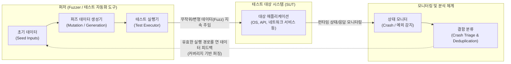

# 퍼징 테스트 (Fuzzing Test)

---

## I. 예측 불가능한 엣지 케이스 및 보안 취약점 탐지 기법, 퍼징 테스트의 개요

* **정의**: 소프트웨어 시스템에 무작위로 생성되거나 의도적으로 변형된 유효하지 않은 데이터(Fuzz)를 대량으로 지속 주입하여, 시스템 크래시(Crash), 메모리 누수, 예외 처리 오류 등 숨겨진 보안 취약점과 결함을 찾아내는 동적 분석(Dynamic Analysis) 기반의 테스트 기법
* **등장 배경**: 정적 보안 분석([[SAST]])의 높은 오탐률(False Positive) 및 런타임 오류 탐지 불가 한계 극복, 시스템 복잡도 증가에 따른 예측 불가능한 엣지 케이스([[EDGE|Edge]] Case)와 제로데이(Zero-day) 취약점에 대한 선제적 방어 필요성 대두
* **특징**: 고도로 자동화된 테스트 실행, 크래시 발생 시 즉각적인 재현 가능(오탐률이 매우 낮음), 버퍼 오버플로우(Buffer Overflow)와 같은 메모리 손상 취약점 발견에 특히 탁월한 효과

---

## II. 퍼징 테스트의 개념도 및 핵심 기술 요소

### 가. 퍼징 테스트의 아키텍처 및 동작 원리

* 퍼저(Fuzzer)가 생성한 기형적인 데이터를 타겟 시스템(SUT)에 주입하고, 시스템이 멈추거나 메모리 에러를 뱉어내는 등 비정상 동작(Crash)을 일으킬 때의 입력값을 저장하여 취약점의 근본 원인을 분석함

### 나. 퍼징 테스트의 핵심 기술 및 구성 요소

| 구분 | 요소기술(키워드) | 세부 설명 |
| --- | --- | --- |
| **데이터 생성** | 뮤테이션 (Mutation) 퍼징 | 기존에 존재하는 유효한 정상 입력 데이터(Seed)의 일부 바이트를 무작위로 변형(비트 반전 등)하여 테스트 데이터를 생성하는 기법 |
| **데이터 생성** | 제너레이션 (Generation) 퍼징 | 대상 프로그램의 [[프로토콜]] 명세나 파일 포맷 구조(Grammar)를 사전에 학습하여, 규칙에 기반한 새로운 기형 데이터를 생성하는 기법 |
| **분석 관점** | 블랙박스 (Black-box) 퍼징 | 타겟 시스템의 내부 소스코드나 구조를 전혀 모르는 상태에서, 외부 인터페이스(입출력)만을 대상으로 무작위 퍼징을 수행 |
| **분석 관점** | 화이트박스 (White-box) 퍼징 | 소스코드 수준의 분석과 기호 실행(Symbolic Execution)을 결합하여, 프로그램의 모든 분기점을 탐색할 수 있도록 정교한 퍼즈 데이터를 수학적으로 계산 |
| **분석 관점** | 그레이박스 (Grey-box) 퍼징 | 컴파일 시점에 코드를 계측(Instrumentation)하여 **실행 경로 커버리지 피드백**을 받고, 이를 바탕으로 새로운 경로를 여는 유효한 입력값을 진화시키는 기법 (대표 도구: AFL) |
| **오류 탐지** | 메모리 새니타이저 (ASan 등) | 퍼징 시 AddressSanitizer(ASan) 등을 타겟에 적용하여, 단순 크래시뿐만 아니라 런타임에 발생하는 미세한 메모리 손상(Use-after-free 등)을 즉각 탐지 |
| **사후 처리** | 트라이아지 (Triage) | 퍼징 과정에서 쏟아지는 수천 개의 크래시 중 중복을 제거(Deduplication)하고, 실제 익스플로잇([[Exploit]]) 가능한 치명적 결함을 우선순위화 하는 분류 작업 |

---

## III. 정적 분석과의 비교 및 퍼징 테스트 최신 동향

### 가. 정적 보안 분석(SAST)과 퍼징 테스트(동적 분석) 비교

| 비교 항목 | 정적 보안 분석 (SAST) | 퍼징 테스트 (Fuzzing / 동적 분석) |
| --- | --- | --- |
| **테스트 시점** | 소스코드 작성 단계 (실행 전) | 빌드 및 배포 이후 (런타임 실행 중) |
| **주요 탐지 대상** | 코딩 표준 위배, 알려진 취약점 패턴 (SQLi, [[XSS]] 등) | 메모리 누수, 크래시, 무한 루프, 제로데이 취약점 |
| **오탐률 (False Positive)** | **매우 높음** (실제 실행 불가능한 경로도 결함으로 보고) | **매우 낮음** (크래시가 발생했다면 확실한 버그임) |
| **실행 시간 및 종료 조건** | 소스코드 크기에 비례하며 종료 시점이 명확함 | 본질적으로 무한 루프이며, 정해진 시간(Time-box) 통제 필요 |
| **도메인 지식 요구도** | 규칙 기반으로 자동 검출되므로 상대적 낮음 | 타겟 시스템의 환경 설정 및 초기 Seed 구성 역량 요구 |

### 나. 퍼징 테스트의 최신 기술 동향 및 시사점

* **지속적 퍼징(Continuous Fuzzing)과 [[DevSecOps]] 통합**: 구글의 OSS-Fuzz나 ClusterFuzz와 같이, CI/CD 파이프라인의 백그라운드 클러스터에서 24시간 365일 퍼징을 자동으로 병렬 수행하여, 코드 커밋과 동시에 새로운 런타임 결함을 찾아내는 체계가 글로벌 표준으로 자리매김
* **AI 및 [[초거대 언어 모델|LLM]] 기반 스마트 퍼징 (Smart Fuzzing)**: 복잡한 문법을 가진 최신 API(REST, GraphQL)나 [[JSON]] 구조체를 테스트하기 위해, 대규모 언어 모델(LLM)이 프로토콜 명세서(Swagger 등)를 이해하고 익스플로잇 가능성이 높은 고도의 정형화된 퍼즈 데이터(Grammar-based Fuzz)를 자동 생성하는 AI 퍼징으로 진화
* **언어 내장 퍼징(First-class Fuzzing) 지원 확산**: Go 언어의 `go test -fuzz` 기능이나 Rust의 `cargo-fuzz`처럼, 별도의 외부 도구 설치 없이 프로그래밍 언어의 툴체인 자체에서 커버리지 기반 퍼징을 기본 [[단위 테스트]](Unit Test) 수준으로 쉽게 작성하고 실행할 수 있도록 지원하는 추세

---

### 🔗 연관 토픽

- **소속 도메인**: [[00_소프트웨어공학_MOC|🏗️ 소프트웨어공학]]
- **세부 분류**: `6. 소프트웨어 테스팅 & 품질 보증 (QA/QC)`
- **핵심 연관 토픽**:
  - [[DevSecOps]]
  - [[단위 테스트]]
  - [[코드 커버리지|코드 커버리지(Code Coverage)]]
  - [[초거대 언어 모델|초거대 언어 모델(Large Language Model)]]
  - [[프로토콜]]
