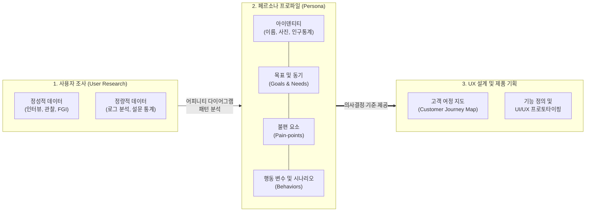

# 페르소나 (Persona)

---

## I. 사용자 중심 설계(UCD)를 위한 공감과 의사결정의 기준, 페르소나의 개요

* **정의**: 다양한 사용자 연구(User Research) 데이터를 바탕으로 도출된 핵심 타겟 사용자 집단을 대표하는 '가상의 인물(Fictional Character)' 모델로, 제품 기획 및 UX/UI 설계의 기준이 되는 분석 도구
* **등장 배경**: 앨런 쿠퍼(Alan Cooper)의 '목표 지향 디자인(Goal-Directed Design)'에서 처음 도입. 개발자나 기획자가 스스로를 사용자로 착각하는 자기 참조(Self-referential)의 오류와, 조건에 따라 요구사항이 늘어나는 '탄력적 사용자(Elastic User)' 문제를 해결하기 위해 고안
* **특징**: 사용자 공감대(Empathy) 형성의 극대화, 정성적/정량적 데이터에 기반한 사실성(Reality) 부여, 이해관계자 간의 원활한 커뮤니케이션 및 일관된 의사결정(Decision Making) 지원

---

## II. 페르소나의 개념도 및 핵심 구성 요소

### 가. 페르소나 도출 프로세스 및 아키텍처

* 사용자 조사에서 수집된 방대한 데이터를 패턴화하여 페르소나를 모델링하며, 이는 후속 단계인 고객 여정 지도(CJM) 작성과 구체적인 기능 설계의 흔들리지 않는 기준점으로 작용함

### 나. 페르소나 프로파일의 핵심 구성 요소

| 구분 | 요소기술(키워드) | 세부 설명 |
| --- | --- | --- |
| **인물화 요소** | 아이덴티티 (Identity) | 이름, 직업, 나이, 가상의 사진, 인용구(Quote) 등을 부여하여 실존 인물처럼 생동감과 현실감을 제공 |
| **인구 통계** | 데모그래픽 (Demographic) | 거주지, 소득 수준, 교육 수준, 가족 구성 등 사용자의 배경을 형성하는 객관적 지표 |
| **핵심 가치** | 목표 (Goals) / 동기 (Needs) | 사용자가 해당 제품이나 서비스를 통해 궁극적으로 달성하고자 하는 목적과 내재적 동기 |
| **문제 정의** | 페인 포인트 (Pain-points) | 현재 시스템이나 일상생활에서 겪고 있는 주요 불편함, 좌절감(Frustrations), 해결해야 할 과제 |
| **사용 맥락** | 행동 변수 (Behavioral Variables) | 제품 사용 환경, IT 기기 숙련도, 서비스 이용 빈도, 선호하는 채널 등 구체적인 행동 양식 |
| **맥락화** | 내러티브 (Narrative) / 시나리오 | 페르소나가 특정 목적을 달성하기 위해 제품과 상호작용하는 과정을 묘사한 스토리텔링 |
| **조직화 기법** | 어피니티 다이어그램 (Affinity) | 리서치에서 얻은 방대한 정성적 인사이트를 포스트잇 형태로 그룹화하여 페르소나의 특징을 뽑아내는 분석 기법 |

---

## III. 시장 세분화와의 비교 및 향후 전망

### 가. 페르소나 (UX 관점) vs 시장 세분화 (마케팅 관점) 비교

| 비교 항목 | 페르소나 (Persona) | 시장 세분화 (Market Segmentation) |
| --- | --- | --- |
| **핵심 목적** | **제품 설계(UX), 문제 해결, 사용자 공감 형성** | **시장 규모 파악, 타겟 마케팅 전략 수립** |
| **분석 초점** | 사용자의 **행동 패턴, 목표, 동기, 맥락 (Why)** | 소비자의 **인구통계, 구매력, 시장 규모 (Who)** |
| **도출 결과물** | 구체적인 얼굴과 이름을 가진 **단일 가상 인물** | 특정 속성(예: 20대 여성 직장인)을 공유하는 **타겟 집단** |
| **기반 데이터** | 심층 인터뷰, 관찰 중심의 **정성적(Qualitative) 데이터** | 설문조사, 매출 통계 중심의 **정량적(Quantitative) 데이터** |

### 나. 최신 페르소나 기술 동향 및 시사점

* **AI 및 [[초거대 언어 모델|LLM]] 기반의 합성 페르소나(Synthetic Persona)**: 사용자 리서치에 소요되는 막대한 시간과 비용을 줄이기 위해, 생성형 AI에게 방대한 사용자 데이터를 학습시키고 특정 페르소나를 부여(Role-playing)하여 UX 리서치, A/B 테스트, 인터뷰 시뮬레이션을 수행하는 가상 사용자(Synthetic User) 활용 급증
* **데이터 기반 동적 페르소나(Dynamic Persona)**: 과거의 페르소나가 한번 만들어지면 변하지 않는 정적인 PDF 문서였다면, 최근에는 고객 데이터 플랫폼(CDP)과 연동하여 사용자의 실제 행동 데이터 변화에 따라 페르소나의 특징이 실시간으로 진화하고 업데이트되는 동적(Data-driven) 페르소나 시스템으로 발전
* **초거대 AI 프롬프트 엔지니어링의 핵심 기법**: ChatGPT 등 LLM을 활용할 때, "너는 20년 차 시니어 UX 디자이너야"처럼 AI에게 구체적인 페르소나(역할)를 부여하여 답변의 전문성, 어투, 출력 방향성을 정밀하게 제어하는 '페르소나 프롬프팅(Persona Prompting)'이 핵심 기술로 정착

---

### 🔗 연관 토픽

- **소속 도메인**: [[00_소프트웨어공학_MOC|🏗️ 소프트웨어공학]]
- **세부 분류**: `2. 애자일(Agile) & 지속적 통합/배포(CI/CD)`
- **핵심 연관 토픽**:
  - [[사용성 평가]]
  - [[초거대 언어 모델|초거대 언어 모델(Large Language Model)]]
  - [[프롬프트 엔지니어링|프롬프트 엔지니어링(Prompt Engineering)]]
  - [[리그레션 테스트|리그레션(회귀, Regression) 테스트]]
  - [[TDD|TDD (Test Driven Development)]]
