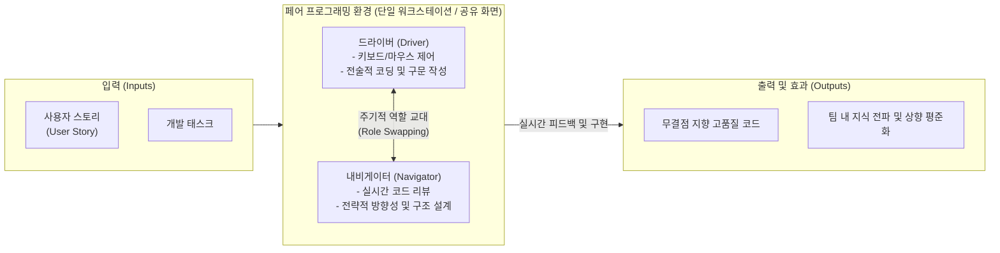

# 페어 프로그래밍 (Pair Programming)

---

## I. 품질 향상과 지식 공유를 위한 실시간 협업 코딩 기법, 페어 프로그래밍의 개요

* **정의**: 애자일([[Agile]]) 소프트웨어 개발 방법론인 익스트림 프로그래밍(XP: eXtreme Programming)의 핵심 실천법으로, 두 명의 개발자가 하나의 워크스테이션(모니터, 키보드)에서 공동으로 코드를 작성하고 리뷰하는 개발 기법
* **등장 배경**: 개발 후반부에 진행되는 사후 코드 리뷰의 한계 및 결함 수정 비용 증가, 개발자 간 도메인 지식 격차 해소 필요성, 팀 내 암묵지(Tacit Knowledge)의 형식지화 및 신속한 전수 요구
* **특징**: 드라이버(Driver)와 내비게이터(Navigator)의 역할 분담, 코드 작성과 동시에 이루어지는 지속적 코드 리뷰(Continuous Code Review), 팀의 집단 코드 소유권(Collective Code Ownership) 강화

---

## II. 페어 프로그래밍의 개념도 및 핵심 구성 요소

### 가. 페어 프로그래밍의 역할 분담 및 동작 원리

* 두 개발자는 코드 구현이라는 미시적 관점(드라이버)과 전체 아키텍처 및 결함 탐지라는 거시적 관점(내비게이터)을 분담하며, 주기적으로 역할을 교대하여 집중력을 유지함

### 나. 페어 프로그래밍의 핵심 원칙 및 구성 요소

| 구분 | 요소기술(키워드) | 세부 설명 |
| --- | --- | --- |
| **핵심 역할** | 드라이버 (Driver) | 직접 타이핑을 하며 전술적인 문제([[알고리즘]], 문법, 변수명 등)를 해결하고 코드를 즉시 구현하는 역할 |
| **핵심 역할** | 내비게이터 (Navigator) | 드라이버의 코드를 실시간 리뷰하여 오타나 논리적 오류를 찾고, 향후 발생할 예외 상황 등 전략적 방향성을 고민하는 역할 |
| **운영 규칙** | 역할 교대 (Role Swapping) | 인지적 피로를 방지하고 동등한 참여를 유도하기 위해, 보통 20~30분 주기(포모도로 기법 등)로 역할을 교환 |
| **효과/문화** | 지속적 코드 리뷰 | 코드가 작성되는 순간마다 두 번째 눈(Second pair of eyes)을 통해 검증되므로, 결함 발견 비용(Cost of Change) 극단적 최소화 |
| **효과/문화** | 지식 공유 (Knowledge Sharing) | 시니어-주니어 간 멘토링뿐만 아니라, 특정 모듈에 대한 독점적 지식을 타 팀원에게 빠르게 전파(Silo 현상 방지) |
| **효과/문화** | 집단 코드 소유권 | 작성된 소스코드는 개인의 것이 아니라 팀 전체의 소유라는 XP의 기본 철학을 실현하여 누구나 코드 수정이 가능하게 함 |
| **지원 도구** | 원격 페어링 (Remote Pairing) | 물리적 공간 제약을 극복하기 위해 VS Code Live Share, JetBrains Code With Me 등 동시 편집 IDE 확장 도구 활용 |

---

## III. 유사 협업 코딩 기법 비교 및 최신 동향

### 가. 페어 프로그래밍, 전통적 코드 리뷰, 몹 프로그래밍 비교

| 비교 항목 | 전통적 코드 리뷰 (Traditional Code Review) | 페어 프로그래밍 (Pair Programming) | 몹 프로그래밍 (Mob Programming) |
| --- | --- | --- | --- |
| **참여 인원** | 작성자 1명 + 리뷰어 N명 | **정확히 2명 (Driver & Navigator)** | 3명 이상 (팀 전체가 참여) |
| **수행 시점** | 코드 작성이 **완료된 후 (사후)** | 코드 작성과 **동시 (실시간)** | 코드 작성과 **동시 (실시간)** |
| **지식 전파 속도** | 상대적으로 느림 (비동기적 피드백) | **빠름 (밀착형 실시간 피드백)** | 매우 빠름 (팀 전체가 동시에 동일한 컨텍스트 공유) |
| **리소스(Man-Month) 인식** | 단기적 생산성 저하 적음 | 단기적으로 2명의 인력 투입으로 인한 리소스 낭비로 오인될 수 있음 | 인력 투입 부담이 가장 큼 |
| **적합한 상황** | 일반적인 Pull Request(PR) 기반 협업 | **복잡한 비즈니스 로직, 빠른 결함 탐지가 필수적인 핵심 모듈 개발** | 아키텍처 초기 설계, 치명적 장애(장애 대응) 극복 |

### 나. 페어 프로그래밍의 최신 진화 동향 및 향후 전망

* **[[클라우드 네이티브]] 원격 페어링 (Distributed Pairing)**: 팬데믹 이후 글로벌 분산 팀 환경이 보편화되면서, 화면 공유를 넘어 로컬 환경의 차이를 제거하는 클라우드 IDE(GitHub Codespaces, AWS Cloud9) 기반의 완전 동기화된 원격 페어 프로그래밍이 주류로 정착함
* **AI 기반의 가상 페어 프로그래밍 (AI-Assisted Pairing)**: GitHub Copilot, Cursor 등 생성형 AI 어시스턴트가 1인 개발자의 '내비게이터' 또는 '드라이버' 역할을 실시간으로 수행하는 **AI 페어 프로그래머 시대**가 도래. 인간은 아키텍처와 프롬프트 설계(내비게이터)에 집중하고, AI가 보일러플레이트 코드 작성(드라이버)을 전담하는 형태로 진화 중

---

### 🔗 연관 토픽

- **소속 도메인**: [[00_프로젝트관리_MOC|📋 프로젝트관리]]
- **세부 분류**: `3. 소프트웨어 원가 산정 & 성과 관리 (Cost & EVM)`
- **핵심 연관 토픽**:
  - [[XP|XP (eXtreme Programming)]]
  - [[알고리즘]]
  - [[클라우드 네이티브]]
  - [[Agile]]
  - [[경제성 분석 기법]]
