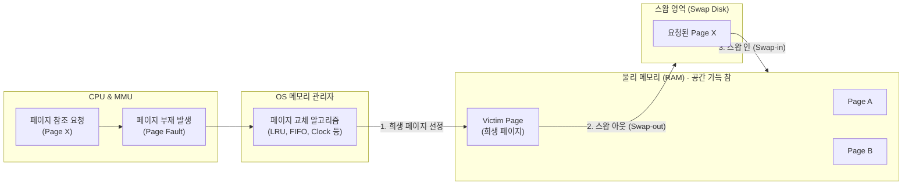

# 페이지 교체 알고리즘 (Paging Replacement Algorithm)

---

## I. 가상 메모리 관리의 핵심, 페이지 교체 알고리즘의 개요

* **정의**: 제한된 물리 메인 메모리(RAM) 공간에 새로운 페이지를 적재해야 할 때, 현재 메모리에 올라와 있는 페이지 중 어떤 페이지를 디스크(Swap 영역)로 내보낼지(Evict) 결정하는 운영체제의 [[메모리 관리]] [[알고리즘]]
* **등장 배경**: 프로세스의 크기가 물리 메모리보다 큰 환경을 지원하는 [[가상 메모리]](Virtual Memory) 기법 사용 시 발생하는 페이지 부재(Page Fault)의 오버헤드를 최소화하기 위함
* **특징**: 지역성의 원리(Principle of Locality)를 기반으로 미래의 참조를 예측, 알고리즘의 효율성이 시스템 전체 성능(디스크 I/O 대기 시간)을 직접적으로 좌우, 잦은 교체 발생 시 스래싱(Thrashing) 현상 유발 가능성 존재

---

## II. 페이지 교체 알고리즘의 개념도 및 핵심 기술 요소

### 가. 페이지 교체 발생 메커니즘 및 개념도

* 페이지 부재(Page Fault) 발생 시 물리 메모리에 빈 프레임(Frame)이 없다면, OS는 교체 알고리즘을 통해 희생 페이지(Victim)를 선정하고 디스크와 스왑(Swap) 연산을 수행함

### 나. 주요 페이지 교체 알고리즘 및 핵심 개념

| 구분 | 알고리즘(키워드) | 세부 설명 |
| --- | --- | --- |
| **이론적 최적** | [[OPT]] (Optimal) / Belady's | **앞으로 가장 오랫동안 사용되지 않을** 페이지를 교체. 미래의 참조 패턴을 미리 알아야 하므로 실제 구현은 불가능하나, 타 알고리즘 성능 평가의 이상적 기준점(Upper Bound) 제공 |
| **순서 기반** | [[FIFO]] (First In First Out) | **가장 먼저 메모리에 적재된(오래된)** 페이지를 우선 교체. 구현이 매우 간단하나 자주 쓰이는 페이지가 교체될 위험이 큼 |
| **시간 기반** | [[LRU]] (Least Recently Used) | **가장 오랫동안 참조되지 않은** 페이지를 교체. 시간적 [[지역성]](Temporal Locality)을 가장 잘 반영하여 성능이 우수하나, 막대한 참조 시간 기록 오버헤드 발생 |
| **빈도 기반** | [[LFU]] (Least Frequently Used) | **과거 참조 횟수가 가장 적은** 페이지를 교체. 초기에 많이 사용되다 이후 안 쓰이는 페이지가 메모리를 계속 점유하는 문제 존재 |
| **근사 기반** | [[NUR]] (Not Used Recently) | 참조 비트(Reference bit)와 변형 비트(Modified bit)를 사용하여, **최근에 사용되지 않은** 페이지를 교체. LRU의 오버헤드를 줄인 실용적 하드웨어 근사 기법 |
| **변형 기법** | Clock Algorithm | NUR의 일종으로, 프레임들을 원형 큐(Circular [[Queue]])로 구성하고 시계바늘(포인터)을 돌리며 참조 비트가 0인 페이지를 찾아 교체 (Second Chance 알고리즘) |
| **부작용/이슈** | Belady의 모순 ([[Anomaly(이상현상)|Anomaly]]) | 할당된 프레임(메모리)의 수를 늘렸음에도 불구하고 역으로 페이지 폴트가 증가하는 현상 (주로 FIFO에서 발생) |
| **부작용/이슈** | 스래싱 (Thrashing) | 다중 프로그래밍 정도가 너무 높아져, [[CPU]]가 실제 연산을 하는 시간보다 페이지 교체(디스크 I/O)에 보내는 시간이 더 길어지는 성능 붕괴 현상 |

---

## III. 주요 교체 알고리즘 비교 및 최신 동향

### 가. 4대 주요 페이지 교체 알고리즘 비교

| 비교 항목 | FIFO | LRU | LFU | NUR (Clock) |
| --- | --- | --- | --- | --- |
| **교체 기준** | 적재된 **순서 (시간)** | 최근 **참조 시점** | 총 **참조 횟수** | 최근 **참조 여부 (비트)** |
| **지역성 반영 여부** | 반영하지 않음 | **매우 잘 반영함** | 일부 반영함 | 잘 반영함 |
| **구현 난이도/비용** | 매우 낮음 | **매우 높음 (타임스탬프 갱신)** | 높음 (카운터 갱신) | 낮음 (하드웨어 비트 지원) |
| **Belady 모순 발생** | **발생 가능성 있음** | 발생하지 않음 | 발생하지 않음 | 발생하지 않음 |
| **실제 OS 적용** | 거의 사용 안 함 | 구현 복잡성으로 변형 사용 | 오버헤드로 잘 안 쓰임 | **현대 OS의 주력 (변형 적용)** |

### 나. 메모리 관리 알고리즘의 최신 동향 및 시사점

* **하드웨어 및 OS 레벨의 Clock 알고리즘 고도화**: 순수한 LRU는 매 메모리 참조마다 연결 리스트를 업데이트해야 하므로 병목이 발생함. 따라서 리눅스(Linux) 등 현대 OS는 Active 리스트와 Inactive 리스트를 분리 관리하는 고도화된 LRU 근사 알고리즘(예: 2Q, ARC, LRU-K)을 표준으로 채택하고 있음.
* **AI/ML 기반의 페이지 프리패칭(Prefetching) 및 교체**: 단순히 과거의 패턴(LRU)에 의존하는 것을 넘어, 기계학습 모델을 [[MMU(Memory Management Unit)]] 주변에 배치하여 프로그램의 미래 메모리 접근 패턴을 예측하고, 발생할 페이지 부재를 선제적으로 방지하는 지능형 메모리 관리 연구 활발.
* **[[CXL]] 및 메모리 티어링(Memory Tiering) 도입**: 차세대 인터페이스인 CXL(Compute Express Link)의 등장으로 [[HBM]], 일반 DRAM, CXL 메모리, NVMe SSD 등 메모리 계층이 다변화됨에 따라, 데이터의 접근 온도(Hot/Cold)에 맞춰 최적의 티어로 페이지를 동적 마이그레이션하는 복합 티어링(Tiering) 교체 알고리즘이 핵심 아키텍처로 부상 중.

---

### 🔗 연관 토픽

- **소속 도메인**: [[00_컴퓨터구조_MOC|💻 컴퓨터구조]]
- **세부 분류**: `2. 캐시 & 메모리 계층 구조 · 스토리지`
- **핵심 연관 토픽**:
  - [[메모리 관리]]
  - [[가상 메모리]]
  - [[OPT]]
  - [[NUR]]
  - [[HBM|HBM (High Bandwidth Memory)]]
