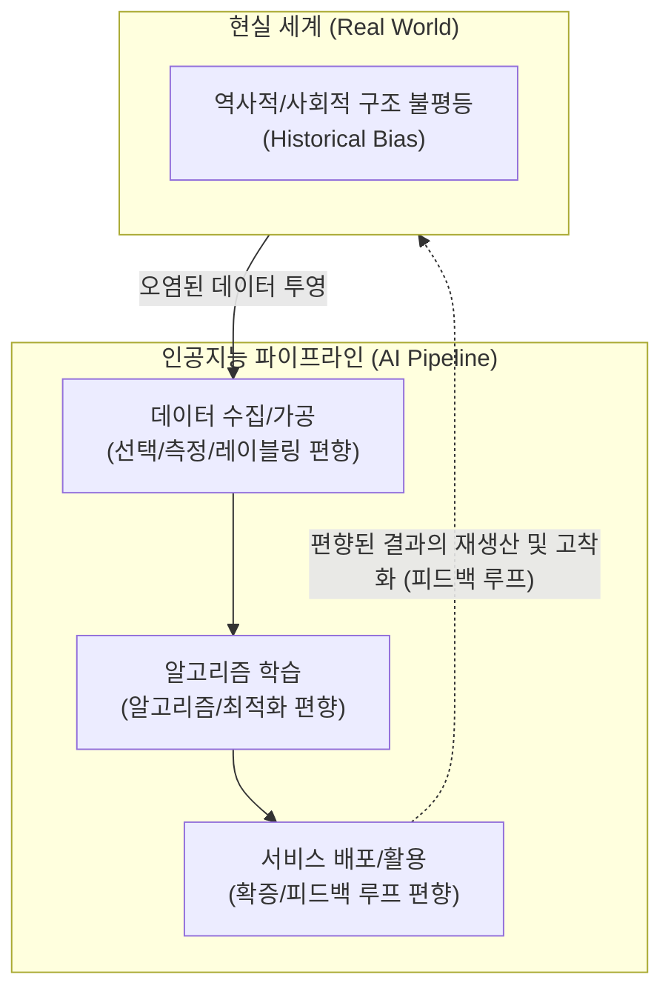

# 편향 (Bias)

---

## I. 데이터와 인공지능의 공정성을 위협하는 체계적 오류, 편향의 개요

* **정의**: 데이터 수집, 모델 설계, 혹은 사용자 상호작용 과정에서 특정 집단이나 결과에 체계적으로 치우쳐(Systematic Error), 예측의 정확도를 떨어뜨리거나 사회적 공정성(Fairness)을 훼손하는 현상
* **등장 배경**: 현실 세계의 차별적 구조가 데이터에 그대로 투영되는 현상 심화, [[딥러닝]] 기반 블랙박스(Black-box) 알고리즘의 확산으로 채용, 금융, 사법 등 핵심 영역에서 불공정한 의사결정 파장 발생
* **특징**: AI 파이프라인(기획 ➔ 수집 ➔ 학습 ➔ 서비스) 전 주기에 걸쳐 발생 및 증폭됨, 통계적 관점에서는 분산(Variance)과 상충 관계(Trade-off)를 가짐, 기술적 해결책뿐만 아니라 윤리적/제도적 접근이 필수적임

---

## II. 편향의 개념도 및 핵심 기술 요소

### 가. 기계학습 파이프라인 단계별 편향 주입 메커니즘

* 편향은 단순히 알고리즘의 문제가 아니라 현실 세계의 내재된 문제가 데이터를 통해 주입되며, 모델의 예측 결과가 다시 현실의 데이터를 오염시키는 악순환(Feedback Loop) 고리를 형성함

### 나. 편향의 주요 유형 및 핵심 구성 요소

| 구분 | 요소기술(키워드) | 세부 설명 |
| --- | --- | --- |
| **데이터 편향** | 선택 편향 (Selection) | 수집된 표본(Sample) 데이터가 전체 모집단을 제대로 대표하지 못하고 특정 그룹에 치우칠 때 발생 (예: 스마트폰 설문조사 시 고령층 배제) |
| **데이터 편향** | 역사적 편향 (Historical) | 데이터 측정 과정은 완벽했으나, 과거의 사회적 편견이나 차별적 관행 자체가 데이터에 고스란히 담겨 있는 경우 |
| **데이터 편향** | 레이블링 편향 (Labeling) | 데이터를 분류(정답지 부여)하는 작업자(Human Labeler)의 주관적 편견이나 문화적 배경이 개입되어 발생하는 오류 |
| **[[알고리즘]] 편향** | 모델 최적화 편향 | 다수결이나 평균 오류(MSE) 최소화를 목표로 학습할 때, 소수 집단(Minority)의 특성이 무시되고 다수 집단에 유리하게 가중치가 수렴하는 현상 |
| **인지적 편향** | 확증 편향 (Confirmation) | AI가 제시한 다양한 결과 중, 사용자가 자신의 원래 믿음이나 가치관과 일치하는 정보만 선택적으로 수용하는 현상 |
| **완화 기법** | 디바이어싱 (Debiasing) | [[데이터 전처리]](리샘플링), 학습 중(패널티/가중치 조정), 후처리(결과값 보정) 단계를 통해 인위적으로 편향을 제거하는 알고리즘 기법 |
| **평가 지표** | 공정성 지표 (Fairness) | 인구통계학적 패리티(Demographic Parity), 동등 확률(Equalized Odds) 등 모델의 예측이 집단 간 공평한지 수학적으로 측정하는 척도 |

---

## III. 통계적 오차 비교 및 편향 극복 최신 동향

### 가. 기계학습의 통계적 오차: 편향(Bias)과 분산(Variance) 비교

| 비교 항목 | 편향 (Bias) | 분산 (Variance) |
| --- | --- | --- |
| **정의** | 예측값들의 평균과 실제 정답과의 차이 (정확도 문제) | 예측값들이 서로 얼마나 흩어져 있는가의 정도 (정밀도 문제) |
| **과녁 비유** | 영점이 안 맞아 한쪽으로 쏠림 (치우침) | 영점은 맞으나 탄착군이 매우 넓음 (흩어짐) |
| **발생 원인** | 모델이 너무 단순하여 데이터의 특징을 포착하지 못함 | 모델이 너무 복잡하여 훈련 데이터의 노이즈까지 암기함 |
| **모델 상태** | **과소적합 (Under-fitting)** | **과대적합 (Over-fitting)** |
| **상충관계 (Trade-off)** | 편향을 줄이려 모델을 복잡하게 하면 분산이 증가 | 분산을 줄이려 모델을 단순화하면 편향이 증가 |
| **해결 방안** | 파라미터 추가, 복잡한 알고리즘(비선형) 사용 | 훈련 데이터 추가, 정규화(Regularization), 드롭아웃([[Dropout]]) |

### 나. AI 편향 관리의 최신 기술 동향 및 시사점

* **[[합성 데이터]](Synthetic Data)를 통한 데이터 불균형 해소**: 소수자, 특정 인종, 희귀 케이스 등 현실에서 수집하기 어려운 데이터를 생성형 AI([[GAN (Generative Adversarial Network)|GAN]], Diffusion)를 통해 합성 데이터로 생성 및 증강(Augmentation)하여 근본적인 데이터 편향을 완화하는 기술 확산
* **설명 가능한 AI([[XAI]])와 레드티밍(Red Teaming) 결합**: 모델이 어떤 특징(Feature)에 가중치를 두어 판단했는지 XAI(SHAP, [[LIME]] 등)로 시각화하고, 고의로 편향적이고 악의적인 프롬프트를 주입하여 모델의 취약점을 선제적으로 찾아내는 레드팀 활동이 거대 언어 모델([[초거대 언어 모델|LLM]]) 개발의 필수 과정으로 정착
* **[[AI 거버넌스]] 및 규제 대응 의무화**: 유럽연합의 인공지능법(EU AI Act) 등 글로벌 규제가 본격화됨에 따라, 고위험(High-Risk) AI 시스템의 경우 학습 데이터의 편향 통제 여부와 공정성 평가 결과를 문서화하고 검증받아야 하는 컴플라이언스 체계 구축이 기업의 핵심 과제로 부상

---

### 🔗 연관 토픽

- **소속 도메인**: [[00_인공지능_MOC|🤖 인공지능]]
- **세부 분류**: `6. 설명가능한 AI (XAI) & AI 윤리 · 거버넌스`
- **핵심 연관 토픽**:
  - [[XAI]]
  - [[AI 거버넌스|AI 거버넌스 (AI Governance)]]
  - [[데이터 전처리]]
  - [[알고리즘]]
  - [[LIME]]
