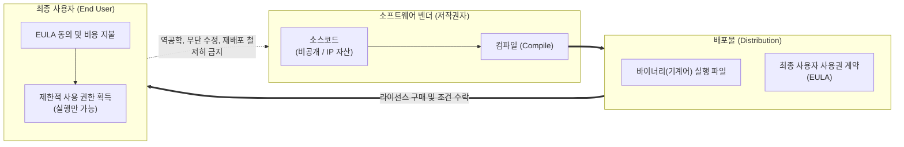

# 폐쇄형 라이선스 (Closed Source Software License)

---

## I. 지식재산권 보호와 소프트웨어 상업화의 근간, 폐쇄형 라이선스의 개요

* **정의**: 소프트웨어의 소스코드를 대중에게 비공개로 유지하며, 원저작자(벤더)가 지식재산권을 독점하고 최종 사용자에게는 계약에 따른 '제한된 사용 권한(실행 파일)'만을 부여하는 상용 소프트웨어 라이선스 모델 (Proprietary License)
* **등장 배경**: 1980년대 소프트웨어 상업화가 본격화됨에 따라 소프트웨어 자체가 독자적인 자산(IP)으로 인정받기 시작하였고, 불법 복제 방지, [[01_IT Tech/지식재산권]] 보호, 초기 개발 비용 회수 및 수익 모델(Monetization) 확보의 필요성 대두
* **특징**: 최종 사용자 사용권 계약(EULA) 동의 필수, 소스코드 수정 및 재배포 원천 금지, 리버스 엔지니어링(역공학) 엄격 통제, 벤더 차원의 법적 보증(Warranty) 및 전문적인 기술 지원 제공

---

## II. 폐쇄형 라이선스의 개념도 및 핵심 기술 요소

### 가. 폐쇄형 라이선스의 배포 및 권한 통제 메커니즘

* 벤더는 자산인 소스코드를 감추고 실행 가능한 바이너리 형태만 배포하며, 사용자는 EULA에 명시된 엄격한 규정에 따라 소프트웨어를 소유하는 것이 아니라 '사용할 권리'만을 임대받음

### 나. 폐쇄형 라이선스의 핵심 구성 요소

| 구분 | 요소기술(키워드) | 세부 설명 |
| --- | --- | --- |
| **법적 장치** | EULA (최종 사용자 사용권 계약) | 소프트웨어 설치 및 사용 전 반드시 동의해야 하는 법적 계약서로, 사용 범위, 복제 금지, 책임 제한 등을 명시 |
| **보안 통제** | 리버스 엔지니어링 금지 | 디컴파일(Decompile), 역어셈블 등을 통해 바이너리에서 소스코드를 추출하고 분석하는 행위를 계약으로 원천 차단 |
| **배포 형태** | 바이너리 (Binary) 전용 | 사람이 읽고 수정할 수 있는 소스코드를 배포하지 않고, 컴퓨터만 인식할 수 있는 기계어 형태로만 제공 |
| **권리 귀속** | 지식재산권 (IP) 독점 | 소프트웨어에 대한 저작권, 특허권 등 모든 권리는 개발사(벤더)에 귀속되며, 사용자에게 양도되지 않음 |
| **위험 관리** | 소프트웨어 임치 (Escrow) | 벤더의 파산이나 [[유지보수]] 불가 상황 시 고객을 보호하기 위해 제3의 신뢰 기관에 소스코드를 안전하게 보관하는 제도 |
| **과금 체계** | 라이선스 메트릭 (Metrics) | Named User(지정 사용자), Concurrent(동시 접속), [[CPU]] Core(코어 수) 등 사용 권한을 측정하고 과금하는 다양한 기준 |
| **사후 관리** | 벤더 종속성 (Vendor Lock-in) | 보안 패치, 버그 수정, 기능 업데이트를 전적으로 원저작자에게 의존하게 되어 타 솔루션으로의 전환이 어려워지는 현상 |

---

## III. 오픈소스 라이선스와의 비교 및 향후 동향

### 가. 폐쇄형 라이선스와 오픈소스 라이선스 비교

| 비교 항목 | 폐쇄형 라이선스 (Proprietary / Closed) | 오픈소스 라이선스 (OSS License) |
| --- | --- | --- |
| **소스코드 접근** | **비공개** (실행 파일만 제공) | **완전 공개** (누구나 열람 가능) |
| **사용 및 수정 권한** | EULA에 의한 엄격한 제한 (수정 불가) | 자유로운 사용, 수정, 복제, 배포 허용 |
| **비용 모델** | 라이선스 구매 비용(License Fee) 발생 | 라이선스 자체는 무료 (기술 지원/컨설팅은 유료) |
| **유지보수 및 보증** | 벤더가 법적/기술적 책임 및 품질 보증 제공 | 무보증(No Warranty) 원칙, 커뮤니티 중심 지원 |
| **파생물 재배포** | 절대 금지 (저작권 침해) | 라이선스 조건(Copyleft, Permissive)에 따라 허용 |
| **대표 사례** | Windows, MS Office, Oracle Database | Linux, MySQL, Apache HTTP Server |

### 나. 상용 소프트웨어 라이선스의 최신 동향 및 시사점

* **SaaS 및 구독(Subscription) 모델로의 완전한 전환**: 과거 패키지 형태의 영구 라이선스(Perpetual) 판매에서 벗어나, 클라우드 기반의 SaaS 모델로 전환함으로써 소프트웨어 불법 복제를 원천 차단하고 안정적인 연간 반복 수익(ARR)을 창출하는 방향으로 산업 재편
* **오픈 코어(Open Core) 하이브리드 모델의 대세화**: 순수 폐쇄형 모델의 한계를 극복하기 위해 핵심 엔진이나 기본 기능은 오픈소스로 무료 공개하여 생태계(점유율)를 빠르게 장악하고, 엔터프라이즈급 보안, 관리 도구, 모니터링 기능 등은 폐쇄형 상용 라이선스로 판매하는 수익 모델 도입 (예: Elastic, GitLab)
* **클라우드/[[컨테이너]] 환경의 라이선스 감사(Audit) 분쟁 심화**: 물리적 서버 중심의 과거 라이선스 메트릭(CPU 코어 등)을 동적으로 확장/축소되는 [[가상화]], [[쿠버네티스]](Kubernetes) 컨테이너 환경에 적용하려다 보니 벤더와 고객 간의 라이선스 위반 분쟁이 증가. 이에 따라 SAM(소프트웨어 자산 관리) 도구의 중요성 부각

---

### 🔗 연관 토픽

- **소속 도메인**: [[00_소프트웨어공학_MOC|🏗️ 소프트웨어공학]]
- **세부 분류**: `6. 소프트웨어 테스팅 & 품질 보증 (QA/QC)`
- **핵심 연관 토픽**:
  - [[가상화]]
  - [[컨테이너|컨테이너 (Container)]]
  - [[쿠버네티스|쿠버네티스(Kubernates)]]
  - [[유지보수]]
  - [[난독화]]
