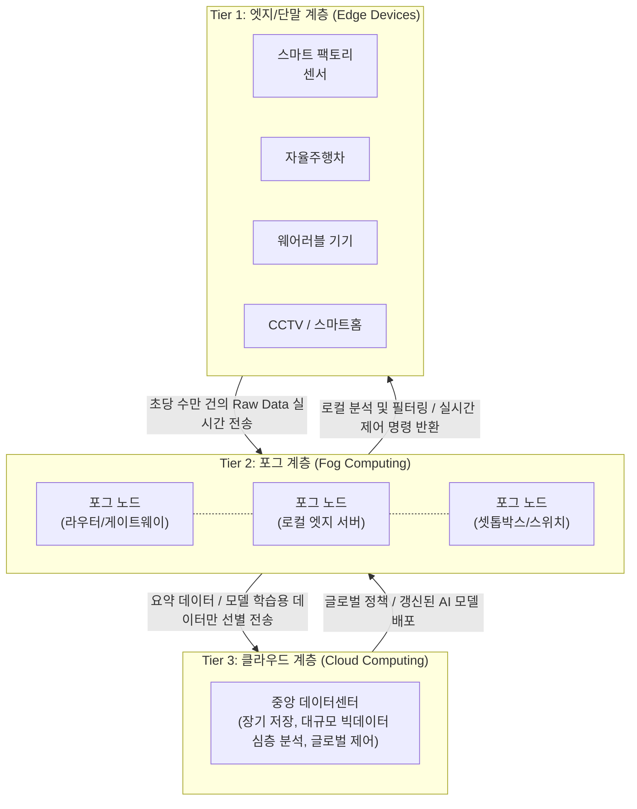

# 포그 컴퓨팅 (Fog Computing)

---

## I. 실시간 IoT 처리를 위한 클라우드의 확장, 포그 컴퓨팅의 개요

* **정의**: 클라우드 컴퓨팅의 연산, 스토리지, 네트워킹 기능을 데이터가 발생하는 단말([[EDGE|Edge]])과 중앙 클라우드 사이의 중간 계층인 '포그(Fog) 노드'로 전진 배치하여 분산 처리하는 네트워크 아키텍처
* **등장 배경**: 수십억 개의 IoT 기기 발달로 인한 중앙 집중형 클라우드의 네트워크 대역폭 포화, 전송 지연(Latency) 한계 노출, [[Smart Car(자율주행)|자율주행]] 및 스마트 팩토리와 같은 밀리초(ms) 단위의 실시간 응답성 요구 증대
* **특징**: 저지연(Low Latency) 실시간 데이터 처리, 네트워크 트래픽 및 대역폭 비용 절감, 데이터 [[지역성|지역성(Locality)]] 확보를 통한 프라이버시 및 보안 강화, 위치 인지(Location Awareness) 기반의 유연한 서비스 제공

---

## II. 포그 컴퓨팅의 개념도 및 핵심 기술 요소

### 가. 3계층(Tier) 포그 컴퓨팅 아키텍처 및 동작 원리

* 데이터 발생원(Tier 1)에서 생성된 방대한 데이터를 중앙(Tier 3)으로 모두 보내지 않고, 근거리의 포그 노드(Tier 2)에서 1차적으로 필터링 및 실시간 분석하여 클라우드의 부하를 분산하고 응답 속도를 극대화함

### 나. 포그 컴퓨팅의 핵심 기술 및 구성 요소

| 구분 | 요소기술(키워드) | 세부 설명 |
| --- | --- | --- |
| **인프라 자원** | 포그 노드 (Fog Node) | [[게이트웨이]], [[라우터]], 로컬 서버 등 네트워크 종단점 근처에 위치하며 일정 수준의 컴퓨팅 및 스토리지 능력을 갖춘 분산 인프라 |
| **운영 체계** | 초경량 [[컨테이너]] (K3s, MicroK8s) | 리소스가 제한적인 포그 노드에 마이크로서비스([[MSA (Micro Service Architecture)|MSA]])를 배포하고 실행하기 위해 최적화된 경량화 [[쿠버네티스]](Kubernetes) 환경 |
| **네트워크 제어** | [[SDN(Software Defined Network)|SDN]] / [[NFV]] | 포그 노드 간의 유연한 연결과 자원 할당을 위해 네트워크 제어부를 소프트웨어로 분리하고, 네트워크 기능을 가상화하는 기술 |
| **데이터 처리** | 데이터 필터링 (Pruning/Filtering) | 센서에서 올라오는 무의미한 데이터를 포그 노드에서 즉시 폐기하고, 의미 있는(유효한) 이벤트 데이터만 클라우드로 전송 |
| **관리/통제** | 포그 오케스트레이션 (Orchestration) | 수많은 포그 노드의 상태를 중앙에서 모니터링하고, 애플리케이션(컨테이너) 배포, 로드 밸런싱, 생명 주기를 통합 통제하는 메커니즘 |
| **보안 강화** | 신뢰 실행 환경 (TEE) | 포그 노드가 물리적 탈취 위험에 노출되기 쉬우므로, 하드웨어 기반의 보안 영역(TrustZone 등)을 구축하여 데이터 위변조 방지 |

---

## III. 엣지/클라우드와의 비교 및 최신 동향

### 가. 클라우드, 포그, 엣지 컴퓨팅의 아키텍처 비교

| 비교 항목 | [[클라우드 컴퓨팅]] (Cloud) | 포그 컴퓨팅 (Fog) | 엣지 컴퓨팅 (Edge) |
| --- | --- | --- | --- |
| **데이터 처리 위치** | 인터넷 코어 (중앙 데이터센터) | 로컬 네트워크 (게이트웨이/라우터) | 데이터 발생 단말기 자체 (센서/기기) |
| **지연 시간 (Latency)** | 높음 (수십~수백 ms) | **낮음 (수 ms 단위)** | **매우 낮음 (거의 실시간 1ms 이하)** |
| **컴퓨팅 파워** | 무한대에 가까운 확장성 | 중간 수준 (네트워크 장비 자원 활용) | 제한적 (기기 자체의 배터리/프로세서 한계) |
| **커버리지 및 성격** | 글로벌 (Global) / 중앙 집중형 | 지역적 (Regional) / 분산형 | 특정 종단점 (Specific) / 극단적 분산 |
| **주요 역할** | 장기 데이터 보관, 무거운 AI 학습 | **[[데이터 전처리]], 트래픽 라우팅, 실시간 분석** | 즉각적인 하드웨어 제어 제어, 센싱 |

*※ 최근에는 포그 컴퓨팅과 엣지 컴퓨팅이 엄격하게 구분되기보다는 상호 혼용되거나 통합된 '엣지-클라우드 연속체(Edge-Cloud Continuum)' 개념으로 융합되는 추세임.*

### 나. 포그 컴퓨팅의 기술 동향 및 시사점

* **5G/6G [[Mobile Edge Computing|MEC]] (Multi-access Edge Computing)와의 결합**: 이동통신 기지국 내에 포그/엣지 서버를 전진 배치하여, 모바일 사용자와 자율주행 차량에 초저지연 서비스를 제공하는 통신사 주도의 MEC 아키텍처가 표준 인프라로 자리 잡음
* **[[연합 학습]] (Federated Learning) 인프라로 부상**: 데이터를 클라우드로 전송하여 중앙 집중식으로 학습하던 기존 AI 모델을 탈피, 개별 포그 노드에서 분산 학습한 뒤 모델의 '가중치(Weight)'만을 클라우드로 전송하여 병합함으로써, 개인정보 유출을 원천 차단하는 분산 AI 아키텍처 활성화
* **데브옵스([[DevOps]]) 파이프라인의 엣지 전파 (EdgeOps)**: GitOps 및 쿠버네티스(KubeEdge 등) 생태계가 발전함에 따라, 개발자가 중앙 클라우드에서 코드를 커밋하면 전 세계에 흩어진 수만 개의 포그 노드에 컨테이너화된 애플리케이션이 자동으로 [[무중단 배포]] 및 업데이트되는 진정한 CI/CD 파이프라인의 연장선이 구축됨

---

### 🔗 연관 토픽

- **소속 도메인**: [[00_디지털서비스_MOC|🚀 디지털서비스]]
- **세부 분류**: `1. 클라우드 컴퓨팅 & 가상화 인프라`
- **핵심 연관 토픽**:
  - [[쿠버네티스|쿠버네티스(Kubernates)]]
  - [[클라우드 컴퓨팅|클라우드 컴퓨팅 (Cloud Computing)]]
  - [[컨테이너|컨테이너 (Container)]]
  - [[EDGE|edge]]
  - [[SDN(Software Defined Network)]]
