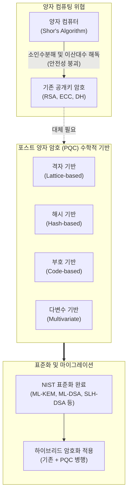

# 포스트 양자 암호 (Post-Quantum Cryptography, PQC)

---

## I. 양자 컴퓨팅 위협에 대응하는 차세대 보안 암호, 포스트 양자 암호의 개요

* **정의**: 대규모 양자 컴퓨터의 연산 능력(쇼어 [[알고리즘]] 등)에 의해 무력화되는 기존의 공개키 암호 체계([[RSA (Rivest Shamir Adleman)|RSA]], [[ECC]], Diffie-Hellman 등)를 대체하기 위해, 양자 컴퓨터로도 풀기 어려운 복잡한 수학적 난제를 기반으로 설계된 차세대 [[암호 알고리즘]] 총칭
* **등장 배경**: 양자 비트(Qubit)의 중첩과 얽힘 특성을 이용한 양자 컴퓨터의 발전으로 기존 소인수분해 및 이산대수 기반 암호 체계가 단시간에 해독될 위험이 대두됨에 따라, 전 세계적인 보안 패러다임 전환(Crypto-Agility) 필요성 증대
* **특징**: 클래식(기존) 컴퓨터에서는 안전하게 연산되면서 양자 컴퓨터의 공격에는 내성을 가짐, 기존 공개키 암호 대비 키 크기(Key Size)나 서명 데이터가 상대적으로 커서 네트워크 대역폭 및 성능 최적화 고려 필요

---

## II. 포스트 양자 암호의 개념도 및 핵심 기술 요소

### 가. 전통 암호 체계의 위협과 PQC 전환 아키텍처

* 양자 컴퓨터의 쇼어 알고리즘은 기존 RSA/ECC의 수학적 근간을 무력화하므로, 미 국립표준기술연구소(NIST) 등을 중심으로 격자, 해시, 부호 기반 등 양자 내성 수학적 난제에 기반한 PQC 표준이 확립되어 전환이 진행 중임

### 나. 포스트 양자 암호의 주요 수학적 기반 및 표준 알고리즘

| 구분 | 수학적 난제 (Problem) | 대표 알고리즘 (NIST 표준 등) | 주요 특징 및 활용 영역 |
| --- | --- | --- | --- |
| **격자 기반 (Lattice)** | 고차원 공간에서 숏티지 벡터(SVP) 등을 찾는 난제 | **ML-KEM** (Kyber), **ML-[[DSA]]** (Dilithium), FALCON | 현재 PQC 표준의 주축, 암호화와 전자서명 모두 지원하며 균형 잡힌 성능 제공 |
| **해시 기반 (Hash)** | 일방향 해시 함수의 충돌 저항성 | **SLH-DSA** (SPHINCS+) | 상태(State) 비저장형 해시 서명, 구현이 비교적 안전하나 서명 크기가 다소 큼 |
| **부호 기반 (Code)** | 오류 정정 부호의 디코딩 난제 ( McEliece 등) | Classic McEliece | 역사적으로 가장 오래된 내성 암호, 키 크기가 매우 크나 [[암호화]] 속도가 빠름 |
| **다변수 기반 (Multivariate)** | 다변수 다항식 연립방정식 풀이 난제 | Rainbow (일부 공격으로 대안 검토) | 주로 전자서명에 특화, 서명 생성 및 검증 속도가 빠름 |
| **전환기 기술** | 하이브리드 모드 (Hybrid) | 기존 RSA/ECC + PQC 결합 방식 | PQC 알고리즘의 잠재적 취약성에 대비하여 기존 신뢰된 알고리즘과 동시에 적용하는 과도기적 기법 |

---

## III. 전통 공개키 암호와의 비교 및 향후 전망

### 가. 전통 공개키 암호 vs 포스트 양자 암호 (PQC) 비교

| 비교 항목 | 전통 공개키 암호 (RSA, ECC) | 포스트 [[양자 암호]] (PQC) |
| --- | --- | --- |
| **수학적 근간** | 소인수분해, 이산대수 문제 | **격자, 해시, 부호 이론 등의 복잡한 수학적 난제** |
| **양자 컴퓨터 위협** | **치명적 취약** (쇼어 알고리즘에 의해 즉시 해독) | **안전함** (양자 알고리즘으로도 효율적 해독 불가능) |
| **키 및 서명 크기** | 상대적으로 작음 (예: RSA 2048-bit, ECC 256-bit) | **상당히 큼** (네트워크 대역폭 및 메모리 최적화 필요) |
| **연산 속도** | 하드웨어 가속 최적화 완료, 매우 빠름 | 알고리즘에 따라 연산 부하가 상이하며 추가 최적화 진행 중 |
| **표준화 및 성숙도** | 수십 년간 검증된 성숙한 표준 | NIST 표준화 완료(2024년 [[FIPS (Federal Information Processing Standards)|FIPS]] 지정 등) 및 본격 도입 단계 |

### 나. PQC 마이그레이션(전환) 동향 및 시사점

* **"지금 저장하고 나중에 복독(Store Now, Decrypt Later)" 위협 대응**: 해커들이 현재 암호화된 기밀 데이터를 대량으로 수집(Sniffing)하여 저장해 두었다가 향후 상용 양자 컴퓨터가 완성되는 시점에 일괄 복호화하려는 공격 시도가 현실화되고 있음. 이에 따라 장기 기밀성이 요구되는 금융, 국방, 공공 분야를 중심으로 긴급한 PQC 전환 요구 증대
* **크립토-애자일리티(Crypto-Agility) 아키텍처 설계 필수**: 암호 알고리즘이나 키 길이에 시스템이 고정(Hard-coding)되어 있으면 향후 새로운 취약점이 발견되거나 알고리즘이 변경될 때 시스템 전면 개편이 필요하므로, 소스코드 수정 없이 설정 변경만으로 암호 체계를 교체할 수 있는 유연한 설계 패러다임 정착
* **하이브리드(Hybrid) 암호 체계의 보편화**: PQC 알고리즘의 수학적 안정성이 완전히 검증되는 과도기 동안, 기존의 신뢰된 암호(RSA/ECC)와 신규 PQC 알고리즘을 동시에 적용하여 두 암호 중 하나만 뚫려도 안전성이 유지되도록 하는 하이브리드 인증/암호화 방식이 실무 표준으로 정착 중

---

### 🔗 연관 토픽

- **소속 도메인**: [[00_보안_MOC|🛡️ 보안]]
- **세부 분류**: `2. 현대 암호학 & 키 관리 · 전자서명`
- **핵심 연관 토픽**:
  - [[RSA (Rivest Shamir Adleman)]]
  - [[ECC|ECC(Elliptic Curve Cryptography)]]
  - [[FIPS (Federal Information Processing Standards)]]
  - [[양자 암호|양자 암호(Quantum Cryptography)]]
  - [[암호화|암호화 (Encryption)]]
